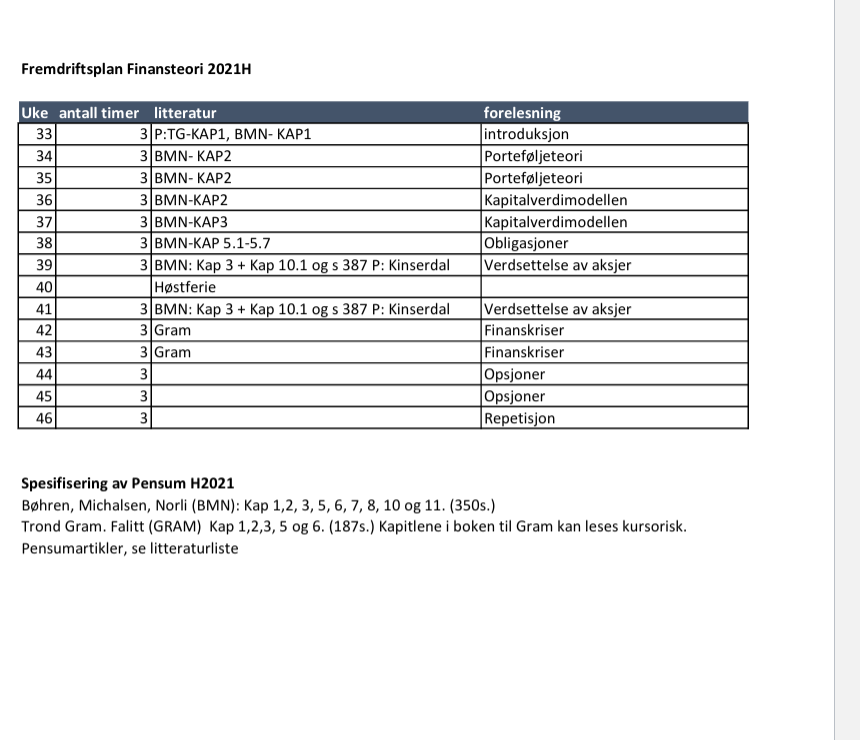

```{r echo=FALSE, message=FALSE, warning=FALSE}
source("timeplan.R")
```



# Forelesning 1
Læringsmål
Kapittel 1

Etter å ha jobbet med læreboken og nettsiden til dette kapitlet skal du

forklare strukturen i risikojustert rente metoden for beregning av nåverdi.
redegjøre for forskjellen mellom et investeringsprosjekt og et finansieringsprosjekt.
konstruere en kontantstrøm fra prosjektdata.
forklare hva som menes med begrepene sannsynlighet, tilstand og utfall.
beregne forventet kontantstrøm og forventet avkastning for et prosjekt og en portefølje.
gi et oversiktsbilde av innholdet i boken og bokens nettside.
abc

# Forelesning 2
Etter å ha jobbet med dette kapitlet skal du kunne:

tallfeste risiko i en portefølje ved å beregne standardavvik.
forklare gjennom et eksempel hvorfor et prosjekt som er risikabelt vurdert alene kan ha lav risiko når prosjektet inngår i en portefølje.
forklare hvorfor porteføljens risiko avhenger av samvariasjonen mellom prosjektene som inngår i porteføljen og de andelene som er investert i hvert prosjekt.
beskrive hvorfor risikoen i en portefølje reduseres når antall prosjekter i porteføljen øker.
beregne betaverdien til et prosjekt og forklare hva den fanger opp.
gi eksempler på kilder for systematisk og usystematisk risiko.

# Forelesning 3
Kapittel 3

Etter å ha jobbet med dette kapitlet skal du kunne:

forklare begrepene effisiente og ineffisiente porteføljer og konstruere slike porteføljer ut fra data.
skrive opp kapitalverdimodellen og forklare modellens økonomiske innhold.
bruke kapitalverdimodellen til å beregne kostnaden for egenkapital, gjeld og totalkapital.
forklare forskjellen mellom kapitalkostnaden for bedriften og kapitalkostnaden for et enkeltstående prosjekt i bedriften.
beskrive kapitalverdimodellens sterke og svake sider.
forklare hva slags type risiko følsomhetsanalyse og beslutningstre tar hensyn til.

# Forelesning 4
Kapittel 4

Etter å ha jobbet med dette kapitlet skal du kunne:

forklare forskjellen mellom bokverdi og markedsverdi for bedrifter og prosjekter.
redegjøre for begrepene investeringsrisiko og finansieringsrisiko.
forklare hvordan finansieringsformen kan påvirke verdien av et investeringsprosjekt.
beskrive tre imperfeksjoner som kan påvirke bedriftens dividendepolitikk.
definere begrepet opsjon.
nevne tre finansielle instrumenter som brukes i risikostyring.
 LENKER
 RETTELSER
 TAKK

# Forelesning 5
Etter å ha jobbet med dette kapitlet skal du kunne:

redegjøre for hovedkjennetegn ved ordinære lån, obligasjonslån og konvertible lån.
beregne markedsverdi og effektiv rente for en obligasjon.
finne terminrenter fra spotrenter samt beregne durasjon (varighet) og rentefølsomhet for en obligasjon.
lage en balanseoppstilling basert på bokverdier og markedsverdier.
redegjøre for egenkapitalemisjoner og kjøp av egne aksjer samt beregne verdien av en tegningsrett.
forklare de økonomiske effektene av aksjesplitter og fondsemisjoner.
 LENKER
 RETTELSER
 TAKK

# Forelesning 6
Kapittel 6

Etter å ha jobbet med dette kapitlet skal du kunne:

definere begrepene gjeldsgrad og gjeldsandel.
forklare hva som bestemmer selskapets investeringsrisiko.
redegjøre for hvordan finansieringsrisiko påvirker risiko for eierne.
forklare hvorfor finansieringsrisiko ikke primært skyldes konkursrisiko.
skille mellom den positive og negative effekten av høyere gjeldsgrad sett med eiernes øyne.
tegne sammenhengen mellom gjeldsgrad og aksjekurs i en situasjon der selskapsverdien er uavhengig av gjeldsgraden.

# Forelesning 7
Kapittel 7

Etter å ha jobbet med dette kapitlet skal du kunne:

beregne kontantstrøm til kreditorene og overskuddet for eierne med utgangspunkt i data om et investeringsprosjekt og et finansieringsprosjekt.
vise med et eksempel at forventet overskudd pr. aksje stiger med stigende gjeldsgrad.
forklare hva en arbitrasjemulighet er.
konstruere en arbitrasjestrategi for å høste en arbitrasjegevinst.
gjengi de to hovedresultatene til Miller og Modigliani (M&M) med formler og ord for en verden uten skatt.
forklare hvorfor kapitalverdimodellen kan gi to prosjekter samme kapitalkostnad selv om de ifølge M&M ikke er i samme risikoklasse.

# Forelesning 8
Kapittel 8

Etter å ha jobbet med dette kapitlet skal du kunne:

forklare forskjellen mellom ettleddsskatt og toleddsskatt og fortelle hvilket alternativ Norge benytter.
definere et nøytralt skattesystem ved toleddsskatt.
redegjøre for hva som skaper Miller-likevekt (rente-likevekt) i et gjeldsfavoriserende skattesystem.
forklare hvorfor verdien av selskapet stiger og totalkapitalkostnaden synker med gjeldsgraden under ettleddsskatt.
redegjøre for fire gjeldsgradsbestemmende faktorer som ikke har med skatt å gjøre.

# Forelesning 9
Kapittel 9

Etter å ha jobbet med dette kapitlet skal du kunne:

redegjøre for begrepet gjeldskapasitet og i hvilke situasjoner dette begrepet er relevant i en prosjektanalyse.
forklare begrepet målsatt gjeldsgrad og hvordan det brukes i verdsettelsen av enkeltprosjekter.
skrive opp uttrykket for justert nåverdi og forklare hva hver komponent uttrykker.
beregne verdien av et gjeldfritt selskap basert på data fra et selskap med gjeld.
forklare hvorfor det trengs en gjeldsgradsteori for å beregne kapitalkostnad for et selskap uten gjeld ved hjelp av data fra selskaper som har gjeld.
beregne verdien av et selskap med egenkapitalmetoden og totalkapitalmetoden og forklare i hvilke situasjoner de gir samme resultat.

# Forelesning 10
Kapittel 10

Etter å ha jobbet med dette kapitlet skal du kunne:

estimere kapitalkostnaden for egenkapital og for gjeld.
fastsette risikofri rente og markedets risikopremie.
estimere beta for et selskap med utgangspunkt i beta for sammenlignbare selskaper.
beregne totalkapitalkostnaden for et selskap.
beregne fri kontantstrøm fra historiske regnskapstall.
predikere fremtidig fri kontantstrøm for et selskap.
verdsette et selskap basert på fri kontantstrøm.
verdsette et selskap med multiplikatorer.

# Forelesning 11
Kapittel 11

Etter å ha jobbet med dette kapitlet skal du kunne:

forklare forholdet mellom målsatt dividende og utbetalt dividende ifølge Lintner-modellen.
forklare hva som menes med hjemmelaget dividendepolitikk og hvorfor dette kan gjøre selskapets dividendepolitikk irrelevant.
redegjøre for teori og empiri om dividendens signalfunksjon.
forklare hvorfor dividende kan påvirke agentkostnader.
forklare hvorfor det norske skattesystemet er dividendenøytralt.

# Forelesning 12
Kapittel 12

Etter å ha jobbet med dette kapitlet skal du kunne:

redegjøre for max-funksjonene til kjøpsopsjoner og salgsopsjoner ved forfall.
konstruere kontantstrømsdiagram for kjøpsopsjoner og salgsopsjoner.
redegjøre for salg-kjøp-paritet og beregne verdien av ett element i pariteten ved hjelp av de øvrige elementene.
beregne verdien av en kjøpsopsjon med den binomiske opsjonsprismodellen.
beregne en kjøpsopsjons verdi ved hjelp av Black-Scholes-modellen.
redegjøre for hvordan opsjonsprismodeller kan brukes til å verdsette fleksibilitet.
 LENKER
 RETTELSER
 TAKK

# Forelesning 13
<<<<<<< HEAD
Some more text here


Pensumliste
Kursmateriale
Oppgave (web + bok løsningsforslag)
Ekamen (skole + innlevering)
Studentene
=======
Kapittel 13

Etter å ha jobbet med dette kapitlet skal du kunne:
>>>>>>> fa06a3ac38443f6809db4108a05e8667806abbd2

begrunne hvorfor risikostyring kan være viktig.
redegjøre for viktige risikokilder.
redegjøre for forwardkontrakter, samt beregne FRA-betaling.
vise hvordan man kan sikre rente- og valutarisiko med futureskontrakter.
vise hvordan valutarisiko kan reduseres ved hjelp av opsjoner.
vise hvordan renterisiko og valutarisiko kan styres ved hjelp av swaps.  

# Forelesning xx

Kapittel 14

Etter å ha jobbet med dette kapitlet skal du kunne:

forklare hvorfor det er et positivt forhold mellom kapitalkostnad og systematisk risiko, men ikke nødvendigvis mellom kapitalkostnad og total risiko.
begrunne hvorfor eierne av en familiebedrift bør være skeptiske til et avkastningskrav fra kapitalverdimodellen.
forklare hvorfor en investor kan være villig til å betale mer for et selskap desto mer diversifisert investoren er.
redegjøre for hvorfor risikoaversjon ikke impliserer at risikominimering er beste strategi.
forklare hvorfor informasjonseffisiens beskytter uinformerte investorer.
begrunne at verdipotensialet er større i investeringsprosjekter enn i finansieringsprosjekter.

# Emnebeskrivelse
[emnebeskrivesle](https://www.hiof.no/studier/emner/oss/2020/host/sfb30820.html)


<<<<<<< HEAD


=======
[Fagbokforlaget](https://eportal.fagbokforlaget.no/Pages/programs.aspx)
[Ressurs](https://finans2.portfolio.no/read_container/b7293def-6aa3-4f4b-81c7-f62972d97d5a)|
>>>>>>> fa06a3ac38443f6809db4108a05e8667806abbd2
