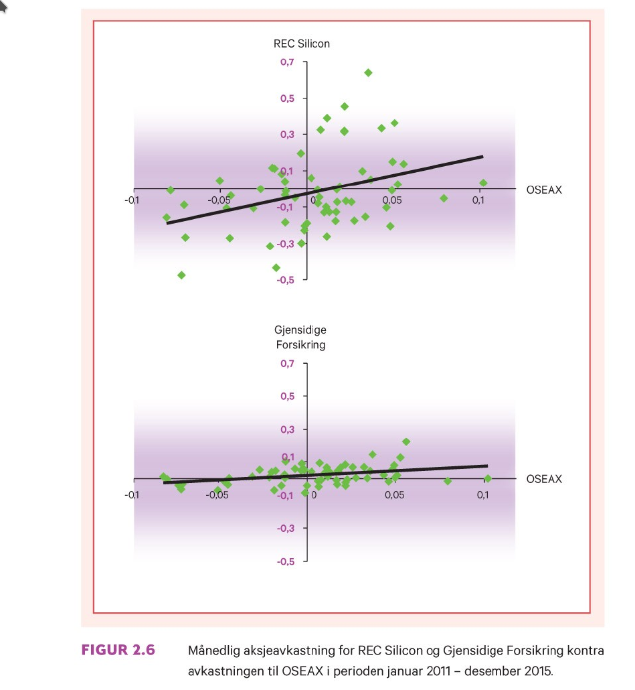
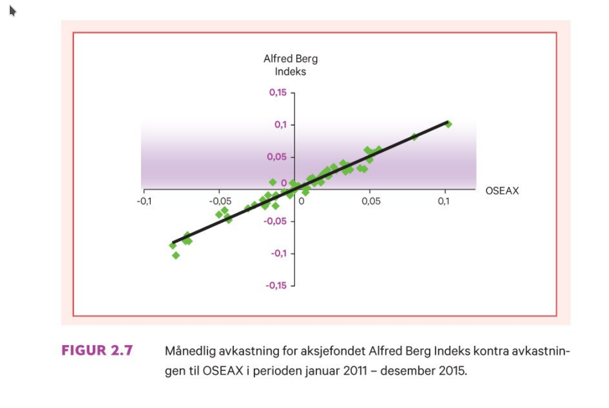

```{r xaringan-tile-view, echo=FALSE, message=FALSE, warning=FALSE}
xaringanExtra::use_editable(expires = 1)
xaringanExtra::use_tile_view()
#xaringanExtra::use_share_again()
xaringanExtra::use_scribble()
xaringanExtra::use_webcam()
#xaringanExtra::use_slide_tone()
xaringanExtra::use_panelset()
library(htmlTable)
library(magrittr)
library(xaringan)
library(plotly)
```

```{r eval=FALSE, include=FALSE}
xaringan::inf_mr("dagens.Rmd")
servr::daemon_stop()
```

```{r echo=FALSE, message=FALSE, warning=FALSE}
source("timeplan.R")
```

class: inverse, center, middle

# Forelesning 3: `r tema[3]`

**Læringsmål:**

-  Beskrive hvorfor risikoen i en portefølje reduseres når antall prosjekter i porteføljen øker.
-  Gi eksempler på kilder for systematisk og usystematisk risiko.
-  Beregne betaverdien til et prosjekt og forklare hva den fanger opp.

`r paste("Oppdatert:",Sys.Date())`

---

## Måling av risiko (portefølje fra 3 til n fonds)

**Metode 2 for måling av risiko (3 investeringsobjekter)**

Porteføljens varians er gitt ved
\begin{equation}
Var(r_p)=w_a^2Var(r_a)+w^2_bVar(r_b)+w^2_cVar(r_c) + \\
2w_aw_bStd(a)Std(b)Korr(a,b)+\\
2w_aw_cStd(a)Std(c)Korr(a,c)+\\
2w_bw_cStd(b)Std(c)Korr(b,c) 
\end{equation}
Mens standardavviket (som tidligere) framkommer som
\begin{equation}
Std(r_p)=\sqrt{Var(rp)}
\end{equation}

---

**Eksempel 2.6**

```{r, eval=T, echo=F}
w <- c(0.30, 0.40, 0.30)
df_eks_2_6 <- data.frame(aksje=c("A","B","C"),erp=c(0.12,0.15,0.25),std=c(0.10,0.20,0.40),korr=c("Mellom A og B: 0.8",
												 "Mellom A og C: 0.5",
												 "Mellom B og C: -0.10"))
htmlTable(df_eks_2_6, header=c("Aksje","Forventet avkastning","Standardavvik","Korrelasjonskoeffisient"))
```

Hvor investert beløp vektene er gitt ved $w_a$=`r w[1]`, $w_b$=`r w[2]` og $w_c$=`r 1-w[1]-w[2]`

Ved innsetting av formelen gir dette oss

\begin{equation}
Var(r_p)=(0.30)^2\cdot 0.10^2+(0.40)^2\cdot 0.20^2+(0.3)^2\cdot 0.40^2 \\ 
+2 \cdot 0.30 \cdot 0.40 \cdot 0.10 \cdot 0.20 \cdot 0.80 \\ 
+2 \cdot 0.30 \cdot 0.30 \cdot 0.10 \cdot 0.40 \cdot 0.50 \\
-2 \cdot 0.40 \cdot 0.30 \cdot 0.20 \cdot 0.40 \cdot 0.10 \\ 
=0.02722
\end{equation}

\begin{equation*}
Std(r_p)=\sqrt{0.02722}=0.1649848
\end{equation*}

```{r, eval=F, echo=F}
#! doublecheck
l1 <- (0.30)^2*0.10^2+(0.40)^2*0.20^2+(0.3)^2*0.40^2
l2 <- 2*0.30*0.40*0.10*0.20*0.80+2*0.30*0.30*0.10*0.40*0.50 -2*0.30*0.40*0.20*0.40*0.10  
l1+l2
sqrt(l1+l2)
```

---

**Metode 2 for måling av risiko (generell metode med n investeringsobjekter)**

Porteføljens forventning er gitt ved
\begin{equation}
E(r_p)=\sum_{i=1}^{N}w_iE(r_i)=w_1E(r_1)+w_2E(r_2)+...+w_NE(r_N)
\end{equation}
Porteføljens varians gitt ved
\begin{equation}
Var(r_p)=\sum_{i=1}^{N}w_i^2Var(r_i)+\underset{i\neq j}{\sum_{i=1}^{N}\sum_{j=1}^{N}}w_iw_jKov(i,j)=\\
\sum_{i=1}^{N}w_i^2Var(r_i)+\underset{i\neq j}{\sum_{i=1}^{N}\sum_{j=1}^{N}}w_iw_jStd(i)Std(j)Korr(i,j)
\end{equation}
Mens standardavviket (som tidligere) er gitt ved
\begin{equation}
Std(r_p)=\sqrt{Var(rp)}
\end{equation}

---

### Diversifisering og risikoreduksjon

- Legg merke til at første del av uttrykket for porteføljevariansbestår av $N$ leddd, mens siste består av $N^2-N$ ledd

- Dersom vi antar at en like stort andel $1/N$ blir investert i hvert av de n objektene, kan vi skrive 
\begin{equation}
Var(r_p)=(1/N)^2(Var(r_1)+Var(r_2)+...+Var(r_N)))\\
+(1/N)^2(Kov(r_1,r_2)+Kov(r_1,r_2)+...+Kov(r_1,r_2))))
\end{equation}

Vi har at gjennomsnittlig varians ( $\overline{Var}$ ) er gitt ved

$$
\overline{Var}=\frac{1}{N}(Var(r_1)+Var(r_2)+...+Var(r_N))
$$

Mens gjennomsnittlig kovarians ( $\overline{Kov}$ ) er gitt ved

$$
\overline{Kov}=\frac{1}{N}(Kov(r_1,r_2)+Kov(r_1,r_2)+...+Kov(r_1,r_2))
$$

---

Uttrykket ovenfor kan derfor skrives som

\begin{equation}
Var(r_p)=N(1/N)^2(\overline{Var}) + (N^2-N)(\frac{1}{N})^2(\overline{Kov})
\end{equation}

Vi kan forenkle dette, slik at vi til slutt står igjen med

\begin{equation}
Var(r_p)=\frac{1}{N}(\overline{Var}) + (1-\frac{1}{N})(\overline{Kov})
\end{equation}

Dette uttrykket forteller oss:

- Større N (dvs. desto flere aksjer i porteføljen), desto mer dominerer porteføljevariansen av $(1-\frac{1}{N})\overline{Kov}$ framfor $\frac{1}{N}\overline {Var}$
- Når $N \rightarrow \infty$, synker porteføljevariansen mot sin nedre grense gitt ved $\overline(Kov)$
- Desto lavere $\overline{Kov}$ er i forhold til 
  $\overline{Var}$, desto rasker synker porteføljevariansen når antall aksjer i porteføljen stiger

---

Eks. Oslo Børs perioden 2011-2015. 


```{r, echo=FALSE, out.width="55%", fig.cap=""}
knitr::include_graphics("pensum/figurer-08.png")
```

Her har vi at $\overline{Var}=0.21$ og gjennomsnittlig $\overline{Kov}=0.0229$.

\begin{equation*}
Var(r_p)=\frac{1}{N}(0.21) + (1-\frac{1}{N})(0.0229)
\end{equation*}

---


.panelset[
.panel[.panel-name[R-kode (ikke pensum)]
```{r}
varo <- 0.21
kovo <- 0.0229
tportvar <- '(1/N)*varo + (1-1/N)*kovo'
N <- 1:60
df_n <- data.frame(N=N,varp=eval(parse(text=tportvar),c(varo=varo,kovo=kovo,list(N=N))))
```
]
.panel[.panel-name[Figur]
```{r, out.width="55%",echo=F}
ggplot2::ggplot(df_n, aes(x=N,y=varp)) + geom_line()
```
]]

**Øvelse:** Se om du klarer å replikere figuren som er vist her ved bruk av et regneark.

---

## Kilder til usystematisk og relevant risiko

Uttrykket for porteføljvariansen med N-objekter (**øvelse:** se om du klarer å finne ut av det på egenhånd) kan dekomponeres til å bestå av en komponent for *Systematisk* risiko og en annen komponent for *usystemtisk* risiko. 

\begin{equation}
Var(r_p)=(\frac{1}{N})\overline{Var}+(1-\frac{1}{N})\overline{Kov}=\\ 
\underset{\text{Systematisk risiko}}{\overline{Kov}} +
(\frac{1}{N}) \underset{\text{Usystematisk riskiko}}{(\overline{Var}-\overline{Kov})} 
\end{equation}

Det første leddet er her et mål på porteføljens *systematiske* (ikke diversifiserbare) risiko, mens det siste leddet representerer den *usystematiske* risikoen. 

---

- Usystematisk risiko
  - Ledelsen kompetanse eller helse
  - Forsinkelser, lokal streik, brann
  - Overgang til ny teknolog innen en bransje

- Systematisk risiko
  - Konjunkturbevegelser
  - Pandemi
  - Krig eller fred 

---

## Betaverdien til en aksje eller et prosjekt

Relevant risiko til en enkelt aksje eller et prosjekt kan forstås som 
forholdet mellom aksjens eller prosjektets risiko i forhold til markedsporteføljen. Dette relativet risikomålet betegner vi som *beta* ( $\beta$ ):

\begin{equation}
\beta_j=\frac{Kov(r_j,r_m)}{Var(r_m)}
\end{equation}

- $\beta_j>1$ - Mer følsom enn markedsporteføljen
- $\beta_j=1$ - Følsomhet lik markedsporteføljen 
- $\beta_j<1$ - Mindre følsom enn markedsporteføljen
- $\beta_j=0$ - Risikofri aksje (null systematisk risiko, man kan innehold usystematisk risiko)

Ved å utnytte sammenhengen om at $Kor(j,m)=\frac{Kov(j,m)}{Std(j)Std(m)}$, kan vi også uttrykke beta som 

\begin{equation}
\beta_j=\frac{Kor(r_j,r_m)Std(r_j)}{Std(r_m)}
\end{equation}

---

```{r, echo=FALSE, out.width="55%", fig.cap=""}

```

---

```{r, echo=FALSE, out.width="55%", fig.cap=""}

```

