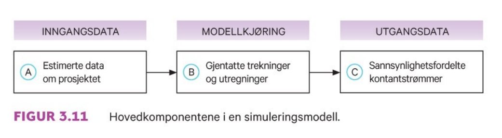

```{r xaringan-tile-view, echo=FALSE, message=FALSE, warning=FALSE}
xaringanExtra::use_editable(expires = 1)
xaringanExtra::use_tile_view()
#xaringanExtra::use_share_again()
xaringanExtra::use_scribble()
xaringanExtra::use_webcam()
#xaringanExtra::use_slide_tone()
xaringanExtra::use_panelset()
library(htmlTable)
library(magrittr)
library(xaringan)
```

```{r eval=FALSE, include=FALSE}
xaringan::inf_mr("dagens.Rmd")
```


---

class: inverse, center, middle

# Forelesning 5: `r tema[5]` 

**Læringsmål:**

- Skrive opp kapitalverdimodellen og forklare modellens økonomiske innhold.
- Forklare forskjellen mellom kapitalkostnaden for bedriften og kapitalkostnaden for et enkeltstående prosjekt i bedriften.
- Beskrive kapitalverdimodellens sterke og svake sider.
- Forklare hva slags type risiko følsomhetsanalyse og beslutningstre tar hensyn til.

`r paste("Oppdatert:",Sys.Date())`

---

## Kapitalverdimodellen (KVM)

Porteføljeteorien som vi analysert forut bygger på eksplisitte forutsetninger om:

- Investorene
 - Risikoaversjon (forventning-varians/standardavvik-kriteriet)
 - Alle investorene har samme én periodiske tidshorisont og prognoser om forventet avkastning
- Kapitalmarkedet
 - Alle investorer kan låne og spare i kapitalmarkedet til den samme risikofrie rente
 - Informasjonen er fritt tilgjengelig for alle
 - Tilbudet av alle eiendeler er gitt

*Kapitalverdimodellen* (KVM) er basert på porteføljeteorien, men inneholder i tillegg forutsetningen om at: 
- Kapitalmarkedet er i likevekt

---

Fra **eksempel 3.3** i læreboka har vi at markedet består tre selskaper(1,2 og 3) og to investorer (A og B). Selskap 1 har en egenkapitalverdi på 2000 kr, selskap 2: 6000 kr og selskap 3: 4000 kr. Investor A ønsker å plassere 3000 kr, mens B plasserer 9000 kr.  


```{r, echo=F}
radnr_i <- c("Etterspørsel A",
	   "Etterspørsel B",
	   "Samlet etterspørsel",
	   "Tilbud")
radnr_ii <- c("Selskap 1",
	   "Selskap 2",
	   "Selskap 3",
	   "")
tils1 <- c(3000,9000,9000,12000)
tils2 <- c(2000,6000,4000,0)
df_prosj_kontantstrøm <- data.frame(radnr_i,tils1,radnr_ii,tils2)
htmlTable(df_prosj_kontantstrøm, header=c("","Børsen","","Verdi EK"))
```


Knyttet til fordelingen av de to investeringsbeløpene, kan vi se for oss to forskjellige situasjoner:
- Situasjon 1 (likeveid): Investorene setter like stort beløp hvert selskap
  - $w=(4000/12000,4000/12000,4000/12000)=(1/3,1/3,1/3)$
- Situasjon 2 (verdiveid): Investorene setter det *verdiveide* beløp i hvert selskap
	- $w=(2000/12000,6000/12000,4000/12000)=(1/6,3/6,2/6)$

---

```{r, echo=F}
radnr_i <- c("Etterspørsel A",
	   "Etterspørsel B",
	   "Samlet etterspørsel",
	   "Tilbud")
w1 <- c(1000,3000,4000,2000)
w2 <- c(1000,3000,4000,6000)
w3 <- c(1000,3000,4000,4000)
df_prosj_kontantstrøm_lik <- data.frame(radnr_i,w1,w2,w3)
htmlTable(df_prosj_kontantstrøm_lik, header=c("","w_1=1/6","w_2=1/6","w_3=1/6"))
```
	- Ikke forenlig med likevekt

```{r, echo=F}
radnr_i <- c("Etterspørsel A",
	   "Etterspørsel B",
	   "Samlet etterspørsel",
	   "Tilbud")
w1 <- c(500,1500,2000,2000)
w2 <- c(1500,4500,6000,6000)
w3 <- c(1000,3000,4000,4000)
df_prosj_kontantstrom_ver <- data.frame(radnr_i,w1,w2,w3)
htmlTable(df_prosj_kontantstrom_ver, header=c("","w_1=1/6","w_2=3/6","w_3=2/6"))
```
	- Forenlig med likevekt

**Resultat: Situasjon 2 gir oss den maksimalt diversifiserte *markedsporteføljen (M)* (dvs. den verdiveide)**

---

### Risiko og kapitalkostnad i likevekt

Samlet sett gir porteføljeteorien pluss forutsetningen om markedslikevekt oss mulighet til å finne prisen (forholdet mellom risiko og forventet avkastning)
av samtlige aksjer som inngår i markedsporteføljen (M). Formelt kan vi uttrykke dette som 

\begin{equation}
E(r_p)=r_f+\beta_j[E(r_m) - rf] \\
\end{equation}

Videre kan vi grafisk representere denne sammenhengen ved den grønne *verdipapirmarkedslinjen* i figuren nedenfor


```{r, echo=FALSE, out.width="40%", fig.cap=""}
knitr::include_graphics("pensum/figurer-18.png")
```

---

Kapitalverdimodellen (KVM) forteller oss hva en investor kan regne med av forventet avkastning i aksjemarkedet dersom vedkommende bære en bestemt mengde systematisk risiko

---

### Litt empiri 

**Markedsporteføljen (den verdiveide)**

```{r, echo=FALSE, out.width="55%", fig.cap=""}
knitr::include_graphics("pensum/figurer-19.png")
```

Som gir oss i real makrosørrelsene (realisert)

- Markedets risikofri realrente: $0.032$
- Markedets risikopremie: $0.064$

---

**Enkeltaksjer**

```{r, echo=FALSE, out.width="55%", fig.cap=""}
knitr::include_graphics("pensum/figurer-20.png")
```


```{r, echo=F}
radnr_i <- c(
     "Frontline",
	   "Norsk Hydro",
	   "Telenor",
	   "DNO",
	   "Subsea 7")
w1 <- c(1.69,0.92,0.71,1.53,1.43)
df_prosj_beta_selskap <- data.frame(radnr_i,w1)
htmlTable(df_prosj_beta_selskap, header=c("Selskap","Beta"))
```

---

### Kapitalkostnad for egenkapital og gjeld

- Kapitalkostnad for egenkapital 

\begin{equation}
k_E=r_f+\beta_E[E(r_m) - r_f] 
\end{equation}

- Kapitalkostnad for gjeld

\begin{equation}
k_G=r_f+\beta_G[E(r_m) - r_f] 
\end{equation}

- Totalkapitalkostnaden (gjennomsnittskostnaden) for egenkapital og gjeld

\begin{equation}
k_T= k_E\underset{=w_E}{\frac{E}{E+G}} + 
k_G(1-s)\underset{=w_G}{\frac{G}{E+G}}
\end{equation}

\begin{equation}
k_T= k_Ew_E + k_G(1-s)w_G
\end{equation}

---

Fra **eksempel 3.4** i læreboka om Tomra (eksempel fra virkeligheten) er aksjens beta, basert på tre år med data, estimert slik at $\beta_E=0.83$, mens gjeldsbetaen er beregnet slik at $\beta_G=0.1$. Den nominelle risikofrie renten er på $3$ prosent, mens markedets risikopremie anslås til 5 prosent og Tomras skattesats er lik 5 prosent. 

Totalt sett har Tomra 148 020 078 aksjer utestående (pålydende 1,- per aksje) med markedspris lik 85,50 den 02.02.2016. Det gir en markedsverdi på egenkapital lik $=148020078\cdot 85.50=$ 12 654 mill.

Fra årsapporten har vi videre at:

```{r, echo=F}
radnr_i <- c("Innskutt egenkapital",
	   "Opptjent egenkapital",
	   "Minoritetsinteresser",
	   "Gjeld",
	   "Totalt")
w1 <- c(1066,2879,160,3212,7317)
df_aarsrapport <- data.frame(radnr_i,w1)
htmlTable(df_aarsrapport, header=c("",""))
```

---

Framgangsmåte for å bestemme totalkapitalkostnaden til et selskap

1. Beregne vektene (markedsverdi) for egenkapital og gjeld
\begin{equation*}
w_E=\frac{E}{E+G}=\frac{12654}{12654+3212}=0.80 \\ 
w_G=\frac{G}{E+G}=\frac{3212}{12654+3212}=0.20
\end{equation*}
1. Kapitalkostnad for egenkapital
$$
k_E=r_f+\beta_E[E(r_m) - rf]=0.03+0.83[0.08 - 0.03] = 0.0715
$$
1. Kapitalkostnad for gjeld
$$
k_G=r_f+\beta_G[E(r_m) - rf] = 0.03+0.1[0.05]= 0.035 
$$
1. Totalkapitalkostnad for selskapet
$$
k_T= k_Ew_E + k_G(1-s)w_G = 0.0715\cdot0.8 + 0.035\cdot(1-0.05)0.2 = 0.063
$$

```{r eval=FALSE, include=FALSE}
0.03+0.83*(0.08 - 0.03)
0.03+0.1*(0.05) 
0.0715*0.8 + 0.035*(1-0.05)*0.2
```
---

## Kapitalkostnad for nye prosjekter vs. bedriftens eksisterende virksomhet

Som allerede omtalt under forelesning 3 (`r tema[3]`), ville denn relevante risikoen (systematiske risikoen) kunne knytte opp mot både en enkelt aksje eller et prosjekt, hvor beta ble beregnet på grunnlag av 
\begin{equation}
\beta_j=\frac{Kor(r_j,r_m)Std(r_j)}{Std(r_m)}
\end{equation}

Foreløpig har kun benyttet dette målet opp mot en aksje (selskapet), men vi nevnte allerede under forelesning 1 (`r tema[1]`) at vi ønsket å komme fram til kapitalkostnaden (risikojusert rente) for det nye prosjektet fordi den inngikk som en sentral del av risikojustert-rente-metoden (dvs. nevneren)

Merk: Skal nåverdibeslutningen bli helt korrekt, er det denne kapitalkostnaden som vi må bruke i bergegningen av nåverdier med usikre kontantstrømmer

---

Likefullt blir i praksis bedriftens totalkapalkostnad hyppig benyttet som kapitalkostnaden også for nye prosjekter. Være imidlertid klar at konsekvensen av dette vil bli:
1. Ved for lav $\beta$, gjennomgående for *få* investeringsprosjekter vil bli satt i gang
1. Ved for høy $\beta$, gjennomgående for *mange* investeringsprosjekter vil bli satt i gang

---

**Eksempel på korrekt nåverdiberegning risikojuster-rente-metoden**

Tilknyttet Tomra-eksemplet som vi har sett på tidligere er det opplyst at selskapet vurderer oppkjøp av en bokseprodusent i Tyskland. 
Dette oppkjøpet er i tråd selskapets strategi om operere langs store deler av verdikjede for gjenvinning av drikkeembalasje. Dette prosjektets totalkapitalkostnad er beregnet til å være 3.4 prosent. Investeringsbeløpet er 1.3 mrd. kroner og forventes i 10 år framover å gi en årlig total kapitalstrøm etter skatt på 160 milll. Nåverdien vil hær være gitt ved

\begin{equation*}
NV = - 1300 + \frac{160}{(1+0.034)} + \frac{160}{(1+0.034)^2} + ... + \frac{160}{(1+0.034)^{10}} = 37
\end{equation*}

---

## Bedriftsdiversifisering kontra eierdiversifisering

Porteføljeteorien innebærer at investorene (for å kvitte seg med usystematisk risiko) sprer sine investeringer over flest mulig selskaper 

Er det slik at samme resultat *også* vil holde for en enkeltstående bedrift (dvs. bør de søke seg mot å bli et diversifisert konglomerat)? 

Svar: 
1. Generelt vil diversifiseringsstratgi kunne påvirke både nevneren og tellern i bedriftens framtidige kontantstrøm  
1. For nevneren, er det klart diversifiseringsstratgi enklere kan nås ved at eierene selv holder en diversifisert portefølje (billigere å kjøpe nye akskjer enn å starte opp produksjonen av helt nye produkter)
1. For tellern, kan effekten av en diversifiseringsstratgi en del tilfeller bli at bedriften oppnår høyere profitt som følge av økt 
markedsmakt (eks. økt forhandlingsstyrke, bedre distribusjonskanaler, kjernekompetansen på tvers av produkter)

Merk: Svaret på spørsmålet blir av bedriftsdiversifisering hvorvidt effekten fra økt markedsmakt dominerer kontanstrømseffekten.

---

## Informasjonseffisiens

- Under forutsetning om likevekt i kapitalmarkedet ligger implisitt en antagelse om at kapitalmarkedet er *informasjonseffisient*

- Med dette forstå at all eksisterende relevant informasjon er reflektert (tatt hensyn til) i dagens aksjekurser

- Det byre at gjennbruk av informasjon til å finne feilprisede aksjer vil ikke være mulig

Merk: Det er antagelsen om Informasjonseffisiens som ligger til grunn for at markedsporteføljen (M) (den verdiveide) skulle inngå som en komponent i den effisiente porteføljestrategien 

**Spørsmål:** Ligger en antagelse om Informasjonseffisiens til grunn for Statens Pensjonsfond (Oljefondets) investeringsstrategi?

---

### Effisienstyper

- *Svak effisiens:* Aksjeprisen reflekterer all informasjon som ligger i aksjens tidligere prisutvikling
- *Halvsterk effisiens:* Svak effisiens + all offentlig tilgjengelig informasjon 
- *Sterk effisiens:* Halvsterk effisiens + *all* relevant informasjon (også innsideinformasjon)


```{r, echo=FALSE, out.width="55%", fig.cap=""}
knitr::include_graphics("pensum/figurer-21.png")
```

---

### Effisiensmekanismen


```{r, echo=FALSE, out.width="55%", fig.cap=""}
knitr::include_graphics("pensum/figurer-22.png")
```

- Informasjonseffisiens skapes av (1) konkurransen investorene imellom og (2) profittmuligheter for den som oppdager og raskt utnytter effisiens
- For at markedet skal være våre effisient må det *alltid* finnes investorer som tror at markedet ikke er effisient. Forsvinner den troen vil nemlig markedet bli ineffisient.

---

## Svake og sterk sider ved KVM

.pull-left[
Pluss (+)

+ Sterk teoretisk matematisk fundament (porteføljeteorien + antagelse om likevekt i kapitalmarkedet)
+ Evnen til å skille mellom systematisk og ikke systematisk risiko 
+ Mulig til å forklare de observerbare priser på usikre kontantstrømmer


]

.pull-right[

Minus (-)

- I stor grad bygd på antagelsen om Informasjonseffisiens  
- Empirisk settes man vanligvis likhet mellom markedsporteføljen og aksjemarkedet
- Modellen er en-periodisk (men det er mulig å bygge ut modellen til å gjelde flere)

]

---

## Tradisjonell metode, eller alternativer til kVM

Skal være berørt i tidligere kurs i investering- og finansieringsanalyse. Består av

1. Følsomhetsanalyse
1. Scenarioanalyse
1. Simulering.
1. Beslutningstre

Et kjennetegn ved alle disse metodene er at de ikke tilfredsstiller *noen* av de tre egenskapene som tidligere ble ramset opp som styrken til KVM.

---

### Følsomhetsanalyse

```{r, echo=FALSE, out.width="55%", fig.cap=""}
knitr::include_graphics("pensum/figurer-24.png")
```

Fordeler:

+ Enkelt å forstå siden den enkelt kan belyse usikkerheten i selve kontantstrømmen 
+ ...
+ ...


---

### Scenarioanalyse

```{r, echo=F}
radnr_i <- c("1", "2")
w1 <- c("Pris og produksjon opp 10%","Pris og produksjon ned 20%")
df_scenario <- data.frame(radnr_i,w1)
htmlTable(df_scenario, header=c("Scenario","Faktorverdier (endring fra basis)"))
```

Fordeler:

+ Nyttig risikoinformasjon siden en kan fokusere på usikkerhet i kontantstrømmen framfor en vanskelig tolkbar nåverdi
+ ... 
+ ...

---

### Simulering


```{r, echo=FALSE, out.width="55%", fig.cap=""}

```

Fordeler:

+ Kan ta hensyn sannsynligheter for alle kategorier inngangsdata
+ ...
+ ...


---

### Beslutningstre


```{r, echo=FALSE, out.width="55%", fig.cap=""}
knitr::include_graphics("pensum/figurer-26.png")
```

Fordeler:

+ Velegnet når prosjektet inneholder fleksibilitet
+ ...
+ ...

---


<!-- https://www.nettavisen.no/okonomi/oystein-stray-spetalen-advarer-gronne-investorer-de-vil-tape-alle-pengene-sine/s/12-95-3424177786 -->
<!-- https://resett.no/2021/09/11/spetalen-mener-gronne-aksjer-er-overpriset-det-kommer-til-a-bli-helt-katastrofe/ -->
