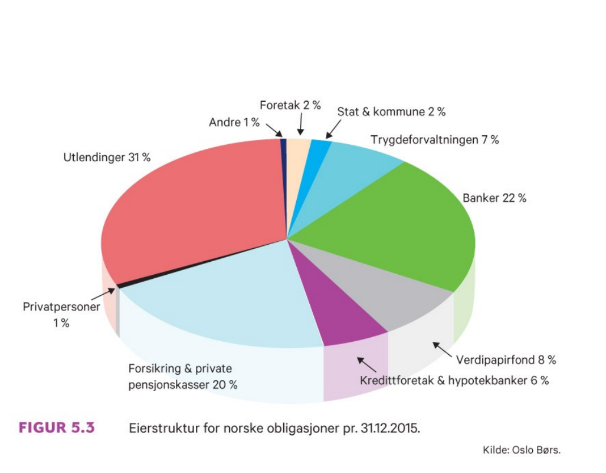

```{r xaringan-tile-view, echo=FALSE, message=FALSE, warning=FALSE}
xaringanExtra::use_editable(expires = 1)
xaringanExtra::use_tile_view()
#xaringanExtra::use_share_again()
xaringanExtra::use_scribble()
xaringanExtra::use_webcam()
#xaringanExtra::use_slide_tone()
xaringanExtra::use_panelset()
library(htmlTable)
library(magrittr)
library(xaringan)
```

```{r eval=FALSE, include=FALSE}
xaringan::inf_mr("dagens.Rmd")
```

---

class: inverse, center, middle

# Forelesning 6: `r tema[6]` 


**Læringsmål:**

- Redegjøre for hovedkjennetegn ved ordinære lån, obligasjonslån og konvertible lån.
- Beregne markedsverdi og effektiv rente for en obligasjon.
- Finne terminrenter fra spotrenter samt beregne durasjon (varighet) og rentefølsomhet for en obligasjon.
- Lage en balanseoppstilling basert på bokverdier og markedsverdier.
- Redegjøre for egenkapitalemisjoner og kjøp av egne aksjer samt beregne verdien av en tegningsrett.
- Forklare de økonomiske effektene av aksjesplitter og fondsemisjoner.

`r paste("Oppdatert:",Sys.Date())`

---

## Kapitalmarkedet

```{r, echo=FALSE, out.width="50%", fig.cap=""}

```

```{r, echo=FALSE, out.width="50%", fig.cap=""}
knitr::include_graphics("pensum/figurer-30.png")
```

---

```{r, echo=FALSE, out.width="50%", fig.cap=""}

```

```{r, echo=FALSE, out.width="50%", fig.cap=""}
knitr::include_graphics("pensum/figurer-32.png")
```

---

### Omsetning av gjeld

```{r, echo=FALSE, out.width="50%", fig.cap=""}

```

```{r, echo=FALSE, out.width="50%", fig.cap=""}

```

### Omsetning av egenkapital

---

## Gjeld

### Ordinære lån

---

### Obligasjonslån

Figurpakke 1

```{r, echo=FALSE, out.width="50%", fig.cap=""}

```

```{r, echo=FALSE, out.width="50%", fig.cap=""}
knitr::include_graphics("pensum/figurer-32.png")
```

---

Figurpakke 2

```{r, echo=FALSE, out.width="50%", fig.cap=""}

```

```{r, echo=FALSE, out.width="50%", fig.cap=""}

```
---

**Beregning av obligasjonspris** 

\begin{equation}
P_0=\sum_{t=1}^{T}\frac{Mr_k/n}{(1+r/n)^{t}} + \frac{M}{(1+r/n)^T} = \\ 
\frac{Mr_k/n}{(1+r/n)^{1}} + \frac{Mr_k/n}{(1+r/n)^{2}} + ... + \frac{Mr_k/n}{(1+r/n)^{T}}+\frac{M}{(1+r/n)^T} 
\end{equation}

**Null-kupong obligasjoner** 

\begin{equation}
P_0=\frac{M}{(1+r/n)^T} 
\end{equation}

**Beregning av effektiv rente**

Løse uttrykkene ovenfor mhp. r.

---

**Eksempel 5.1**

---

```{r, echo=FALSE, out.width="50%", fig.cap=""}
knitr::include_graphics("pensum/figurer-35.png")
```

---

### Konvertible obligasjoner

---

### Terminstruktur

**Beregning av spotrente og implisitte renter**
A=B

**Beregning av inflasjonsforventningene**


---

```{r, echo=FALSE, out.width="50%", fig.cap=""}
knitr::include_graphics("pensum/figurer-36.png")
```

```{r, echo=FALSE, out.width="50%", fig.cap=""}
knitr::include_graphics("pensum/figurer-37.png")
```


---


### Renterisiko og durasjon

**Beregning av durasjon**

$$\frac{\Delta P_0}{\Delta r}=$$

\begin{equation}
\Delta P_o=\sum_{t=1}^{T}\frac{Mr_k/n}{(1+r/n)^{t}} + \frac{M}{(1+r/n)^T} =  
\end{equation}

\begin{equation}
\frac{\Delta P_o}{P_o}=\frac{1}{2}D
\end{equation}

Hvor
\begin{equation}
D=1+2+3+...+T
\end{equation}

---

```{r, echo=FALSE, out.width="50%", fig.cap=""}
knitr::include_graphics("pensum/figurer-38.png")
```

---

## Bokverdier kontra markedsverdier

```{r, echo=FALSE, out.width="50%", fig.cap=""}
knitr::include_graphics("pensum/figurer-40.png")
```

---

## Egenkapital

#### Beregning av tegningsrettigheter

\begin{equation}
\Delta P_x=
\end{equation}
\begin{equation}
\Delta P_x=
\end{equation}
\begin{equation}
\Delta T_n=
\end{equation}

**Eksempel 5.12**

### Tilbakekjøp av egne aksjer

### Aksjesplitt og fondsemisjon

```{r, echo=FALSE, out.width="50%", fig.cap=""}
knitr::include_graphics("pensum/figurer-39.png")
```


