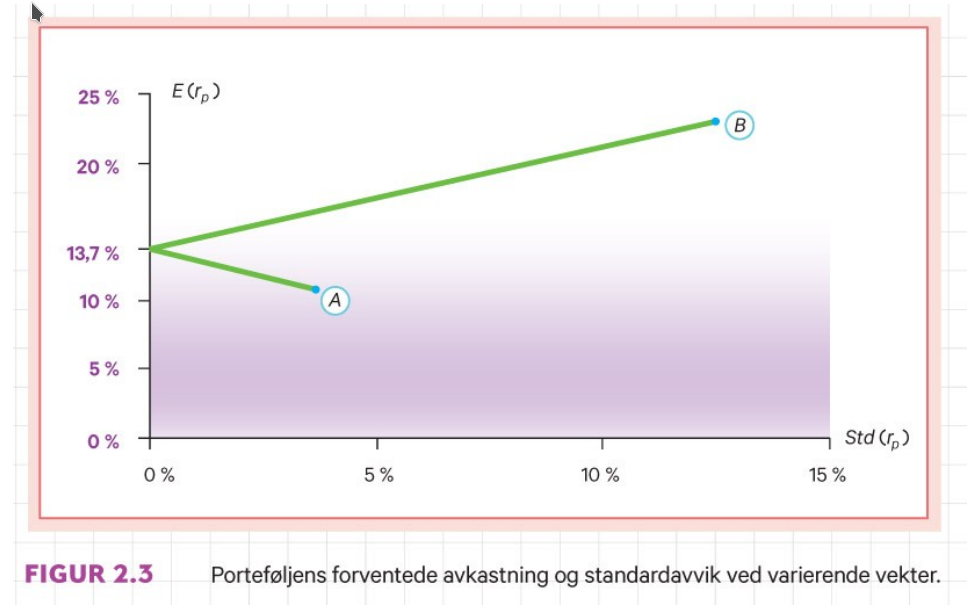

```{r xaringan-tile-view, echo=FALSE, message=FALSE, warning=FALSE}
xaringanExtra::use_editable(expires = 1)
xaringanExtra::use_tile_view()
#xaringanExtra::use_share_again()
xaringanExtra::use_scribble()
xaringanExtra::use_webcam()
#xaringanExtra::use_slide_tone()
xaringanExtra::use_panelset()
library(htmlTable)
library(magrittr)
library(xaringan)
library(plotly)
```

```{r eval=FALSE, include=FALSE}
xaringan::inf_mr("presentations.Rmd")
xaringan::inf_mr("dagens.Rmd")
servr::daemon_stop()
```

```{r echo=FALSE, message=FALSE, warning=FALSE}
source("timeplan.R")
```

---

class: inverse, center, middle

# Forelesning 2: `r tema[2]`

**Læringsmål:**

-  Forklare gjennom et eksempel hvorfor et prosjekt som er risikabelt vurdert alene kan ha lav risiko når prosjektet inngår i en portefølje.
-  Tallfeste risiko i en portefølje ved å beregne standardavvik.
-  Forklare hvorfor porteføljens risiko avhenger av samvariasjonen mellom prosjektene som inngår i porteføljen og de andelene som er investert i hvert prosjekt.
---

## Prosjektrisiko for eierne vs. bedriften

Grunnleggende forutsetning: Ledelsen i bedriften har som oppgave å treffe beslutninger som maksimerer verdien av egenkapitalen til eierne. 

Vi tar utgangspunkt i følgende tabell
```{r, echo=FALSE, out.width="25%"}
dfn12 <- data.frame(prob=c(0.20,30,50),
		    beskr=c("Nedgangstid","Trend","Oppgangstid"),
		    tilstand=c(1,2,3),
		    bedriften=c(-60,5,60),
		    nyttprosj=c(30,2.5,-30),
		    portefoljen_ikkediv=c(-60,5,60),
		    portefoljen_div=c(10,5,-10))
g1 <- ggplot(data=dfn12, aes(x=beskr, y=nyttprosj)) + geom_bar(stat="identity")
g2 <- ggplot(data=dfn12, aes(x=beskr, y=bedriften)) + geom_bar(stat="identity")
g3 <- ggplot(data=dfn12, aes(x=beskr, y=portefoljen_ikkediv)) + geom_bar(stat="identity")
g4 <- ggplot(data=dfn12, aes(x=beskr, y=portefoljen_div)) + geom_bar(stat="identity")
htmlTable(dfn12, header=c("Sannsynl.","Tilstandsb.","Tilstand","Nytt prosjekt","Bedriftens portefølje","Eierens portefølje (ikke div.)", "Eierens portefølje (div.)"))
```

---

### Risiko for bedriften

De nye prosjektets bidrag til bedriftens kontantstrøm

```{r, echo=FALSE, out.width="45%"}
gridExtra::grid.arrange(g1,g2,ncol=2)
```

---

### Risiko for eierne

- Udeversifiserte eiere: 
  - Ser forventet kontantstrøm fra det nye prosjektet i sammenheng med bedriftens allerede eksisterende kontantstrøm

```{r, echo=FALSE, out.width="20%"}
gridExtra::grid.arrange(g1,g3,ncol=2)
```

- Veldiversifiserte eiere: 
  - Ser forventet kontantstrøm fra det nye prosjektet i sammenheng med porteføljens eksisterende kontantstrøm

```{r, echo=FALSE, out.width="20%"}
gridExtra::grid.arrange(g1,g4,ncol=2)
```

---

## Måling av risiko 

**Metode 1 for måling av risiko (1-n investeringsobjekter)**
- Varians
\begin{equation}
Var(X)=\sum_{s=1}^{S}Pr(s)[X(s)-E(X)]^2=\\ Pr(1)[X(1)-E(X)]^2+Pr(2)[X(2)-E(X)]^2+...+\\Pr(S)[X(S)-E(X)]^2
\end{equation}
- Standardavvik
\begin{equation}
Std(X)=\sqrt{Var(X)}
\end{equation}

Merk: Mens standardavviket gir oss samme benevning som forventet verdi, er benevningen til variansen vanskeligere å forholde seg til ("tolkning: Det kvadrerte til benevningen av standardavviket")


---

**Metode 2 for måling av risiko (2 investeringsobjekter)**
- Varians
\begin{equation}
Var(r_p)=w_1^2Var(r_1)w^2_2Var(r_2)+2w_1w_2Kov(r_1,r_2)
\end{equation}
Hvor samvariasjonen er gitt ved
\begin{equation}
Kov(r_1,r_2)=\sum_{s=1}^{S}Pr(s)[r_1(s)-E(r_1)][r_2(s)-E(r_1)] \\
Pr(1)[r_1(1)-E(r_1)][r_2(1)-E(r_1)]+\\Pr(2)[r_1(2)-E(r_1)][r_2(2)-E(r_1)]+...+ \\ Pr(S)[r_1(S)-E(r_1)][r_2(S)-E(r_1)] 
\end{equation}

- Standardavviket
\begin{equation}
Std(r_p)=\sqrt{Var(r_p)}
\end{equation}

---

## Måling av risiko
### Enkelobjekter

**Eksempel 2.1**
```{r, echo=F}
# Data input
df_eks_2_1 <- data.frame(tilstand=c(1,2,3),
                         prob=c(0.2,0.5,0.3),
                         avk_a=c(0.16,0.12,0.06),
                         avk_b=c(0.05,0.20,0.40)
                         )
ex_a <- c(df_eks_2_1$avk_a%*%df_eks_2_1$prob)
ex_b <- c(df_eks_2_1$avk_b%*%df_eks_2_1$prob)
vx_a <- c((df_eks_2_1$avk_a-ex_a)^2%*%df_eks_2_1$prob)
vx_b <- c((df_eks_2_1$avk_b-ex_b)^2%*%df_eks_2_1$prob)
htmlTable(df_eks_2_1, header=c("Tilstand","Sansynlighet","A","B"))
```

---

Fra Metode 1 oppgitt under første forelesning har vi at 

$$E(r_a)=0.2\cdot 0.16+0.5\cdot 0.12+0.3\cdot 0.06=0.11$$ 
$$E(r_b)=0.2\cdot 0.05+0.5\cdot 0.20+0.3\cdot 0.40=0.23$$

Fond **A**
\begin{equation*}
Var(r_a) =0.2[0.16-0.11]^2+0.5[0.12-0.11]^2+0.3[0.06-0.11]^2=0.0013 \\
Std(r_a)=\sqrt{0.0013}=0.03605551
\end{equation*}

Fond **B**
\begin{equation*}
Var(r_b) =0.2[0.05-0.23]^2+0.5[0.20-0.23]^2+0.3[0.40-0.23]^2=0.0156 \\
Std(r_b)=\sqrt{0.0156}=0.1249
\end{equation*}

---

## Måling av risiko
### Sammensatt fond 

Vi antar nå at investeringsbeløpet er likt fordelt mellom de to fondene, dvs $w_1=1/2,w_2=1-w_2=1/2$. 

```{r, echo=F}
# Portefølje: 1-2
w <- c(0.50,0.50)
## Metode 1
df_eks_2_1_w <- df_eks_2_1 %>%
  dplyr::mutate(wa=w[1],wb=w[2]) %>%
  dplyr::mutate(avk_c=avk_a*wa+avk_b*wb)

ex_c <- c(df_eks_2_1_w$avk_c%*%df_eks_2_1_w$prob)
vx_c <- c((df_eks_2_1_w$avk_c-ex_c)^2%*%df_eks_2_1_w$prob)
# Covarnaise missing
htmlTable(df_eks_2_1_w, header=c("Tilstand","Sansynlighet","Avk. A","Avk. B", "w_a","w_b","Avk. C"))
```

Risikoen til det sammensatte fondet C kan måles ved bruk av både metode 1 og 2.

---

**Metode 1**
\begin{equation*}
Var(r_c) =0.2[0.016-0.02]^2+0.5[0.016-0.02]^2+0.3[0.016-0.02]^2=0.001975\\
Std(r_c)=\sqrt{0.001975}=0.044
\end{equation*}

**Metode 2**
\begin{equation*}
Var(r_c) =(1/2)^2(0.0013)+(1/2)^2(0.0156)-2(1/2)(1/2)0.045=0.001975 \\
Std(r_c)=\sqrt{0.001975}=0.044
\end{equation*}

Hvor vi har benyttet at
\begin{equation*}
Kov(r_a,r_b) = 0.2[0.16-0.11][0.05-0.23]+0.5[0.12-0.11][0.20-0.23]+\\
0.3[0.06-0.11][0.40-0.23]=-0.0045\\
\end{equation*}

```{r, echo=F, eval=F}
0.2*(0.16-0.11)*(0.05-0.23)+
0.5*(0.12-0.11)*(0.20-0.23)+
0.3*(0.06-0.11)*(0.40-0.23)
#
(1/2)^2*(0.0013)+(1/2)^2*(0.0156)-2*(1/2)*(1/2)*0.0045
cx_c <- c(((df_eks_2_1_w$avk_a-ex_a)*
	   (df_eks_2_1_w$avk_b-ex_b))%*%df_eks_2_1_w$prob)
#m <- as.matrix(df_eks_2_1_w[,c(3,4)])
#v <- as.vector(df_eks_2_1_w[,c(2)])
#cov.wt(m,v)$cov
```

---

## Risikoholdning og risikokompensasjon

### Holdning

Vi kan skille mellom *risiknøytrale* og *risikoaversje* aktører

- Risikonøytral kun opptatt av forventet avkastning (+)
	- Bedre ut: Nordover et diagram med risiko på x-aksen og forventet avkastning på y-aksen
- Risikoaversj opptatt av forholdet mellom forventet avkastning (+) og risiko (-)
	- Bedre ut: Nordøstover i et diagram med risiko på x-aksen og forventet avkastning på y-aksen

I dette kurset legger vi til grunn at alle aktørene er risikoaversje (ikke villig til å bære usikkerhet gratis), men at graden av risikoaversjon kan variere mellom de ulike aktørene.

---

```{r, echo=FALSE, out.width="75%", fig.cap=""}
knitr::include_graphics("pensum/figurer-04.png")
```

---

### Risikokompenasjon (litt empiri)

Finner man igjen dette i det observerte tallmateriale?

#### Veldiversifisert portefølje

```{r, echo=F}
velportf <- data.frame(label=c("Risikofri rente","Aksjeindeks"),gjsnitt=c(0.015,0.068),stavviks=c(0.01,0.127)) 
htmlTable(velportf, header=c("","Gjennomsnitt","Standardavvik"))
```

#### Udiversifisert portefølje

```{r, echo=F}
udiportf <- data.frame(label=c("Yara","Itera","Aker Solutions","","Portefølje (3 aksjer)"),gjsnitt=c(0.07,0.07,0.08,NA,0.07),stavviks=c(0.29,0.27,0.31,NA,0.21)) 
htmlTable(udiportf, header=c("","Gjennomsnitt","Standardavvik"))
```

---

**Hovedresultater fra undersøkelsen**

1. Det er mye å hente ved diversifisering: Risikoen kan reduseres kraftig uten at du taper noe i form av lavere forventet avkastning
2. Risikokompensasjonen for en enkeltaksje er ikke knyttet til aksjens standardavvik (totalrisiko). Relevant risiko må derfor måles på andre måter.

---

## Endring av porteføljevekter og samvariasjon

### Porteføljevekter


```{r, echo=FALSE, out.width="75%", fig.cap=""}

```

---

**Øvelse:** Forsøk å repliker følgende resultater i Excel

.panelset[
.panel[.panel-name[Tabell]
```{r, echo=F}
htmlTable(df_eks_2_1, header=c("Tilstand","Sannsynlighet","Avkastning A", "Avkastning B"))
```
]
.panel[.panel-name[R-kode (ikke pensum)]
```{r}
plotwf <- c(-1) %>% purrr::map_dfr(function(r,df=df_eks_2_1){
	w <- seq(0,1,0.01)
	v <- as.vector(df[,(2)])
	m <- as.matrix(df[,(3:4)])
	covall <- cov.wt(m,v,method='ML')
	avk <- as.vector(covall$center)
	kov <- covall$cov[lower.tri(covall$cov)] 
	var <- as.vector(diag(as.matrix(covall$cov)))
	avkdf <- data.frame(corr=r,w1=1-w, w2=w) %>%
 		dplyr::mutate(forvavk=w1*avk[1]+w2*avk[2]) %>%
 		dplyr::mutate(varians=w1^2*var[1]+w2^2*var[2]+2*w1*w2*r*sqrt(var[1])*sqrt(var[2])) %>%
 		dplyr::mutate(stdavk=sqrt(varians))
			 }
)
```
]
.panel[.panel-name[Figur]
```{r}
gg <- ggplot2::ggplot(data=plotwf,ggplot2::aes(x=stdavk,y=forvavk)) + ggplot2::geom_point() 
plotly::ggplotly(gg)
```
]
]

---

### Korrelasjonskoeffisienten (standardisert mål på samvariasjon)

\begin{equation}
Kor(r_a,r_b)=\frac{Kov(r_a,r_b)}{S(r_a)S(r_b)}
\end{equation}

- $Kor(r_a,r_b)=1$ (helt avhengige)
- $Kor(r_a,r_b)=0$ (helt uavhengige)
- $Kor(r_a,r_b)=-1$ (helt motsatt avhengige)

Løser denne for $Kov(r_a,r_b)=Kor(r_a,r_b)S(r_a)S(r_b)$

Som gjør at vi kan skrive
\begin{equation}
Var(r_p)=w_1^2Var(r_1)w^2_2Var(r_2)+2w_1w_2Kor(r_a,r_b)S(r_a)S(r_b)
\end{equation}

---

Holder vi oss til eksempel 2.1, innebærer dette at beregningene av porteføljevariansen også kan uttrykkes som
\begin{equation*}
Kor(r_a,r_b)=\frac{-0.0045}{0.036\cdot 0.125}=-1
\end{equation*}

Mens variansen til porteføljen kan uttrykkes som
\begin{equation*}
Var(r_p)=(1/2)^2(0.0013)+(1/2)^2(0.0156)-2(1/2)(1/2)0.036\cdot 0.125 \\ 0.001975
\end{equation*}

---

```{r, echo=FALSE, out.width="75%", fig.cap=""}
knitr::include_graphics("pensum/figurer-05.png")
```

---


```{r, echo=FALSE, out.width="75%", fig.cap=""}
knitr::include_graphics("pensum/figurer-07.png")
```

---

**Øvelse:** Forsøk å replikere følgende tabell i Excel

.panelset[
.panel[.panel-name[Tabell]
```{r, echo=F}
htmlTable(df_eks_2_1, header=c("Tilstand","Sannsynlighet","Avkastning A", "Avkastning B"))
```
]
.panel[.panel-name[R-kode (ikke pensum)]
```{r}
plotwf <- c(-1,0,1) %>% purrr::map_dfr(function(r,df=df_eks_2_1){
	w <- seq(0,1,0.01)
	v <- as.vector(df[,(2)])
	m <- as.matrix(df[,(3:4)])
	covall <- cov.wt(m,v,method='ML')
	avk <- as.vector(covall$center)
	kov <- covall$cov[lower.tri(covall$cov)] 
	var <- as.vector(diag(as.matrix(covall$cov)))
	avkdf <- data.frame(corr=r,w1=1-w, w2=w) %>%
 		dplyr::mutate(forvavk=w1*avk[1]+w2*avk[2]) %>%
 		dplyr::mutate(varians=w1^2*var[1]+w2^2*var[2]+2*w1*w2*r*sqrt(var[1])*sqrt(var[2])) %>%
 		dplyr::mutate(stdavk=sqrt(varians))
			 }
)
```

]
.panel[.panel-name[Figur]
```{r}
ggf <- ggplot2::ggplot(data=plotwf,ggplot2::aes(x=stdavk,y=forvavk, group_by=corr)) + ggplot2::geom_point() 
plotly::ggplotly(ggf)
```
]
]
