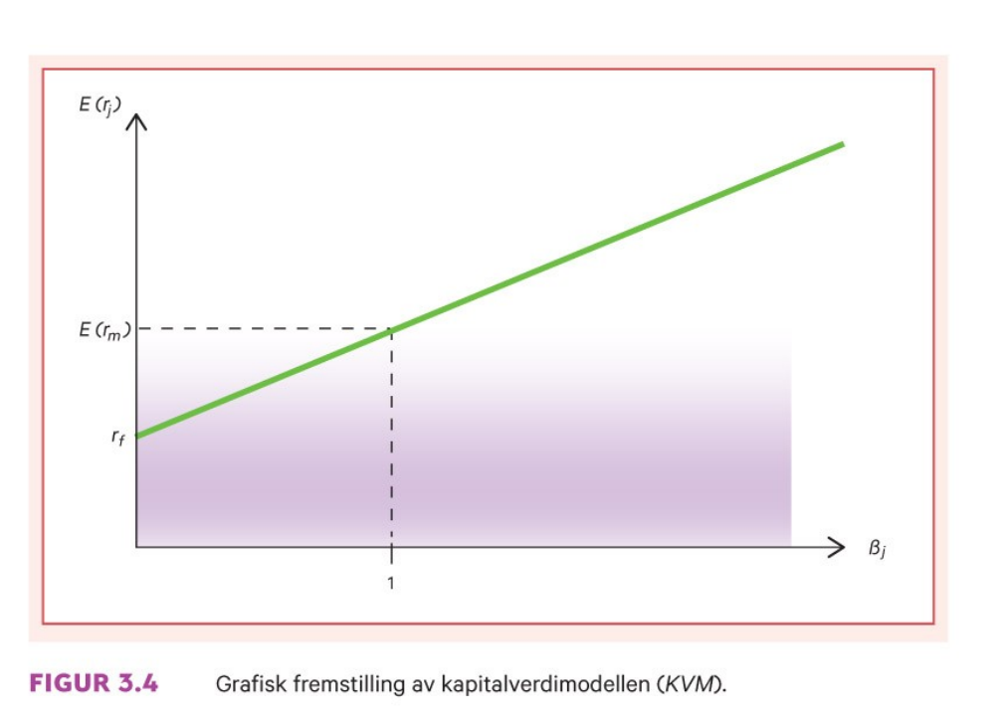

```{r xaringan-tile-view, echo=FALSE, message=FALSE, warning=FALSE}
xaringanExtra::use_editable(expires = 1)
xaringanExtra::use_tile_view()
#xaringanExtra::use_share_again()
xaringanExtra::use_scribble()
xaringanExtra::use_webcam()
#xaringanExtra::use_slide_tone()
xaringanExtra::use_panelset()
library(htmlTable)
library(magrittr)
library(xaringan)
```{r eval=FALSE, include=FALSE}
xaringan::inf_mr("dagens.Rmd")
```

---


```{r include=FALSE}
#library("magrittr")  
#toc <- readLines("dagens.Rmd")
#tocc <- character()
# 
#for (i in 1:3) {
#  if(substr(toc[i][1], 1, 2) == "# ") {
#    toc[i] <- gsub("# ", "", toc[i], fixed = TRUE) %>% 
#                 gsub("#", "", ., fixed = TRUE) %>%
#                 paste0("     ", .)
#     tocc <- append(tocc, toc[i])
#   }
#}
# 
#text <- paste(tocc[-1], "\n")[c(-1)]
#yy <- seq(.9, 0, length = length(text))
```
 
 # Outline Testing
 
```{r echo=FALSE}
#plot(x = rep(0.2, length(text)), y = yy * 1.035, 
#     xlim = c(0, 1), ylim = c(-0.1, 1), xlab = "", ylab = "", axes = FALSE, 
#     col = "#056EA7", type = "p", pch = 16)
#text(x = 0.2, y = yy, labels = text, adj = 0, col = "black")
```


---

class: inverse, center, middle

# Forelesning 5: `r tema[5]` 

**Læringsmål:**

- Skrive opp kapitalverdimodellen og forklare modellens økonomiske innhold.
- Forklare forskjellen mellom kapitalkostnaden for bedriften og kapitalkostnaden for et enkeltstående prosjekt i bedriften.
- Beskrive kapitalverdimodellens sterke og svake sider.
- Forklare hva slags type risiko følsomhetsanalyse og beslutningstre tar hensyn til.

`r paste("Oppdatert:",Sys.Date())`

---

## Kapitalverdimodellen (KVM)

Porteføljeteorien som vi har analysert til nå bygger på eksplisitte forutsetninger om:

- Investorene
 - Risikoaversjon (forventning-varians/standardavvik-kriteriet)
 - Alle investorene har samme én periodiske tidshorisont og prognoser om forventet avkastning
- Kapitalmarkedet
 - Alle investorer kan låne og spare i kapitalmarkedet til den samme risikofrie rente
 - Informasjonen er fritt tilgjengelig for alle
 - Tilbudet av alle eiendeler er gitt

*Kapitalverdimodellen* (KVM) er basert på porteføljeteorien, men inneholder i tillegg forutsetningen om at: 
- Kapitalmarkedet er i likevekt

---

Fra **eksempel 3.3** i læreboka har vi at markedet består tre selskaper(1,2 og 3) og to investorer (A og B). Investor A ønsker å plassere 3000,- mens B plasserer 9000,-. Verdien på de tre selskapene er gitt ved 

```{r, echo=F}
radnr_i <- c("Etterspørsel A",
	   "Etterspørsel B",
	   "Samlet etterspørsel",
	   "Tilbud")
radnr_ii <- c("Selskap 1",
	   "Selskap 2",
	   "Selskap 3",
	   "")
tils1 <- c(3000,9000,9000,12000)
tils2 <- c(2000,6000,4000,0)
df_prosj_kontantstrøm <- data.frame(radnr_i,tils1,radnr_ii,tils2)
htmlTable(df_prosj_kontantstrøm, header=c("","Markedsplassen","","Verdi EK"))
```

---

Med hensyn til fordelingen av investeringsbeløpene kan vi se for oss to forskjellige situasjoner

- Situasjon 1 (likeveid): Investorene setter like stort beløp hvert selskap
	- $w=(4000/12000,4000/12000,4000/12000)=(1/3,1/3,1/3)$

```{r, echo=F}
radnr_i <- c("Etterspørsel A",
	   "Etterspørsel B",
	   "Samlet etterspørsel",
	   "Tilbud")
w1 <- c(1000,3000,4000,2000)
w2 <- c(1000,3000,4000,6000)
w3 <- c(1000,3000,4000,4000)
df_prosj_kontantstrøm_lik <- data.frame(radnr_i,w1,w2,w3)
htmlTable(df_prosj_kontantstrøm_lik, header=c("","w_1=1/6","w_2=1/6","w_3=1/6"))
```
	- Ikke forenlig med likevekt

---

- Situasjon 2 (verdiveid): Investorene setter det *verdiveide* beløp i hvert selskap
	- $w=(2000/12000,6000/12000,4000/12000)=(1/6,3/6,2/6)$

```{r, echo=F}
radnr_i <- c("Etterspørsel A",
	   "Etterspørsel B",
	   "Samlet etterspørsel",
	   "Tilbud")
w1 <- c(500,1500,2000,2000)
w2 <- c(1500,4500,6000,6000)
w3 <- c(1000,3000,4000,4000)
df_prosj_kontantstrom_ver <- data.frame(radnr_i,w1,w2,w3)
htmlTable(df_prosj_kontantstrom_ver, header=c("","w_1=1/6","w_2=3/6","w_3=2/6"))
```
	- Forenlig med likevekt
Situasjon 2 gir oss *markedsporteføljen (M)* (dvs. den verdiveide)


---

### Risiko og kapitalkostnad i likevekt

Samlet sett gir .. + .. prising av aksjer i likevekt (forholdet mellom risiko og forventet avkastning). 
Prising av enkeltakjser (formelt) er gitt ved.

\begin{equation}
E(r_p)=r_f+\beta_j[E(r_m) - rf] \\
\end{equation}

Grafisk lar seg illustrere ved den grønne *verdipapirmarkedslinjen)*

```{r, echo=FALSE, out.width="45%", fig.cap=""}

```

KVM forteller oss hva en investor kan regne med av forventet avkastning i aksjemarkedet dersom vedkommende bære en bestemt mengde systematisk risiko

---

### Litt empiri 

**Markedsporteføljen (verdiveide)**

```{r, echo=FALSE, out.width="55%", fig.cap=""}
knitr::include_graphics("pensum/figurer-19.png")
```

Som gir oss i real makrosørrelsene (realisert)

- Markedets risikofri realrente: $0.032$
- Markedets risikopremie: $0.064$

---

**enkeltaksjer**

```{r, echo=FALSE, out.width="55%", fig.cap=""}
knitr::include_graphics("pensum/figurer-20.png")
```

---

### Kapitalkostnad for egenkapital og gjeld

- Kapitalkostnad for egenkapital 

\begin{equation}
k_E=r_f+\beta_E[E(r_m) - rf] 
\end{equation}

- Kapitalkostnad for gjeld


\begin{equation}
k_G=r_f+\beta_G[E(r_m) - rf] 
\end{equation}

- Totalkapitalkostnadnen (gjennomsnittskostnaden) for egenkapital og gjeld

\begin{equation}
k_T= k_E\underset{=w_E}{\frac{E}{E+G}} + 
k_G(1-s)\underset{=w_G}{\frac{G}{E+G}}
\end{equation}

\begin{equation}
k_T= k_Ew_E + k_G(1-s)w_G
\end{equation}

---

Fra **eksempel 3.3l** i læreboka 


---

## Kapitalkostnad for nye prosjekter

---


## Diversifisering bedrift vs. eier

Kongomerat

Nåverdi 

teller vs. nevner


---

## Informasjonseffisiens

```{r, echo=FALSE, out.width="55%", fig.cap=""}
knitr::include_graphics("pensum/figurer-21.png")
```

- *Svak effisiens:*
- *Halvsterk effisiens:*
- *Sterk effisiens:*
- i1+i2

---

```{r, echo=FALSE, out.width="55%", fig.cap=""}
knitr::include_graphics("pensum/figurer-22.png")
```

---


## Svake og sterk sider ved KVM

---

```{r, echo=FALSE, out.width="55%", fig.cap=""}
knitr::include_graphics("pensum/figurer-23.png")
```

---

## Alternativer

1. Følsomhetsanalsye
1. Scenarioanalyse
1. Simulering
1. Beslutningstre

```{r, echo=FALSE, out.width="55%", fig.cap=""}
knitr::include_graphics("pensum/figurer-24.png")
```

---

