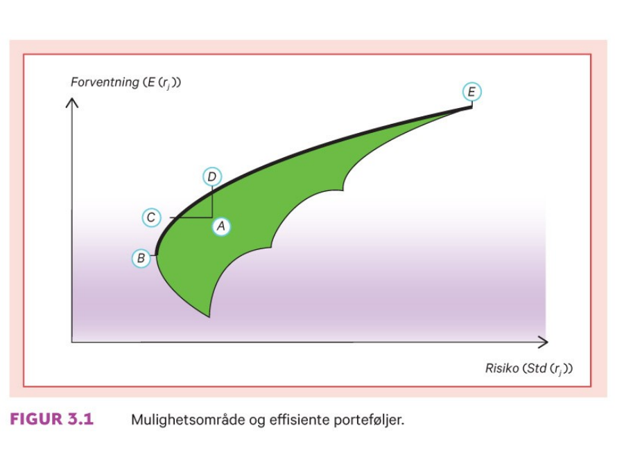
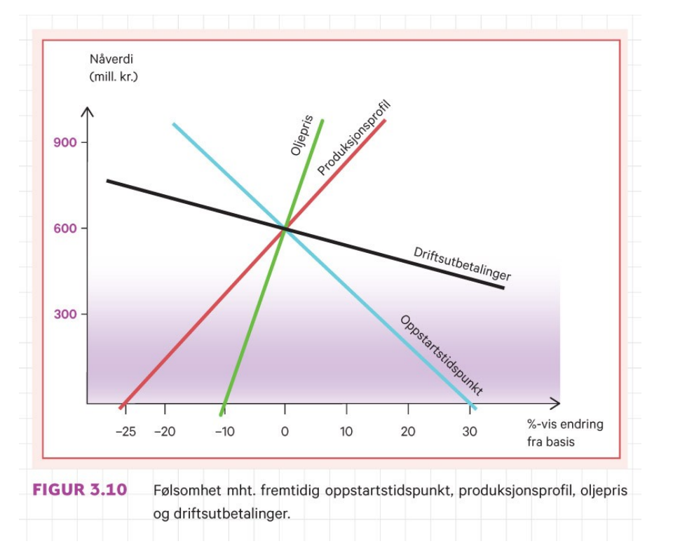

```{r xaringan-tile-view, echo=FALSE, message=FALSE, warning=FALSE}
xaringanExtra::use_editable(expires = 1)
xaringanExtra::use_tile_view()
#xaringanExtra::use_share_again()
xaringanExtra::use_scribble()
xaringanExtra::use_webcam()
#xaringanExtra::use_slide_tone()
xaringanExtra::use_panelset()
library(htmlTable)
library(magrittr)
library(xaringan)
library(plotly)
```

```{r eval=FALSE, include=FALSE}
xaringan::inf_mr("dagens.Rmd")
servr::daemon_stop()
```

```{r echo=FALSE, message=FALSE, warning=FALSE}
source("timeplan.R")
```

## Timeplan

```{r echo=F}
timep_i
```

---

```{r echo=F}
timep_ii
```

## Timeplan

```{r echo=F}
timep_i
```

---

```{r echo=F}
timep_ii
```

---


# Anbefalte oppgaver

```{r, echo=F}
oppgaveplan
```

---

# Pensumliste

.pull-left[

## Hovedbok


```{r, echo=FALSE, out.width="75%", fig.cap=""}
knitr::include_graphics("pensum/figurer-01.png")
```

[Finans: Teori og praksis. Bøhren, Michalsen og Norli](https://www.fagbokforlaget.no/Finans-Teori-og-praksis/I9788245022193)

]

.pull-right[

## Supplerende
```{r, echo=FALSE, out.width="25%", fig.cap=""}
knitr::include_graphics("pensum/falitt.jpg")
```

[fallitt-norske-finansielle-kriser](https://respublica.no/produkter/fallitt-norske-finansielle-kriser/)

]

---


# Anbefalte oppgaver

```{r, echo=F}
oppgaveplan
```

---

# Pensumliste

.pull-left[

## Hovedbok


```{r, echo=FALSE, out.width="75%", fig.cap=""}
knitr::include_graphics("pensum/figurer-01.png")
```

[Finans: Teori og praksis. Bøhren, Michalsen og Norli](https://www.fagbokforlaget.no/Finans-Teori-og-praksis/I9788245022193)

]

.pull-right[

## Supplerende
```{r, echo=FALSE, out.width="25%", fig.cap=""}
knitr::include_graphics("pensum/falitt.jpg")
```

[fallitt-norske-finansielle-kriser](https://respublica.no/produkter/fallitt-norske-finansielle-kriser/)

]

---

class: inverse, center, middle

# Forelesning 4: `r tema[4]`

**Læringsmål:**

- Forklare begrepene effisiente og ineffisiente porteføljer og konstruere slike porteføljer ut fra data.

`r paste("Oppdatert:",Sys.Date())`

---

## Effisiente porteføljer

### Effisienslinjen uten risikofritt alternativ

```{r, echo=FALSE, out.width="55%", fig.cap=""}

```

**Øvelse:**: Ta utgangspunkt i forventning-standardavvik-kriteriet, og forklar hvorfor kurven B-C-D-E utgjør et *effisient sett* av porteføljer.

---

### Effisienslinjen med risikofritt alternativ

```{r, echo=FALSE, out.width="55%", fig.cap=""}
knitr::include_graphics("pensum/figurer-16.png")
```

- Den blå linjen viser kombinasjoner av investeringer i risikofritt alternativ og den effiseinte akjseporteføljen C
 - Til venstre for C vil en andel av de oppsparte innvesteringsbeløpet plasseres i banken 
 - Til høyre for C, ingen sparing så akjseporteføljen blir der finansiert ved bruk av banklån   

---

- Den grønn linjen viser kombinasjoner av investeringer i risikofritt alternativ og den effisiente akjseporteføljen M
 - Til venstre for M vil en andel av de oppsparte innvesteringsbeløpet plasseres i banken 
 - Til høyre for M, ingen sparing så akjseporteføljen blir der finansiert ved bruk av banklån   

Merk: Vi forutsetter her (1) ingen kredittrestriksjoner og at (2) sparerenten er lik utlånsrenten

**Tofondsresultatet:**

1. Uansett graden av risikoaversjon, setter alle investorer sammen sin aksjeportefølje på nøyaktig samme måte.
1. Den enkelte investors risikoaversjon avgjør bare hvor mye som totalt skal satses på den risikable komponenten framfor den risikofrie. Ikke sammensetningen av den risikable komponenten.

**Øvelse:** Hvilken antagelse ligger implisitt til grunn under punkt 1 om investorenes forventninger?

---

### Utledning av kapitalmarkedslinjen (n=2, kombinasjon av risikofri investering og markedsporteføljen M

Forventet avkastning for porteføljen er gitt ved 

\begin{equation}
E(r_p)=wr_f+(1-w)E(r_m) 
\end{equation}

Mens variansen fremkommer som

\begin{equation}
Var(r_p)=(1-w)^2Var(r_m)
\end{equation}

Tar vi kvadratroten av denne på begge sider får vi

\begin{equation}
\frac{Std(r_p)}{Std(r_m)
}=(1-w) 
\end{equation}

Porteføljeavkastningen kan dekomponeres til å bestå av

$$
E(r_p)=wr_f+(1-w)E(r_m) + (r_f - r_f) 
$$

$$
E(r_p)=r_f+(1-w)(E(r_m) - r_f) 
$$

---

Kombinerer uttrykket for forventet avkastning og standardavvik ved å sett inn for $1-w$ gjør at vi kan skrive
\begin{equation}
E(r_p)=r_f+\frac{Std(r_p)}{Std(r_m)}(E(r_m) - r_f) \Leftrightarrow
\end{equation}

- Gitt at $0<w<1 \Rightarrow E(r_p) < E(r_m)$ 
- Gitt at $w=1 \Rightarrow E(r_p) = E(r_m)$
- Gitt at $w>1 \Rightarrow E(r_p) > E(r_m)$ 

```{r, echo=FALSE, out.width="55%", fig.cap=""}
knitr::include_graphics("pensum/figurer-17.png")
```

---

Fra eksempel 3.1-3.2 har vi følgende opplysninger

```{r, echo=F}
radnr <- c("Markedsporteføljen",
	   "Portefølje I",
	   "Portefølje I",
	   "Risikofri rente")
tils1 <- c(0.07,0.05,0.08,0.04)
tils2 <- c(0.03,0.02,0.06,0.00)
df_prosj_kontantstrøm <- data.frame(radnr,tils1,tils2)
htmlTable(df_prosj_kontantstrøm, header=c("","Forventet avkastning","Standardavik"))
```

- Vi har at investor A (stor grad av risikoaversjon) ønsker å plassere 80 prosent av formuen risikofritt
  -  $E(r_p)=0.8\cdot 0.04 + 0.2\cdot 0.07=0.046$ 
  -  $Var(r_p)=0.8^2\cdot 0 + 0.2^2\cdot 0.03^2 +2\cdot 0.8\cdot 0.4\cdot 0=0.00004$
  -  $Std(r_p)=\sqrt{0.00004}  =0.006$
- Vi har at investor B (liten grad av risikoaversjon) ønsker at risikoen i porteføljen skal være på 8.5%
  -  $0.085=w\cdot 0.04 +(1-w)0.2\cdot 0.07 \Leftrightarrow w =-0.5$ og $1-w=1.5$ 
  -  $Var(r_p)=-0.5^2\cdot 0 + 1.5^2\cdot 0.03^2 \cdot 0.07 + 2 \cdot 0.5\cdot 1.5\cdot 0=0.02$
  -  $Std(r_p)=\sqrt{.02}  =0.045$

---

class: inverse, center, middle

# Forelesning 5: `r tema[5]` 

**Læringsmål:**

- Skrive opp kapitalverdimodellen og forklare modellens økonomiske innhold.
- Forklare forskjellen mellom kapitalkostnaden for bedriften og kapitalkostnaden for et enkeltstående prosjekt i bedriften.
- Beskrive kapitalverdimodellens sterke og svake sider.
- Forklare hva slags type risiko følsomhetsanalyse og beslutningstre tar hensyn til.

`r paste("Oppdatert:",Sys.Date())`

---

## Kapitalverdimodellen


```{r, echo=FALSE, out.width="55%", fig.cap=""}
knitr::include_graphics("pensum/figurer-18.png")
```
---

### Kapitalkostnad for egenkapital og gjeld.

\begin{equation}
E(r_p)=r_f+\beta_j[E(r_m) - rf] \\
\end{equation}

\begin{equation}
k_E=r_f+\beta_E[E(r_m) - rf] 
\end{equation}

\begin{equation}
k_G=r_f+\beta_G[E(r_m) - rf] 
\end{equation}

\begin{equation}
k_T= k_E\underset{=w_E}{\frac{E}{E+G}} + 
k_G(1-s)\underset{=w_G}{\frac{G}{E+G}}
\end{equation}

\begin{equation}
k_T= k_Ew_E + k_G(1-s)w_G
\end{equation}

---

### Kapitalkostnad for nye prosjekter

```{r, echo=FALSE, out.width="55%", fig.cap=""}
knitr::include_graphics("pensum/figurer-19.png")
```
---

```{r, echo=FALSE, out.width="55%", fig.cap=""}
knitr::include_graphics("pensum/figurer-20.png")
```
---

### Risiko og kapitalkostnader

---

### Risiko og kapitalkostnader

---

## Informasjonseffisiens

```{r, echo=FALSE, out.width="55%", fig.cap=""}
knitr::include_graphics("pensum/figurer-21.png")
```

- *Svak effisiens:*
- *Halvsterk effisiens:*
- *Sterk effisiens:*


---

```{r, echo=FALSE, out.width="55%", fig.cap=""}
knitr::include_graphics("pensum/figurer-22.png")
```

---

## Oppsummering diskusjon I

---

```{r, echo=FALSE, out.width="55%", fig.cap=""}
knitr::include_graphics("pensum/figurer-23.png")
```

---

```{r, echo=FALSE, out.width="55%", fig.cap=""}

```

---

## Oppsummering diskusjon II

1. Følsomhetsanalsye
1. Scenarioanalyse
1. Simulering
1. Beslutningstre

---

# Huskeliste:
1. Datoer
1. Oljefondet strategi

cor(gensh_df_2$BTC,gensh_df_2$ETH)


De aller fleste eksamener arrangeres i eksamensperiodene – uke 48-51 i høst- og uke 18-24 i vårsemesteret. Alle høstens eksamensdatoer vil være publisert i Studentweb senest 15.september. Datoer for nye og utsatte eksamener på campus Halden høsten 2021 vil være klare i løpet av oktober. Datoer for nye og utsatte eksamener på campus Fredrikstad: sjekk med ditt studium.
