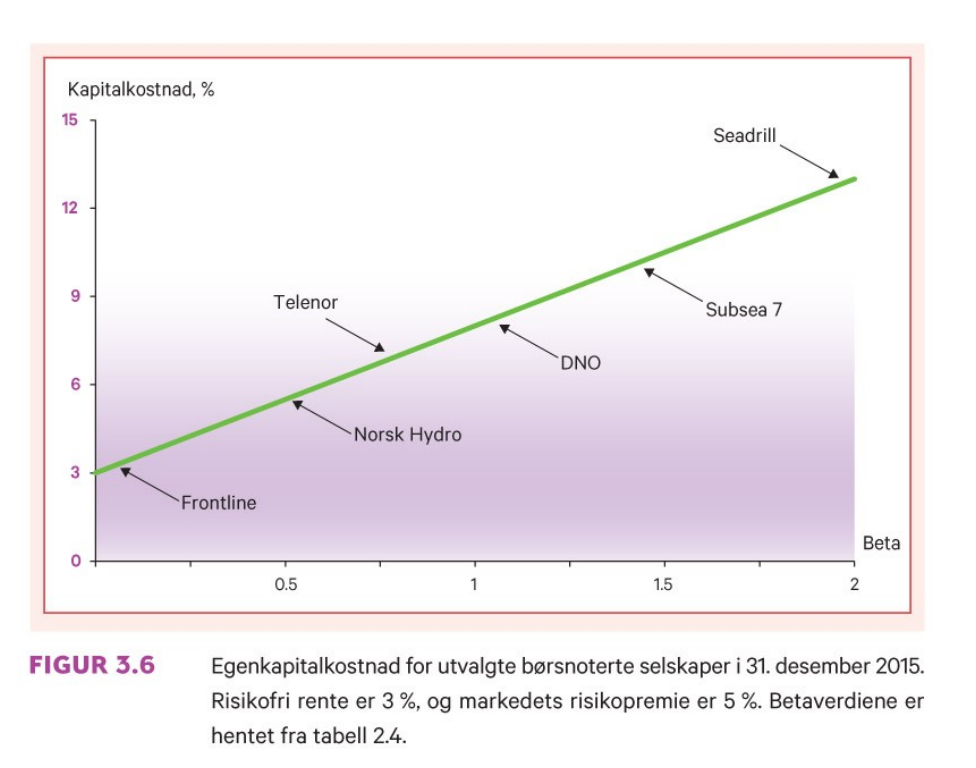
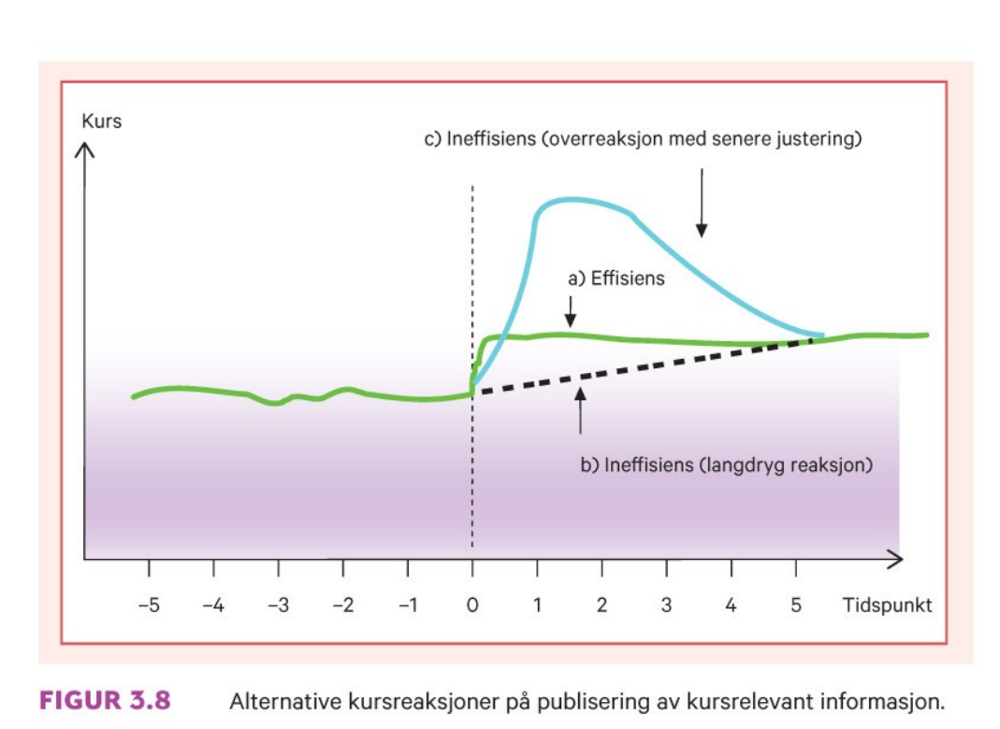

```{r xaringan-tile-view, echo=FALSE, message=FALSE, warning=FALSE}
xaringanExtra::use_editable(expires = 1)
xaringanExtra::use_tile_view()
#xaringanExtra::use_share_again()
xaringanExtra::use_scribble()
xaringanExtra::use_webcam()
#xaringanExtra::use_slide_tone()
xaringanExtra::use_panelset()
library(htmlTable)
library(magrittr)
library(xaringan)
library(plotly)
```

```{r eval=FALSE, include=FALSE}
xaringan::inf_mr("dagens.Rmd")
servr::daemon_stop()
```

```{r echo=FALSE, message=FALSE, warning=FALSE}
source("timeplan.R")
```

## Timeplan

```{r echo=F}
timep_i
```

---

```{r echo=F}
timep_ii
```

## Timeplan

```{r echo=F}
timep_i
```

---

```{r echo=F}
timep_ii
```

---


# Anbefalte oppgaver

```{r, echo=F}
oppgaveplan
```

---

# Pensumliste

.pull-left[

## Hovedbok


```{r, echo=FALSE, out.width="75%", fig.cap=""}
knitr::include_graphics("pensum/figurer-01.png")
```

[Finans: Teori og praksis. Bøhren, Michalsen og Norli](https://www.fagbokforlaget.no/Finans-Teori-og-praksis/I9788245022193)

]

.pull-right[

## Supplerende
```{r, echo=FALSE, out.width="25%", fig.cap=""}
knitr::include_graphics("pensum/falitt.jpg")
```

[fallitt-norske-finansielle-kriser](https://respublica.no/produkter/fallitt-norske-finansielle-kriser/)

]

---


# Anbefalte oppgaver

```{r, echo=F}
oppgaveplan
```

---

# Pensumliste

.pull-left[

## Hovedbok


```{r, echo=FALSE, out.width="75%", fig.cap=""}
knitr::include_graphics("pensum/figurer-01.png")
```

[Finans: Teori og praksis. Bøhren, Michalsen og Norli](https://www.fagbokforlaget.no/Finans-Teori-og-praksis/I9788245022193)

]

.pull-right[

## Supplerende
```{r, echo=FALSE, out.width="25%", fig.cap=""}
knitr::include_graphics("pensum/falitt.jpg")
```

[fallitt-norske-finansielle-kriser](https://respublica.no/produkter/fallitt-norske-finansielle-kriser/)

]

---

class: inverse, center, middle

# Forelesning 5: `r tema[5]` 

**Læringsmål:**

- Skrive opp kapitalverdimodellen og forklare modellens økonomiske innhold.
- Forklare forskjellen mellom kapitalkostnaden for bedriften og kapitalkostnaden for et enkeltstående prosjekt i bedriften.
- Beskrive kapitalverdimodellens sterke og svake sider.
- Forklare hva slags type risiko følsomhetsanalyse og beslutningstre tar hensyn til.

`r paste("Oppdatert:",Sys.Date())`

---

## Kapitalverdimodellen


```{r, echo=FALSE, out.width="55%", fig.cap=""}
knitr::include_graphics("pensum/figurer-18.png")
```
---

### Kapitalkostnad for egenkapital og gjeld.

\begin{equation}
E(r_p)=r_f+\beta_j[E(r_m) - rf] \\
\end{equation}

\begin{equation}
k_E=r_f+\beta_E[E(r_m) - rf] 
\end{equation}

\begin{equation}
k_G=r_f+\beta_G[E(r_m) - rf] 
\end{equation}

\begin{equation}
k_T= k_E\underset{=w_E}{\frac{E}{E+G}} + 
k_G(1-s)\underset{=w_G}{\frac{G}{E+G}}
\end{equation}

\begin{equation}
k_T= k_Ew_E + k_G(1-s)w_G
\end{equation}

---

### Kapitalkostnad for nye prosjekter

```{r, echo=FALSE, out.width="55%", fig.cap=""}
knitr::include_graphics("pensum/figurer-19.png")
```
---

```{r, echo=FALSE, out.width="55%", fig.cap=""}

```
---

### Risiko og kapitalkostnader

---

### Risiko og kapitalkostnader

---

## Informasjonseffisiens

```{r, echo=FALSE, out.width="55%", fig.cap=""}
knitr::include_graphics("pensum/figurer-21.png")
```

- *Svak effisiens:*
- *Halvsterk effisiens:*
- *Sterk effisiens:*


---

```{r, echo=FALSE, out.width="55%", fig.cap=""}

```

---

## Oppsummering diskusjon I

---

```{r, echo=FALSE, out.width="55%", fig.cap=""}

```

---

```{r, echo=FALSE, out.width="55%", fig.cap=""}
knitr::include_graphics("pensum/figurer-24.png")
```

---

## Oppsummering diskusjon II

1. Følsomhetsanalsye
1. Scenarioanalyse
1. Simulering
1. Beslutningstre

---

# Huskeliste:
1. Datoer
1. Oljefondet strategi

cor(gensh_df_2$BTC,gensh_df_2$ETH)


De aller fleste eksamener arrangeres i eksamensperiodene – uke 48-51 i høst- og uke 18-24 i vårsemesteret. Alle høstens eksamensdatoer vil være publisert i Studentweb senest 15.september. Datoer for nye og utsatte eksamener på campus Halden høsten 2021 vil være klare i løpet av oktober. Datoer for nye og utsatte eksamener på campus Fredrikstad: sjekk med ditt studium.
