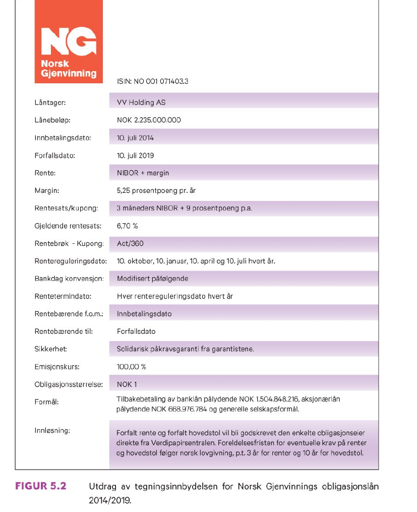
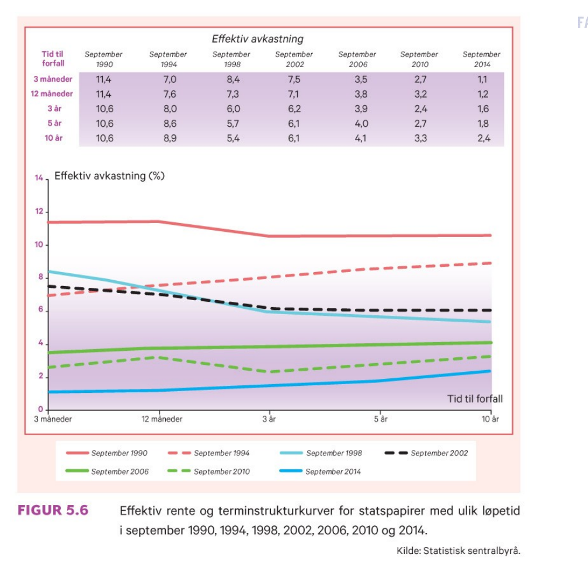
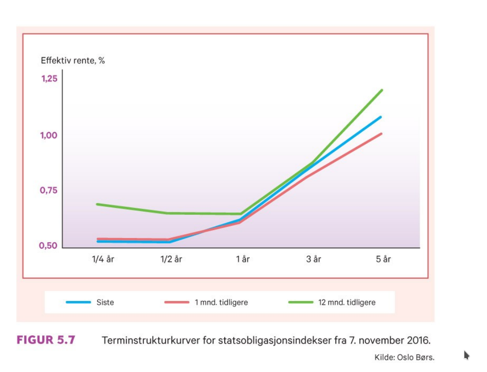
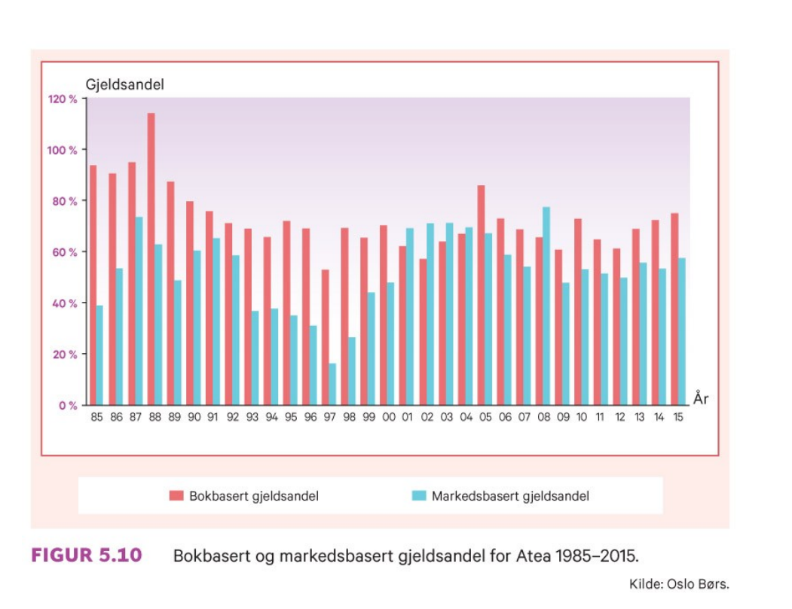

```{r xaringan-tile-view, echo=FALSE, message=FALSE, warning=FALSE}
xaringanExtra::use_editable(expires = 1)
xaringanExtra::use_tile_view()
#xaringanExtra::use_share_again()
xaringanExtra::use_scribble()
xaringanExtra::use_webcam()
#xaringanExtra::use_slide_tone()
xaringanExtra::use_panelset()
library(htmlTable)
library(magrittr)
library(xaringan)
```

```{r eval=FALSE, include=FALSE}
xaringan::inf_mr("dagens.Rmd")
```

---

class: inverse, center, middle

# Forelesning 6: `r tema[6]` 


**Læringsmål:**

- Redegjøre for hovedkjennetegn ved ordinære lån, obligasjonslån og konvertible lån.
- Beregne markedsverdi og effektiv rente for en obligasjon.
- Finne terminrenter fra spotrenter samt beregne durasjon (varighet) og rentefølsomhet for en obligasjon.
- Lage en balanseoppstilling basert på bokverdier og markedsverdier.
- Redegjøre for egenkapitalemisjoner og kjøp av egne aksjer samt beregne verdien av en tegningsrett.
- Forklare de økonomiske effektene av aksjesplitter og fondsemisjoner.

`r paste("Oppdatert:",Sys.Date())`

---

## Kapitalmarkedet

### Omsetning av gjeld

### Omsetning av egenkapital

---

## Gjeld

### Ordinære lån

### Obligasjonslån

### Konvertible obligasjoner

### Terminstruktur

---

## Bokverdier kontra markedsverdier

---

## Egenkapital

### Tegningsrettigheter

### Tilbakekjøp av egne aksjer

### Aksjesplitt og fondsemisjon

---

```{r, echo=FALSE, out.width="50%", fig.cap=""}
knitr::include_graphics("pensum/figurer-29.png")
```
```{r, echo=FALSE, out.width="50%", fig.cap=""}

```
---

```{r, echo=FALSE, out.width="50%", fig.cap=""}
knitr::include_graphics("pensum/figurer-31.png")
```
```{r, echo=FALSE, out.width="50%", fig.cap=""}

```
---

```{r, echo=FALSE, out.width="50%", fig.cap=""}
knitr::include_graphics("pensum/figurer-33.png")
```

```{r, echo=FALSE, out.width="50%", fig.cap=""}
knitr::include_graphics("pensum/figurer-34.png")
```
---

```{r, echo=FALSE, out.width="50%", fig.cap=""}

```

```{r, echo=FALSE, out.width="50%", fig.cap=""}

```
---

```{r, echo=FALSE, out.width="50%", fig.cap=""}

```

```{r, echo=FALSE, out.width="50%", fig.cap=""}

```
---

```{r, echo=FALSE, out.width="50%", fig.cap=""}
knitr::include_graphics("pensum/figurer-39.png")
```

```{r, echo=FALSE, out.width="50%", fig.cap=""}

```
