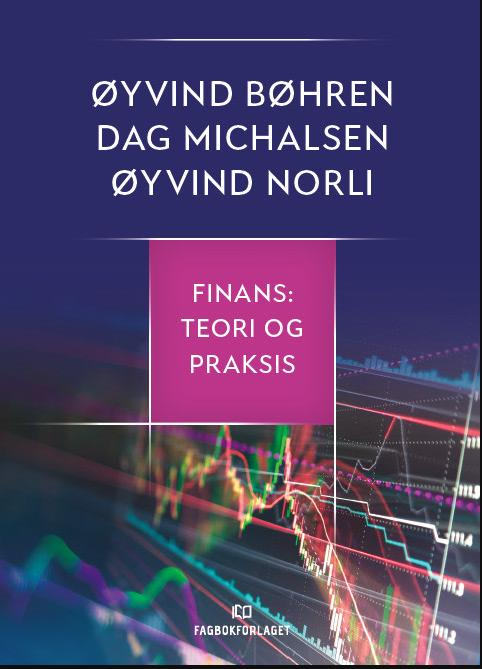

<!-- README.md is generated from README.Rmd. Please edit that file -->

```{r, echo = FALSE}
knitr::opts_chunk$set(
  collapse = TRUE,
  comment = "#>",
  fig.path = "man/figures/"
)
```

```{r, eval=F, echo=F}
# Git relatert
git2r::config(user.name = "joernih", user.email = "jorn.halvorsen@gmail.com")
```

```{r, eval=F, echo=F}
# R-pakker
devtools::document()
devtools::install()
inst/forelesningsnotater/presentations.Rmd
```

```{r, eval=F, echo=F}
## Complete build
pkgdown::build_site() 
rmarkdown::render("index.Rmd")
system("cp -r inst/forelesningsnotater/* docs/articles")
#system("cp -r inst/eksamensoppgaver/* docs/eksamensoppgaver")
#system("cp -R inst/forelesningsnotater/pensum docs/articles/pensum")
pkgdown::build_home()
pkgdown::build_articles()
pkgdown::build_news()
rmarkdown::render("index.Rmd")
rmarkdown::render('inst/forelesningsnotater/dagens.Rmd', 'xaringan::moon_reader')
```

# Finansteori (høsten 2023)

```{r, echo=FALSE, out.width="75%", fig.cap=""}
knitr::include_graphics("man/figures/01_finans.jpg")
```

# Pensum 

[Finans: Teori og praksis. Bøhren, Michalsen og Norli](https://www.fagbokforlaget.no/Finans-Teori-og-praksis/I9788245022193)

```{r, echo=FALSE, out.width="15%", fig.cap=""}

```

# Nyheter
- [Eksamen 2024 Kontinuasjon (sensorveiledning, utkast)](https://github.com/joernih/SFB30820Finansteori/blob/main/inst/eksamensoppgaver/Eksamen_SFB10816_Finansteori_2024_V_K_losning.pdf)
- Som tilbud til de som ønsker å forbedre seg til kontinuasjonseksamen, video hvor jeg går igjennom og diskuterer alle læringsmålene er nå lagt ut: [Lenke her](https://hiof.cloud.panopto.eu/Panopto/Pages/Viewer.aspx?id=c5900f5d-4478-4361-80d2-b10d00f807aa)
- [Eksamen 2023 (sensorveiledning)](https://github.com/joernih/SFB30820Finansteori/blob/main/inst/eksamensoppgaver/Finansteori%20(SFB30820)%2C%20H%C3%B8sten%202023_losning.pdf)
  - Svarene er riktig, men fikset noen syntaksfeil i oppgave 4.
    -   sp. 2: opphøyd i 1,2,3 skal være 1/1,1/2,1/3, 
        sp. 3 noen 1-tall som er strøket.

Undervisnings- og emneansvarlig (jornih at hiof.no)

Jørn I. Halvorsen

**Siste gang oppdatert: `r Sys.time()`**

```{r, echo=F}
knitr::knit_exit()
```

########################################################################
# Lenke
# -
# -
# -
########################################################################
########################################################################

