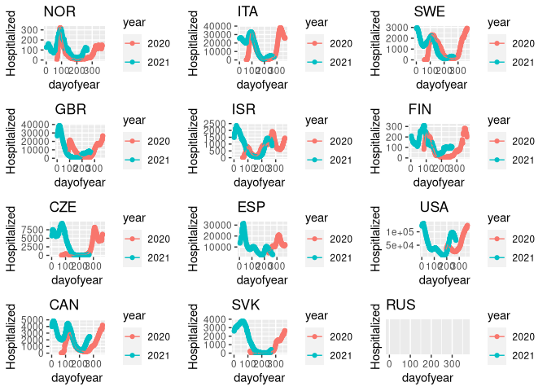

<!-- README.md is generated from README.Rmd. Please edit that file -->

    #> Warning: Removed 126 rows containing missing values (geom_point).
    #> Warning: Removed 55 row(s) containing missing values (geom_path).
    #> Warning: Removed 33 rows containing missing values (geom_point).
    #> Warning: Removed 33 row(s) containing missing values (geom_path).
    #> Warning: Removed 42 rows containing missing values (geom_point).
    #> Warning: Removed 42 row(s) containing missing values (geom_path).
    #> Warning: Removed 67 rows containing missing values (geom_point).
    #> Warning: Removed 67 row(s) containing missing values (geom_path).
    #> Warning: Removed 41 rows containing missing values (geom_point).
    #> Warning: Removed 41 row(s) containing missing values (geom_path).
    #> Warning: Removed 243 rows containing missing values (geom_point).
    #> Warning: Removed 72 row(s) containing missing values (geom_path).
    #> Warning: Removed 55 rows containing missing values (geom_point).
    #> Warning: Removed 55 row(s) containing missing values (geom_path).
    #> Warning: Removed 340 rows containing missing values (geom_point).
    #> Warning: Removed 222 row(s) containing missing values (geom_path).
    #> Warning: Removed 176 rows containing missing values (geom_point).
    #> Warning: Removed 176 row(s) containing missing values (geom_path).
    #> Warning: Removed 48 rows containing missing values (geom_point).
    #> Warning: Removed 48 row(s) containing missing values (geom_path).
    #> Warning: Removed 100 rows containing missing values (geom_point).
    #> Warning: Removed 99 row(s) containing missing values (geom_path).
    #> Warning: Removed 620 rows containing missing values (geom_point).
    #> Warning: Removed 620 row(s) containing missing values (geom_path).

<!-- -->

    #> Warning: Removed 59 rows containing missing values (geom_point).
    #> Warning: Removed 59 row(s) containing missing values (geom_path).
    #> Warning: Removed 40 rows containing missing values (geom_point).
    #> Warning: Removed 40 row(s) containing missing values (geom_path).
    #> Warning: Removed 58 rows containing missing values (geom_point).
    #> Warning: Removed 58 row(s) containing missing values (geom_path).
    #> Warning: Removed 48 rows containing missing values (geom_point).
    #> Warning: Removed 48 row(s) containing missing values (geom_path).
    #> Warning: Removed 65 rows containing missing values (geom_point).
    #> Warning: Removed 65 row(s) containing missing values (geom_path).
    #> Warning: Removed 66 rows containing missing values (geom_point).
    #> Warning: Removed 66 row(s) containing missing values (geom_path).
    #> Warning: Removed 67 rows containing missing values (geom_point).
    #> Warning: Removed 67 row(s) containing missing values (geom_path).
    #> Warning: Removed 48 rows containing missing values (geom_point).
    #> Warning: Removed 48 row(s) containing missing values (geom_path).
    #> Warning: Removed 45 rows containing missing values (geom_point).
    #> Warning: Removed 45 row(s) containing missing values (geom_path).
    #> Warning: Removed 57 rows containing missing values (geom_point).
    #> Warning: Removed 57 row(s) containing missing values (geom_path).
    #> Warning: Removed 77 rows containing missing values (geom_point).
    #> Warning: Removed 77 row(s) containing missing values (geom_path).
    #> Warning: Removed 64 rows containing missing values (geom_point).
    #> Warning: Removed 64 row(s) containing missing values (geom_path).

<!-- -->

    #> Warning: Removed 59 rows containing missing values (geom_point).
    #> Warning: Removed 59 row(s) containing missing values (geom_path).
    #> Warning: Removed 158 rows containing missing values (geom_point).
    #> Warning: Removed 49 row(s) containing missing values (geom_path).
    #> Warning: Removed 125 rows containing missing values (geom_point).
    #> Warning: Removed 98 row(s) containing missing values (geom_path).
    #> Warning: Removed 141 rows containing missing values (geom_point).
    #> Warning: Removed 106 row(s) containing missing values (geom_path).
    #> Warning: Removed 65 rows containing missing values (geom_point).
    #> Warning: Removed 65 row(s) containing missing values (geom_path).
    #> Warning: Removed 66 rows containing missing values (geom_point).
    #> Warning: Removed 66 row(s) containing missing values (geom_path).
    #> Warning: Removed 255 rows containing missing values (geom_point).
    #> Warning: Removed 251 row(s) containing missing values (geom_path).
    #> Warning: Removed 122 rows containing missing values (geom_point).
    #> Warning: Removed 48 row(s) containing missing values (geom_path).
    #> Warning: Removed 106 rows containing missing values (geom_point).
    #> Warning: Removed 91 row(s) containing missing values (geom_path).
    #> Warning: Removed 57 rows containing missing values (geom_point).
    #> Warning: Removed 57 row(s) containing missing values (geom_path).
    #> Warning: Removed 207 rows containing missing values (geom_point).
    #> Warning: Removed 199 row(s) containing missing values (geom_path).
    #> Warning: Removed 64 rows containing missing values (geom_point).
    #> Warning: Removed 64 row(s) containing missing values (geom_path).

<!-- -->
