```{r xaringan-tile-view, echo=FALSE}
xaringanExtra::use_tile_view()
#xaringanExtra::use_share_again()
xaringanExtra::use_scribble()
xaringanExtra::use_webcam()
```

```{r eval=FALSE, include=FALSE}
Sys.which('decktape')
#xaringan::decktape("presentations.html", output="abc.pdf")
xaringan::inf_mr("tavlefil.Rmd")
```

# Opsjoner 
## Kontantstrømverdi 
**12.3**
<br>
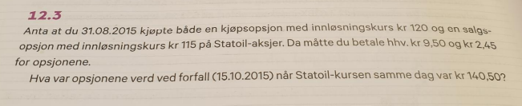
<br>

$$
K_T=maks[0,(140.50-120)]=20.5
$$
<br>
$$
S_T=maks[0,(115-140.50)]=0
$$
---

```{r, echo=FALSE, out.width="60%", fig.cap=""}
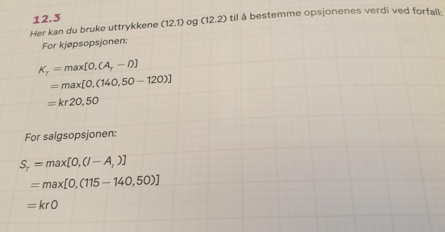
```

---

## Binomisk opsjonsprismodell 

**12.6**
<br>
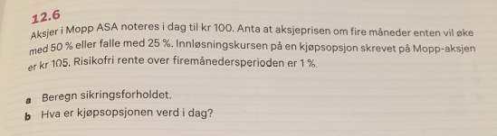
<br>

a. Sikringsforholdet
\begin{equation}
m = \frac{100 (1.5-0.75)}{45-0}=1.67
\end{equation}

---

b. Kjøpsopsjonens verdi i dag

\begin{equation}
K_0 = \frac{1}{1+r_f}[qK_\theta+(1-q)K_n]=\\
\frac{1}{1+0.01}[0.35\cdot 45+0.65\cdot 0] =15.45
\end{equation}
Hvor
\begin{equation*}
q=\frac{1+r_f-n}{\theta-n}=\frac{1+0.01-0.75}{1.50-0.75}=0.35 \\ 
(1-q)=\frac{\theta-1-r_f}{\theta-n} = 1-0.35=0.65
\end{equation*}

$$
K_{\theta}=45
$$

$$
K_n=0
$$

---

```{r, echo=FALSE, out.width="30%", fig.cap=""}
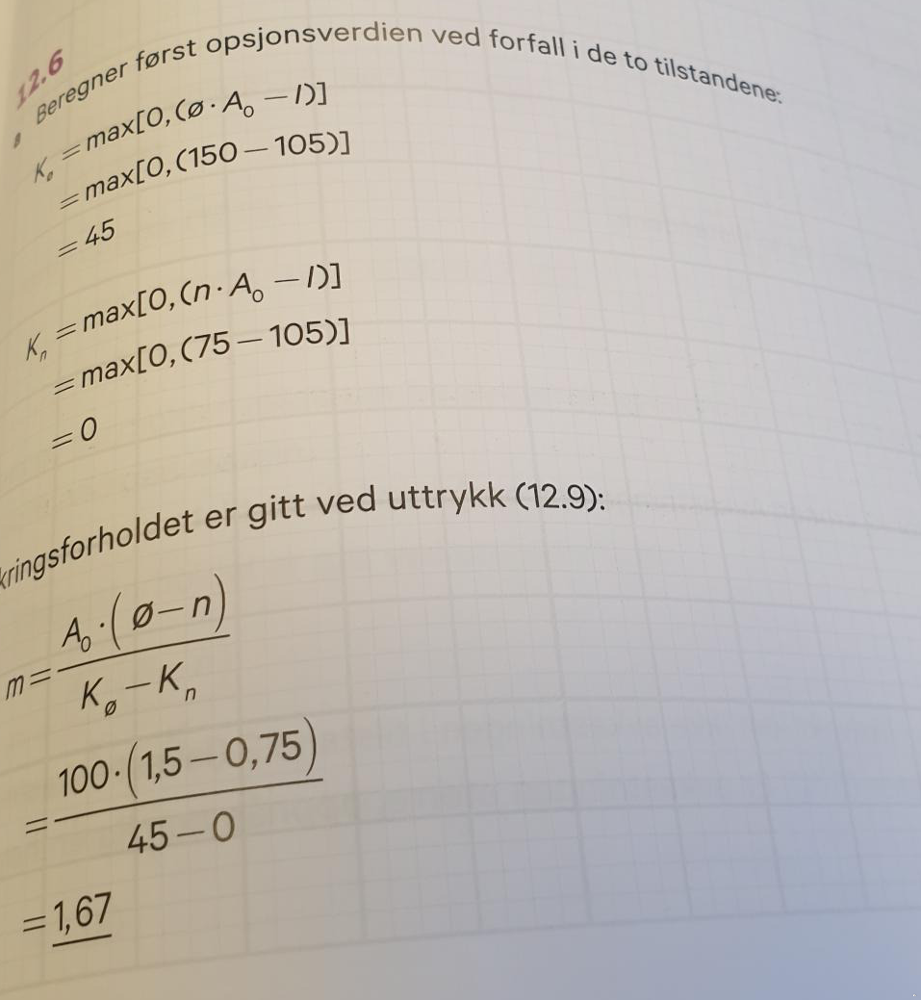
```

```{r, echo=FALSE, out.width="60%", fig.cap=""}
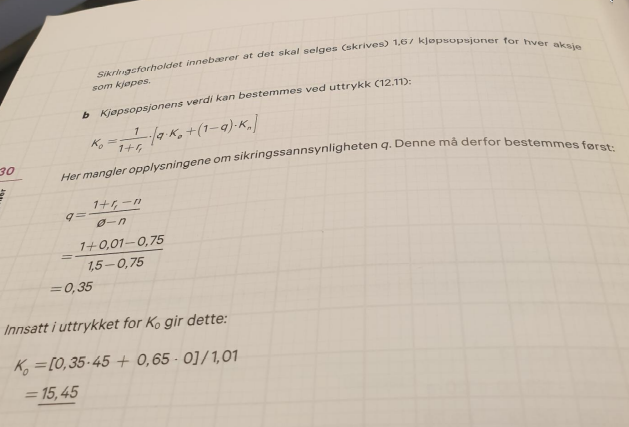
```

---


## Black-Scholes modellen

**12.8**
<br>
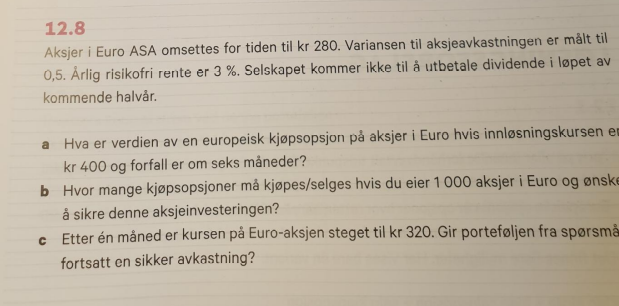
<br>

---

a)
\begin{equation}
K_0 = A_0N(d_1) -Ie^{-i_fT}N(d_2)=\\
280\cdot 0.33 -400e^{-0.03\cdot 6/12}0.17=23.98
\end{equation}
\begin{equation}
N(d_1=-0.433)=1-0.=0.000\\
N(d_2=-0.933)=1-0.=0.000
\end{equation}
[Standar Normalfordelignstabell](https://www.mathsisfun.com/data/standard-normal-distribution-table.html)

Som gir
\begin{equation}
K_0 = A_0N(d_1) -Ie^{-i_fT}N(d_2) = 23.98
\end{equation}

---

b) Antall kjøpsopsjoner per aksje
\begin{equation}
m = \frac{1}{N(d_1)} = 1/0.33 = 3.01
\end{equation}

Som for 1000 akser gir oss $3.01\cdot 1000$ = $3010$

\begin{equation}
K_0 = A_0N(d_1) -Ie^{-i_fT}N(d_2) = 
\end{equation}

c) 
\begin{equation}
m = \frac{1}{N(d_1)} = 1/0.4077 = 2.45
\end{equation}

---

```{r, echo=FALSE, out.width="50%", fig.cap=""}
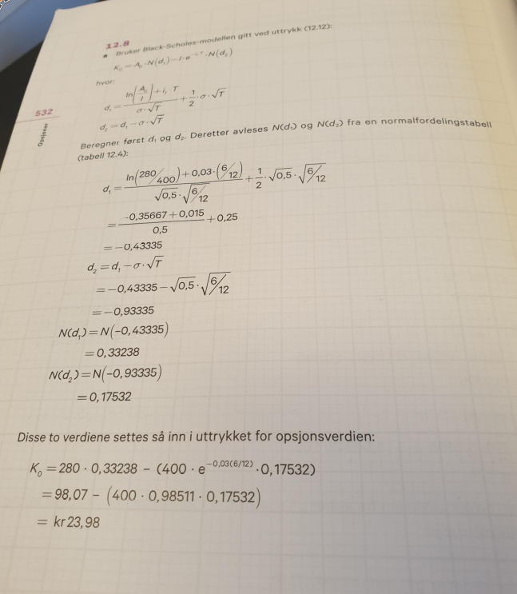
```

---

```{r, echo=FALSE, out.width="50%", fig.cap=""}
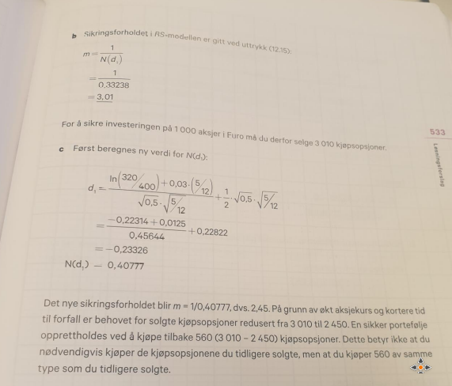
```

---

# Dividende
**11.2**

<br>
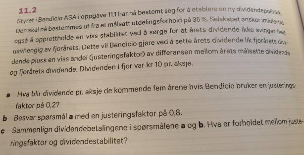
<br>

---

a)

<br>
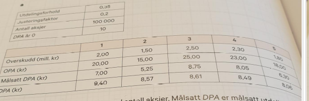
<br>

\begin{equation}
DPA_2= 9.40 + 0.2[0.35(15)-9.40]=8.57
\end{equation}

---

b)

<br>
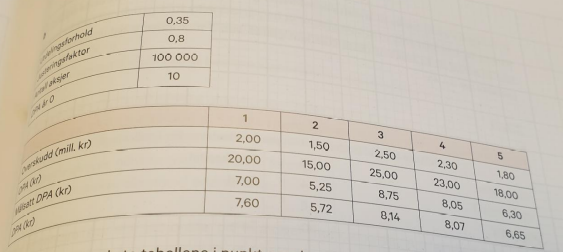
<br>

\begin{equation}
DPA_2 = 7.60 + 0.8[0.35(15)-7.60]=5.72
\end{equation}

c)
Sammenligning

---

```{r, echo=FALSE, out.width="60%", fig.cap=""}
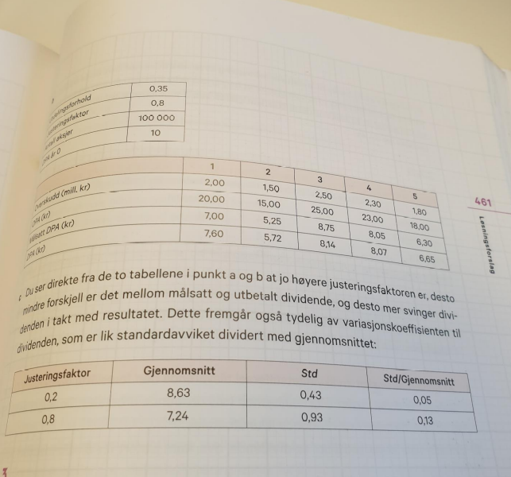
```

---

# Gjeldsgrad og verdi i perfekte kapitalmarkeder

**7.1**
<br>
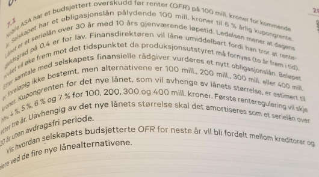
<br>

---

<br>
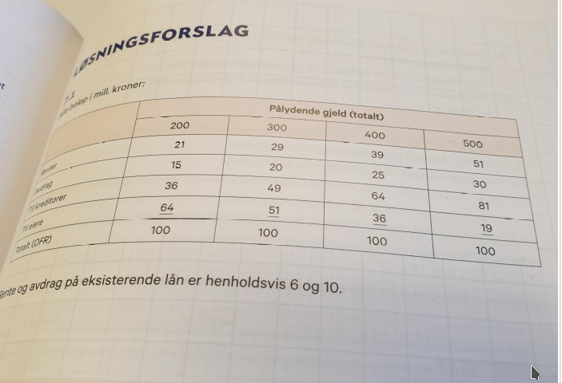
<br>

---

<br>
**7.3**

```{r, echo=FALSE, out.width="50%", fig.cap=""}
knitr::include_graphics("anb_oppgaver/7_3_a.png")
```

```{r, echo=FALSE, out.width="50%", fig.cap=""}
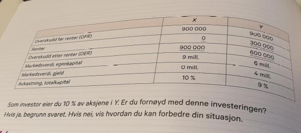
```


---

<br>
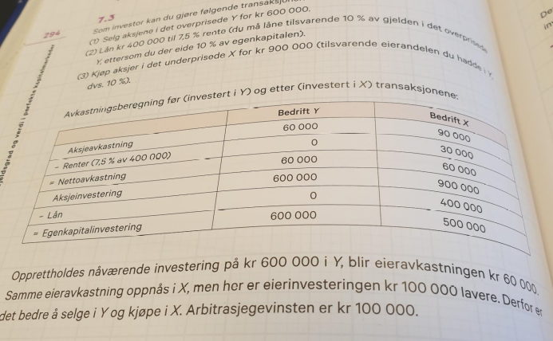
<br>


