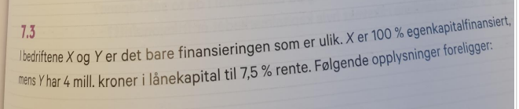

```{r xaringan-tile-view, echo=FALSE}
xaringanExtra::use_tile_view()
#xaringanExtra::use_share_again()
xaringanExtra::use_scribble()
xaringanExtra::use_webcam()
```

```{r eval=FALSE, include=FALSE}
Sys.which('decktape')
#xaringan::decktape("presentations.html", output="abc.pdf")
xaringan::inf_mr("tavlefil.Rmd")
```

# Opsjoner 
**12.3**
<br>

<br>

---

**12.6**
<br>

<br>

---

**12.8**
<br>

<br>

---

# Dividende
**11.2**

<br>

<br>


---

# Gjeldsgrad og verdi i perfekte kapitalmarkeder

**7.1**
<br>

<br>

---

<br>
**7.3**
<br>
<br>

<br>


