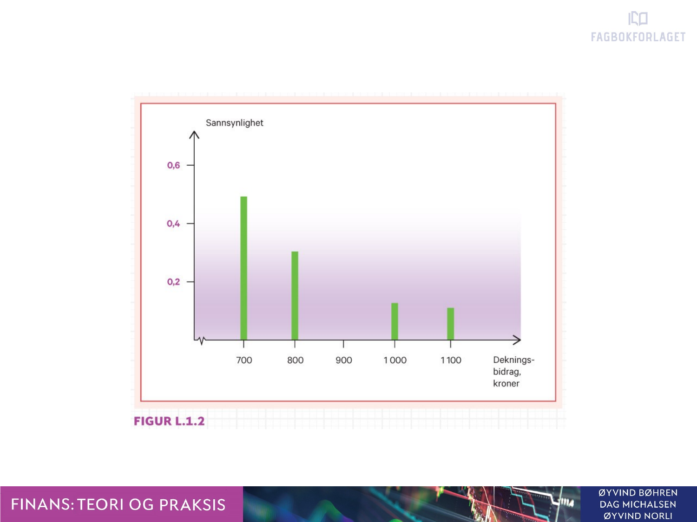

```{r xaringan-tile-view, echo=FALSE}
xaringanExtra::use_editable(expires = 1)
xaringanExtra::use_tile_view()
#xaringanExtra::use_share_again()
xaringanExtra::use_scribble()
xaringanExtra::use_webcam()
xaringanExtra::use_slide_tone()
xaringanExtra::use_panelset()
```

```{r eval=FALSE, include=FALSE}
xaringan::inf_mr("presentations.Rmd")
```


```{r echo=FALSE, message=FALSE, warning=FALSE}
source("timeplan.R")
```

## Timeplan

```{r echo=F}
timep_i
```

---

```{r echo=F}
timep_ii
```

---

# Anbefalte oppgaver

```{r, echo=F}
oppgaveplan
```

---

# Pensumliste

.pull-left[

## Hovedbok


```{r, echo=FALSE, out.width="75%", fig.cap=""}
knitr::include_graphics("pensum/figurer-01.png")
```

[Finans: Teori og praksis. Bøhren, Michalsen og Norli](https://www.fagbokforlaget.no/Finans-Teori-og-praksis/I9788245022193)

]

.pull-right[

## Supplerende
```{r, echo=FALSE, out.width="25%", fig.cap=""}
knitr::include_graphics("pensum/falitt.jpg")
```

[fallitt-norske-finansielle-kriser](https://respublica.no/produkter/fallitt-norske-finansielle-kriser/)

]

---

# Kursgodkjennelse

Består av ....123 

## Obligatorisk innleveringsoppgave

## Eksamen
Eksamen avholdes den

Individuell, skriftlig firetimers eksamen.

Karakterregel: A-F.

Hjelpemidler: godkjent kalkulator.

---

# Lenker benyttet i kurset 
- [Kursbeskrivelse](https://www.hiof.no/studier/emner/oss/2020/host/sfb30820.html)
- [Bokens nettside](https://finans2.portfolio.no/)
- [Statens pensjonsfond utland](https://www.nbim.no/no/)

---

class: inverse, center, middle

# Forelesning 1: `r tema[1]`

**Læringsmål:**

- Forklare strukturen i risikojustert rente metoden for beregning av nåverdi.
- Redegjøre for forskjellen mellom et investeringsprosjekt og et finansieringsprosjekt.
- Konstruere en kontantstrøm fra prosjektdata.
- Forklare hva som menes med begrepene sannsynlighet, tilstand og utfall.
- Beregne forventet kontantstrøm og forventet avkastning for et prosjekt og en portefølje.
- Gi et oversiktsbilde av innholdet i boken og bokens nettside.

---

## Nåverdiberegninger med og uten usikkerhet

**Uten usikkerhet (til nå)**

*Nåverdikriteriet*
\begin{equation}
NV = \sum_{t=0}^{T} \frac{X_{t}}{(1+k)^t} = 
X_{0} + \frac{X_{1}}{(1+k)^1} + \frac{X_{2}}{(1+k)^2} + ... + \frac{X_{T}}{(1+k)^T} 
\end{equation}

Beslutningsregel:
- Gitt uavhengig prosjekter, prosjektet igangsettes dersom nåverdien (NV) > 0
- Gitt avhengige prosjekter, det prosjekt som har høyest nåverdi (NV) igangsettes 

Merk: Benevning ...

---

**Uten usikkerhet (framover)**

*Risikojustert-rente-metoden (RJ-metoden)*
\begin{equation}
NV = \sum_{t=0}^{T} \frac{E(X_{t})}{(1+k)^t} = 
E(X_{0}) + \frac{E(X_{1})}{(1+k)^1} + \frac{E(X_{2})}{(1+k)^2} + ... + \frac{E(X_{T})}{(1+k)^T} 
\end{equation}

- Telleren er nå erstattet med *forventet* kontantstrøm
- Nevneren er nå erstattet med kapitalkostnad som er *risikojusert*

Beslutningsregel (som tidligere):
- Gitt uavhengig prosjekter, prosjektet igangsettes dersom *forventet* nåverdi (NV) > 0
- Gitt avhengige prosjekter, det prosjekt som har høyest *forventet* nåverdi (NV) igangsettes 

---

### Forventet kontantstrøm

### Kapitalkostnad

$\text{Risikojusert rente}=\text{risikofri rente}+\text{risikopremie}$

---

**Oppgave N.1.2**

AS Condor står overfor tre investeringsprosjekter med følgende avkastning:

```{r, echo=F}
#Prosjekt	Nedgangstid	Oppgangstid
#X	3	3
#Y	5	12
#Z	9	11
#Sannsynlighet	30 %	70 %
dfn12 <- data.frame(prob=c(0.30,0.70),x=c(3,3),y=c(5,12),z=c(9,11))
#htmlTable(df1,header=c("Sannsynlighet","Prosjekt X","Prosjekt Y","Prosjekt Z"))
htmlTable(dfn12,header=c("Sannøynlighet","Prosjekt X","Prosjekt Y","Prosjekt Z"))
```

Hva er særtrekket ved prosjekt X?

Beregn forventet avkastning for hvert prosjekt.

Hva er forventet avkastning på en portefølje med like stort beløp investert i hvert av prosjektene?

Hva er svaret på spm. 3 hvis begge tilstander er like sannsynlige?

---

## Investerings- vs. finansieringsprosjekt

Et investeringsprosjekt gir verdien

Et finansieringsprosjekt gir verdien

---

**Oppgave N.1.4**

1. Hvordan vil du beskrive forskjellen mellom et investeringsprosjekt og et finansieringsprosjekt ut fra egenskaper ved kontantstrømmene de gir?
1. Hva er forholdet mellom kapitalkostnad og nåverdi for et investeringsprosjekt kontra for et finansieringsprosjekt?
1. Hva reflekterer kapitalkostnaden (diskonteringsrenten) i et finansieringsprosjekt?

---

## Prosjektets kontantstrøm

```{r, eval=F,echo=FALSE, out.width="40%", fig.cap=""}

```

.panelset[
.panel[.panel-name[R Kode]

```{r}
a <- head(iris)*1000
```
]
.panel[.panel-name[Tabell]
```{r echo=FALSE}
htmlTable(a)
```
]
.panel[.panel-name[Plot]
```{r echo=FALSE}
plot(a[,1],a[,1])
```
]
]

*Øvelse:*
Gjør om til Excel

---

```{r, echo=F}
radnr <- c("Salgsinntekt",
	   "Driftsutgift",
	   "Investering",
	   "Ny arbeidskapital",
	   "Avskrivninger",
	   "Skattbart overskudd",
	   "Skatt",
	   "Kontantstrøm etter skatt",
	   "Sannsynlighet")
tils1 <- seq(1,9)
df_prosj_kontantstrøm <- data.frame(radnr,Tilstand_1=tils1)
kableExtra::kbl(df_prosj_kontantstrøm)
```

---

## Nærmere om forventet kontantstrøm

- Sannsynlighet
- Tilstand
- Utfall

## Porteføljeavkastning

Selve porteføljeavkastningen (rp) er gitt ved

$rp=\frac{P_{t}+Div-P_{0}}{P_{0}}$

---

### Metode 1:

\begin{align}
E(X) = \sum_{s=1}^{S}Pr(s)X(s) =
Pr(1)X(1) + Pr(2)X(2) + ... + Pr(S)X(S) 
\end{align}

---

### Metode 2:

\begin{align}
E(X) = \sum_{i=1}^{N}w_{i}E(X_{i}) =
w_{1}E(X_{1})+w_{2}E(X_{2})+...+w_{N}E(X_{N})
\end{align}

---

## Veien framover

Øvelse til neste gang:
- Gi et oversiktsbilde av innholdet i boken og bokens nettside.

.can-edit[Sett inn]

---

class: inverse, center, middle

# Forelesning 2: `r tema[2]`

**Læringsmål:**

-  Beskrive hvorfor risikoen i en portefølje reduseres når antall prosjekter i porteføljen øker.
-  Beregne betaverdien til et prosjekt og forklare hva den fanger opp.
-  Gi eksempler på kilder for systematisk og usystematisk risiko.

---

## Formula

generell tilfelle
**Uten vekter**

Varians
\begin{equation}
Var(X)=\sum_{s=0}^{S}Pr(s)[X(s)-E(X)]^2=\\ Pr(s)[X(s)-E(X)]^2+Pr(s)[X(s)-E(X)]^2+...+\\Pr(s)[X(s)-E(X)]^2
\end{equation}
\begin{equation}
Std(X)=\sqrt{123}
\end{equation}

---

Standardavvik
\begin{equation}
Var(X)=\sum_{i=0}^{N}Var(X_{i})+ \sum_{i=0}^{N}\sum_{i=0}^{N}
\end{equation}

**med vekter**

\begin{equation}
Std(X)=\sqrt{123}
\end{equation}

---

## Prosjektrisiko for eierne vs. bedriften

---

## Porteføljers risikomål

---

## Risikoholdning og risikokompenasjon

---

## Typer av risiko


---

class: inverse, center, middle

# Forelesning 3: `r tema[3]`

**Læringsmål:**

-  Tallfeste risiko i en portefølje ved å beregne standardavvik.
-  Forklare gjennom et eksempel hvorfor et prosjekt som er risikabelt vurdert alene kan ha lav risiko når prosjektet inngår i en portefølje.
-  Forklare hvorfor porteføljens risiko avhenger av samvariasjonen mellom prosjektene som inngår i porteføljen og de andelene som er investert i hvert prosjekt.


---

class: inverse, center, middle

# Forelesning 4: `r tema[4]`

**Læringsmål:**

- Forklare begrepene effisiente og ineffisiente porteføljer og konstruere slike porteføljer ut fra data.

---

class: inverse, center, middle

# Forelesning 5: `r tema[5]` 

**Læringsmål:**

- Skrive opp kapitalverdimodellen og forklare modellens økonomiske innhold.
- Bruke kapitalverdimodellen til å beregne kostnaden for egenkapital, gjeld og totalkapital.
- Forklare forskjellen mellom kapitalkostnaden for bedriften og kapitalkostnaden for et enkeltstående prosjekt i bedriften.
- Beskrive kapitalverdimodellens sterke og svake sider.
- Forklare hva slags type risiko følsomhetsanalyse og beslutningstre tar hensyn til.

---

class: inverse, center, middle

# Forelesning 6: `r tema[6]`

**Læringsmål:**

- Redegjøre for hovedkjennetegn ved ordinære lån, obligasjonslån og konvertible lån.
- Beregne markedsverdi og effektiv rente for en obligasjon.
- Finne terminrenter fra spotrenter samt beregne durasjon (varighet) og rentefølsomhet for en obligasjon.
- Lage en balanseoppstilling basert på bokverdier og markedsverdier.
- Redegjøre for egenkapitalemisjoner og kjøp av egne aksjer samt beregne verdien av en tegningsrett.
- Forklare de økonomiske effektene av aksjesplitter og fondsemisjoner.

---

class: inverse, center, middle

# Forelesning 7: `r tema[7]`

**Læringsmål:**

- Beregne kontantstrøm til kreditorene og overskuddet for eierne med utgangspunkt i data om et investeringsprosjekt og et finansieringsprosjekt.
- Vise med et eksempel at forventet overskudd pr. aksje stiger med stigende gjeldsgrad.
- Forklare hva en arbitrasjemulighet er.
- Konstruere en arbitrasjestrategi for å høste en arbitrasjegevinst.
- Gjengi de to hovedresultatene til Miller og Modigliani (M&M) med formler og ord for en verden uten skatt.
- Forklare hvorfor kapitalverdimodellen kan gi to prosjekter samme kapitalkostnad selv om de ifølge M&M ikke er i samme risikoklasse.

---

class: inverse, center, middle

# Forelesning 8: `r tema[9]`

**Læringsmål:**

- Beregne kontantstrøm til kreditorene og overskuddet for eierne med utgangspunkt i data om et investeringsprosjekt og et finansieringsprosjekt.
- Vise med et eksempel at forventet overskudd pr. aksje stiger med stigende gjeldsgrad.
- Forklare hva en arbitrasjemulighet er.
- Konstruere en arbitrasjestrategi for å høste en arbitrasjegevinst.
- Gjengi de to hovedresultatene til Miller og Modigliani (M&M) med formler og ord for en verden uten skatt.
- Forklare hvorfor kapitalverdimodellen kan gi to prosjekter samme kapitalkostnad selv om de ifølge M&M ikke er i samme risikoklasse.

---

class: inverse, center, middle

# Forelesning 9: `r tema[10]`

**Læringsmål:**

- Forklare forskjellen mellom ettleddsskatt og toleddsskatt og fortelle hvilket alternativ Norge benytter.
- Definere et nøytralt skattesystem ved toleddsskatt.
- Redegjøre for hva som skaper Miller-likevekt (rente-likevekt) i et gjeldsfavoriserende skattesystem.
- Forklare hvorfor verdien av selskapet stiger og totalkapitalkostnaden synker med gjeldsgraden under ettleddsskatt.
- Fedegjøre for fire gjeldsgradsbestemmende faktorer som ikke har med skatt å gjøre.
---

class: inverse, center, middle

# Forelesning 10: `r tema[11]`

**Læringsmål:**

---

class: inverse, center, middle


# Forelesning 11: `r tema[12]`

**Læringsmål:**

- Forklare forholdet mellom målsatt dividende og utbetalt dividende ifølge Lintner-modellen.
- Forklare hva som menes med hjemmelaget dividendepolitikk og hvorfor dette kan gjøre selskapets dividendepolitikk irrelevant.
- Redegjøre for teori og empiri om dividendens signalfunksjon.
- Forklare hvorfor dividende kan påvirke agentkostnader.
- Forklare hvorfor det norske skattesystemet er dividendenøytralt.

---

class: inverse, center, middle

# Forelesning 12: `r tema[13]`

**Læringsmål:**

- Redegjøre for max-funksjonene til kjøpsopsjoner og salgsopsjoner ved forfall.
- Konstruere kontantstrømsdiagram for kjøpsopsjoner og salgsopsjoner.
- Redegjøre for salg-kjøp-paritet og beregne verdien av ett element i pariteten ved hjelp av de øvrige elementene.
- Beregne verdien av en kjøpsopsjon med den binomiske opsjonsprismodellen.
- Beregne en kjøpsopsjons verdi ved hjelp av Black-Scholes-modellen.
- Redegjøre for hvordan opsjonsprismodeller kan brukes til å verdsette fleksibilitet.

---

class: inverse, center, middle

# Forelesning 13: `r tema[14]`

- Begrunne hvorfor risikostyring kan være viktig.
- Redegjøre for viktige risikokilder.
- Redegjøre for forwardkontrakter, samt beregne FRA-betaling.
- Vise hvordan man kan sikre rente- og valutarisiko med futureskontrakter.
- Vise hvordan valutarisiko kan reduseres ved hjelp av opsjoner.
- Vise hvordan renterisiko og valutarisiko kan styres ved hjelp av swaps.  


```{r include=FALSE}
knitr::knit_exit()
```

1. forklare forskjellen mellom bokverdi og markedsverdi for bedrifter og prosjekter.
1. redegjøre for begrepene investeringsrisiko og finansieringsrisiko.
1. forklare hvordan finansieringsformen kan påvirke verdien av et investeringsprosjekt.
1. beskrive tre imperfeksjoner som kan påvirke bedriftens dividendepolitikk.
1. definere begrepet opsjon.
1. nevne tre finansielle instrumenter som brukes i risikostyring.

**Huskeliste til neste forelesning**
- DWM-tables
- Pdf-files out of Xaringam
- Temaer viske ut
- Anbefalte oppgaver


.pull-left[
]
.pull-right[
]

---

**Oppgave N.1.1**

Forventet kontantstrøm om ett år er 10 mill. kroner. Risikofri kapitalkostand er 2 %, og prosjektet har en risikokostnad på 7 %.

Hva er kontantstrømmen verd i dag?

Hva er sikkerhetsekvivalenten ved slutten av perioden?

Hva er sikkerhetsekvivalenten ved periodens begynnelse?

## .can-edit[You can edit this slide title]
