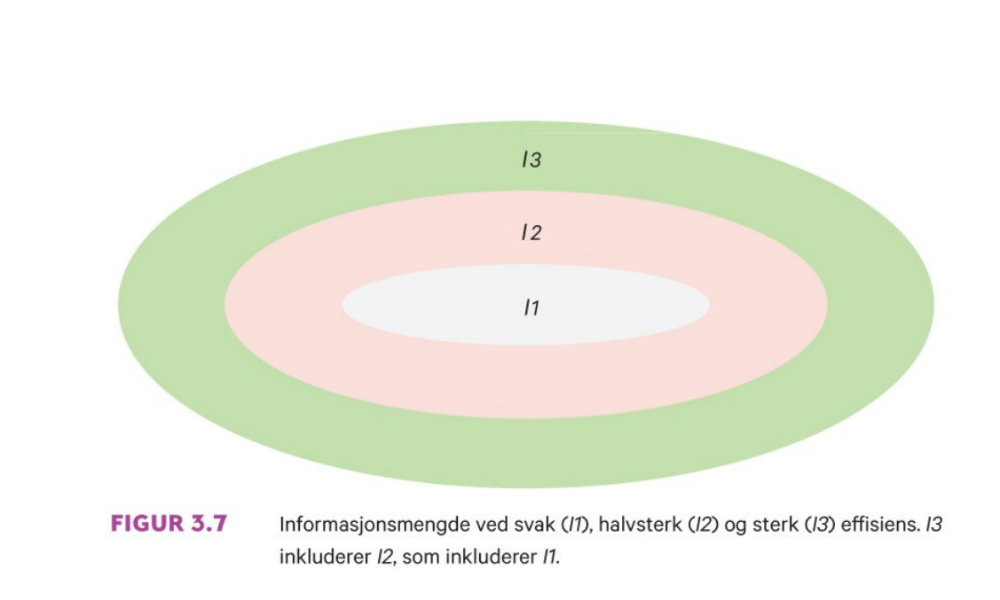

```{r xaringan-tile-view, echo=FALSE, message=F, warning=F}
xaringanExtra::use_editable(expires = 1)
xaringanExtra::use_tile_view()
#xaringanExtra::use_share_again()
xaringanExtra::use_scribble()
xaringanExtra::use_webcam()
#xaringanExtra::use_slide_tone()
xaringanExtra::use_panelset()
library(htmlTable)
library(magrittr)
library(xaringan)
library(plotly)
```

```{r eval=FALSE, include=FALSE}
xaringan::inf_mr("presentations.Rmd")
xaringan::inf_mr("presentations.Rmd")
rmarkdown::render()
servr::daemon_stop()
```


```{r echo=FALSE, message=FALSE, warning=FALSE}
source("timeplan.R")
```

## Timeplan

```{r echo=F}
timep_i
```

---

```{r echo=F}
timep_ii
```

---


# Anbefalte oppgaver

```{r, echo=F}
oppgaveplan
```

---

# Pensumliste

.pull-left[

## Hovedbok


```{r, echo=FALSE, out.width="75%", fig.cap=""}
knitr::include_graphics("pensum/figurer-01.png")
```

[Finans: Teori og praksis. Bøhren, Michalsen og Norli](https://www.fagbokforlaget.no/Finans-Teori-og-praksis/I9788245022193)

]

.pull-right[

## Supplerende
```{r, echo=FALSE, out.width="25%", fig.cap=""}
knitr::include_graphics("pensum/falitt.jpg")
```

[fallitt-norske-finansielle-kriser](https://respublica.no/produkter/fallitt-norske-finansielle-kriser/)

]

---

# Kursgodkjennelse

Består av (1) obligatorisk arbeidskrav og (2) skriftlig eksamen. 

## Obligatorisk innleveringsoppgave

XX-XX: obligatorisk arbeidskrav publiseres (før høstferien)

XX-XX: obligatorisk arbeidskrav innlevering (to uker etter høstferien)

## Eksamen

Eksamen avholdes den XX-XX.

Individuell, skriftlig firetimers eksamen.

Karakterregel: A-F.

Hjelpemidler: godkjent kalkulator.

---

# Lenker benyttet i kurset (foreløpig liste)
- [Kursbeskrivelse](https://www.hiof.no/studier/emner/oss/2020/host/sfb30820.html)
- [Bokens nettside](https://finans2.portfolio.no/)
- [Statens pensjonsfond utland](https://www.nbim.no/no/)
- [Canvas](https://hiof.instructure.com/courses/5156)

---

class: inverse, center, middle

# Forelesning 1: `r tema[1]`

**Læringsmål:**

- Forklare strukturen i risikojustert rente metoden for beregning av nåverdi.
- Redegjøre for forskjellen mellom et investeringsprosjekt og et finansieringsprosjekt.
- Konstruere en kontantstrøm fra prosjektdata.
- Forklare hva som menes med begrepene sannsynlighet, tilstand og utfall.
- Beregne forventet kontantstrøm og forventet avkastning for et prosjekt og en portefølje.
- Gi et oversiktsbilde av innholdet i boken og bokens nettside.

`r paste("Oppdatert:",Sys.Date())`

---

## Nåverdiberegninger med og uten usikkerhet

**Uten usikkerhet (til nå)**

*Nåverdikriteriet*
\begin{equation}
NV = \sum_{t=0}^{T} \frac{X_{t}}{(1+k)^t} = 
X_{0} + \frac{X_{1}}{(1+k)^1} + \frac{X_{2}}{(1+k)^2} + ... + \frac{X_{T}}{(1+k)^T} 
\end{equation}

Beslutningsregel:
- Gitt uavhengig prosjekter, prosjektet igangsettes dersom nåverdien (NV) $> 0$
- Gitt avhengige prosjekter, det prosjekt som har høyest nåverdi (NV) av de $>0$ igangsettes 

Merk: Ved inkludering av faktorer som inflasjon, skatt og finansiering, endres benevningen *både*
i teller og nevner.

---

**Med usikkerhet/risiko (framover)**

*Risikojustert-rente-metoden (RJ-metoden)*
\begin{equation}
NV = \sum_{t=0}^{T} \frac{E(X_{t})}{(1+k)^t} = 
E(X_{0}) + \frac{E(X_{1})}{(1+k)^1} + \frac{E(X_{2})}{(1+k)^2} + ... + \frac{E(X_{T})}{(1+k)^T} 
\end{equation}

- Telleren er nå erstattet med *forventet* kontantstrøm
- Nevneren er nå erstattet med kapitalkostnad som er *risikojustert*

Beslutningsregel (som tidligere):
- Gitt uavhengig prosjekter, prosjektet igangsettes dersom *forventet* nåverdi (NV) > 0
- Gitt avhengige prosjekter, det prosjekt som har høyest *forventet* nåverdi (NV) av de $>0$ igangsettes 

Et alternativ til RJ-metoden (som gir samme svar) er å foreta selve risikojusteringen i telleren av uttrykket. Dette gjøres ved å trekke risikokostnaden fra den forventede kontantstrømmen. Nettbeløpet som blir igjen omtales som *sikkerhetsekvivalenten*. I tråd med prinsippet om samme type benevning i teller og nevner, må dette beløpet deles på den risikofrie renten.

---

Sammenlignet med nåverdikriteriet, krever RJ-metoden at vi i tillegg klare å
beregne

- Forventet kontantstrøm

Utgangspunktet her er at vi betrakter framtiden i form av ulike scenarioer, hvor vi tilknytter en sannsynlighet til hvert enkelt scenario.

- Kapitalkostnad (risikojustert-rente)

Dette uttrykket består nå både av en *tids-* og *usikkerhetsdimensjon*.

Formelt kan vi uttrykke dette som
\begin{equation}
\text{Risikojusert rente}=\text{risikofri rente}+\text{risikopremie}
\end{equation}

Hvor *Risikopremien (risikokostnaden)* representerer den nye komponenten. I kapittel 2-3 i læreboka vises det at for et prosjekt vil denne komponentene er produktet av en *pris (kostnad per risikokomponent)* og *kvantumkomponent (antall risikoenheter tilhørende prosjektet)*. 
---

**Oppgave** N.1.1

Forventet kontantstrøm om ett år er 10 mill. kroner. Risikofri kapitalkostnad er 2 %, og prosjektet har en risikokostnad på 7 %.

Hva er kontantstrømmen verd i dag?
<br>**Svar:**<br>
\begin{equation}
NV=\frac{10}{1+(0.02+0.07)}=\frac{10}{1.09}=9.17
\end{equation}

Hva er sikkerhetsekvivalenten ved slutten av perioden?
<br>**Svar:**<br>
\begin{equation}
9.17=\frac{X}{1+(0.02)} \Leftrightarrow  \\
X=9.17\cdot (1.02)=9.17\cdot (1.02)=9.35
\end{equation}

Hva er sikkerhetsekvivalenten ved periodens begynnelse?
<br>**Svar:**<br>
\begin{equation}
NV=9.17
\end{equation}

---

## Investerings- vs. finansierinsgprosjekt

Et investeringsprosjekt viser bedriftens bruker av penger for å skaffe seg eiendeler i form av anlegg- og omløpsmidler (regnskapsbalansens venstreside)

Et finansieringsprosjekt viser bedriftens anskaffelse av penger i form av gjeld og egenkapital (regnskapsbalansens høyreside)
---

**Oppgave N.1.4**

1. Hvordan vil du beskrive forskjellen mellom et investeringsprosjekt og et finansieringsprosjekt ut fra egenskaper ved kontantstrømmene de gir?
<br>**Svar:**<br>
- I et investeringsprosjekt er tegnfølgen i kontantstrømmen (–,+,+,…,+)
- Tegnfølgen i et finansieringsprosjekt er (+,–,–,…,–)
1. Hva er forholdet mellom kapitalkostnad og nåverdi for et investeringsprosjekt kontra for et finansieringsprosjekt?
<br>**Svar:**<br>
For investeringsprosjekter faller nåverdien med økende kapitalkostnad. For finansieringsprosjekter stiger den.

<!--1. Hva reflekterer kapitalkostnaden (diskonteringsrenten) i et finansieringsprosjekt?-->
---

## Prosjektets Kontantstrøm
For prosjektets kontantstrøm kan velkjente prinsipper tas i bruk til beregning av kontantstrømmen, en trenger kun å spesifere de ulike scenarioene/tilstandene og tilknytte en sannsynlighet til hver av disse.

Fra Oljefelteksemplet eksempel 1.3 i læreboka har vi

```{r, echo=F}
radnr <- c("Salgsinntekt",
	   "Driftsutgift",
	   "Investering",
	   "Ny arbeidskapital",
	   "Avskrivninger",
	   "Skattbart overskudd",
	   "Skatt",
	   "Kontantstrøm etter skatt",
	   "Sannsynlighet")
tils1 <- c(1350,500,200,50,300,550,440,160,0.42)
tils2 <- c(900,500,200,50,300,100,80,70,0.28)
tils3 <- c(1350,400,200,50,300,650,520,180,0.18)
tils4 <- c(900,400,200,50,300,200,160,90,0.12)
df_prosj_kontantstrøm <- data.frame(radnr,tils1,tils2,tils3,tils4)
htmlTable(df_prosj_kontantstrøm, header=c("Tilstand:","1","2","3","4"))
```


---

Den forventede kontantstrømmen framkommer derfor som 


$$
0.42\cdot 160+0.28\cdot 70+0.18\cdot 180 +0.12\cdot 90 = 130 
$$
---

## Nærmere om forventet kontantstrøm

Formelt vil den forventede kontantstrømmen for en bestemt periode t kunne uttrykkes som den forventede verdien til en sannsynlighetsfordeling:

\begin{equation}
E(X)=\sum_{s=1}^{S}Pr(s)X(s)=Pr(1)X(1) + Pr(2)X(2) + ... + Pr(S)X(S)
\end{equation}

Her uttrykker
- $Pr(s)$ gir oss *sannsynligheten* (verdi mellom 0 og 1) for at tilstand s inntreffer
- $s \in \{1,2,..,S\}$ representerer settet av alle mulige *tilstander* som kan inntreffe
- $X(s)$ er *utfallet* til kontantstrømmen dersom tilstand $s$ inntreffer

---

## Porteføljeavkastning

Selve porteføljeavkastningen (rp) uten skatt er gitt ved

$rp=\frac{P_{T}+Div_{0,T}-P_{0}}{P_{0}}$

### Metode 1: Forventet avkastning


\begin{equation}
E(rp) = \sum_{s=1}^{S}Pr(s)X(s) = 
Pr(1)X(1) + Pr(2)X(2) + ... + Pr(S)X(S) 
\end{equation}

### Metode 2: Forventet avkastning

\begin{equation}
E(rp) = \sum_{i=1}^{N}w_{i}E(X_{i})=w_{1}E(X_{1})+w_{2}E(X_{2})+...+w_{N}E(X_{N})
\end{equation}

---

**Oppgave N.1.2**

AS Condor står overfor tre investeringsprosjekter med følgende avkastning:

```{r, echo=F}
#Prosjekt	Nedgangstid	Oppgangstid
#X	3	3
#Y	5	12
#Z	9	11
#Sannsynlighet	30 %	70 %
dfn12 <- data.frame(prob=c(0.30,0.70),beskr=c("Nedgangstid","Oppgangstid"),x=c(3,3),y=c(5,12),z=c(9,11))
#htmlTable(df1,header=c("Sannsynlighet","Prosjekt X","Prosjekt Y","Prosjekt Z"))
htmlTable(dfn12,header=c("Sannsynlighet","Tilstandsbeskrivelse","Prosjekt X","Prosjekt Y","Prosjekt Z"))
```

1. Hva er særtrekket ved prosjekt X?
<br>**Svar:**<br>
Kontantstrømmen er sikker (lik 3 i begge perioder)
2. Beregn forventet avkastning for hvert prosjekt.
<br>**Svar:**<br>
\begin{equation}
E(r_x)=0.30\cdot 3+0.70\cdot 3 = 3\\
E(r_y)=0.30\cdot 5+0.70\cdot 12 = 9.9\\
E(r_z)=0.30\cdot 9+0.70\cdot 11 = 10.4
\end{equation}
---
<p>3.</p> Hva er forventet avkastning på en portefølje med like stort beløp investert i hvert av prosjektene?
.panelset[
.panel[.panel-name[Metode 1]
<br>
<br>
$$
E(r_p)=0.3\cdot (1/3\cdot 3+ 1/3\cdot 5 +1/3\cdot 9) + \\
0.7\cdot (1/3\cdot 3+ 1/3\cdot 12 +1/3\cdot 11) = 7.76
$$
]
.panel[.panel-name[Metode 2]
<br>
<br>
$$
E(r_p)=1/3\cdot 3+1/3\cdot 9.9 +1/3\cdot 10.4=1/3\cdot(3+9.9+10.4) = 7.76
$$
]
]

<p>4.</p> Hva er svaret på spm. 3 hvis begge tilstander er like sannsynlige?
<br>**Svar:**<br> 
$$
E(r_p)=0.5\cdot (1/3\cdot 3+ 1/3\cdot 5 +1/3\cdot 9) + 
0.5\cdot (1/3\cdot 3+ 1/3\cdot 12 +1/3\cdot 11) = 7.16 
$$ 
---

**Oppgave** N.1.3

Gå tilbake til de tre prosjektene fra oppgave N.1.2.

1. Hvordan bør du velge porteføljevekter for å få høyest mulig forventet avkastning?
<br>**Svar:**<br>
Sette alt i prosjekt Z (vekt lik 1), siden dette gir den høyeste forventede avkastningen.
1. Er porteføljen du valgte under spm. 1 også den beste porteføljen som kan velges?
<br>**Svar:**<br>
Nei, prosjekt gir høyere avkastning under oppgangstid.
1. Er det fornuftig å sette alle pengene i prosjekt X?
<br>**Svar:**<br>
Nei, både Y og Z gir bedre avkastning enn X uansett tilstand.

---

## Veien framover

Oppgave til neste forelesning:
- Gi et oversiktsbilde av innholdet i boken og bokens nettside.


```{r, echo=FALSE, out.width="25%", fig.cap=""}
knitr::include_graphics("drawio/oversiktsbildet.png")
```
---

class: inverse, center, middle

# Forelesning 2: `r tema[2]`

**Læringsmål:**

-  Forklare gjennom et eksempel hvorfor et prosjekt som er risikabelt vurdert alene kan ha lav risiko når prosjektet inngår i en portefølje.
-  Tallfeste risiko i en portefølje ved å beregne standardavvik.
-  Forklare hvorfor porteføljens risiko avhenger av samvariasjonen mellom prosjektene som inngår i porteføljen og de andelene som er investert i hvert prosjekt.

`r paste("Oppdatert:",Sys.Date())`

---

## Prosjektrisiko for eierne vs. bedriften

Grunnleggende forutsetning: Ledelsen i bedriften har som oppgave å treffe beslutninger som maksimerer verdien av egenkapitalen til eierne. 

Vi tar utgangspunkt i følgende tabell
```{r, echo=FALSE, out.width="25%"}
dfn12 <- data.frame(prob=c(0.20,30,50),
		    beskr=c("Nedgangstid","Trend","Oppgangstid"),
		    tilstand=c(1,2,3),
		    bedriften=c(-60,5,60),
		    nyttprosj=c(30,2.5,-30),
		    portefoljen_ikkediv=c(-60,5,60),
		    portefoljen_div=c(10,5,-10))
g1 <- ggplot(data=dfn12, aes(x=beskr, y=nyttprosj)) + geom_bar(stat="identity")
g2 <- ggplot(data=dfn12, aes(x=beskr, y=bedriften)) + geom_bar(stat="identity")
g3 <- ggplot(data=dfn12, aes(x=beskr, y=portefoljen_ikkediv)) + geom_bar(stat="identity")
g4 <- ggplot(data=dfn12, aes(x=beskr, y=portefoljen_div)) + geom_bar(stat="identity")
htmlTable(dfn12, header=c("Sannsynl.","Tilstandsb.","Tilstand","Bedriftens portefølje","Nytt prosjekt","Eierens portefølje (ikke div.)", "Eierens portefølje (div.)"))
```

---

### Risiko for bedriften

De nye prosjektets bidrag til bedriftens kontantstrøm

```{r, echo=FALSE, out.width="45%"}
gridExtra::grid.arrange(g1,g2,ncol=2)
```

---

### Risiko for eierne

- Udeversifiserte eiere: 
  - Ser forventet kontantstrøm fra det nye prosjektet i sammenheng med **bedriftens** allerede eksisterende kontantstrøm

```{r, echo=FALSE, out.width="20%"}
gridExtra::grid.arrange(g1,g3,ncol=2)
```

- Veldiversifiserte eiere: 
  - Ser forventet kontantstrøm fra det nye prosjektet i sammenheng med **porteføljens** eksisterende kontantstrøm

```{r, echo=FALSE, out.width="20%"}
gridExtra::grid.arrange(g1,g4,ncol=2)
```

---

## Måling av risiko 

**Metode 1 for måling av risiko (1-n investeringsobjekter)**
- Varians
\begin{equation}
Var(X)=\sum_{s=1}^{S}Pr(s)[X(s)-E(X)]^2=\\ Pr(1)[X(1)-E(X)]^2+Pr(2)[X(2)-E(X)]^2+...+\\Pr(S)[X(S)-E(X)]^2
\end{equation}
- Standardavvik
\begin{equation}
Std(X)=\sqrt{Var(X)}
\end{equation}

Merk: Mens standardavviket gir oss samme benevning som forventet verdi, er benevningen til variansen vanskeligere å forholde seg til ("tolkning: Det kvadrerte til benevningen av standardavviket")


---

**Metode 2 for måling av risiko (2 investeringsobjekter)**
- Varians
\begin{equation}
Var(r_p)=w_1^2Var(r_1)w^2_2Var(r_2)+2w_1w_2Kov(r_1,r_2)
\end{equation}
Hvor samvariasjonen er gitt ved
\begin{equation}
Kov(r_1,r_2)=\sum_{s=1}^{S}Pr(s)[r_1(s)-E(r_1)][r_2(s)-E(r_2)] \\
Pr(1)[r_1(1)-E(r_1)][r_2(1)-E(r_2)]+\\Pr(2)[r_1(2)-E(r_1)][r_2(2)-E(r_2)]+...+ \\ Pr(S)[r_1(S)-E(r_1)][r_2(S)-E(r_2)] 
\end{equation}

- Standardavviket
\begin{equation}
Std(r_p)=\sqrt{Var(r_p)}
\end{equation}

---

## Måling av risiko
### Enkelobjekter

**Eksempel 2.1**
```{r, echo=F}
# Data input
df_eks_2_1 <- data.frame(tilstand=c(1,2,3),
                         prob=c(0.2,0.5,0.3),
                         avk_a=c(0.16,0.12,0.06),
                         avk_b=c(0.05,0.20,0.40)
                         )
ex_a <- c(df_eks_2_1$avk_a%*%df_eks_2_1$prob)
ex_b <- c(df_eks_2_1$avk_b%*%df_eks_2_1$prob)
vx_a <- c((df_eks_2_1$avk_a-ex_a)^2%*%df_eks_2_1$prob)
vx_b <- c((df_eks_2_1$avk_b-ex_b)^2%*%df_eks_2_1$prob)
htmlTable(df_eks_2_1, header=c("Tilstand","Sansynlighet","A","B"))
```

---

Fra Metode 1 oppgitt under første forelesning har vi at 

$$E(r_a)=0.2\cdot 0.16+0.5\cdot 0.12+0.3\cdot 0.06=0.11$$ 
$$E(r_b)=0.2\cdot 0.05+0.5\cdot 0.20+0.3\cdot 0.40=0.23$$

Fond **A**
\begin{equation*}
Var(r_a) =0.2[0.16-0.11]^2+0.5[0.12-0.11]^2+0.3[0.06-0.11]^2=0.0013 \\
Std(r_a)=\sqrt{0.0013}=0.03605551
\end{equation*}

Fond **B**
\begin{equation*}
Var(r_b) =0.2[0.05-0.23]^2+0.5[0.20-0.23]^2+0.3[0.40-0.23]^2=0.0156 \\
Std(r_b)=\sqrt{0.0156}=0.1249
\end{equation*}

---

## Måling av risiko
### Sammensatt fond 

Vi antar nå at investeringsbeløpet er likt fordelt mellom de to fondene, dvs $w_1=1/2,w_2=1-w_2=1/2$. 

```{r, echo=F}
# Portefølje: 1-2
w <- c(0.50,0.50)
## Metode 1
df_eks_2_1_w <- df_eks_2_1 %>%
  dplyr::mutate(wa=w[1],wb=w[2]) %>%
  dplyr::mutate(avk_c=avk_a*wa+avk_b*wb)

ex_c <- c(df_eks_2_1_w$avk_c%*%df_eks_2_1_w$prob)
vx_c <- c((df_eks_2_1_w$avk_c-ex_c)^2%*%df_eks_2_1_w$prob)
# Covarnaise missing
htmlTable(df_eks_2_1_w, header=c("Tilstand","Sansynlighet","Avk. A","Avk. B", "w_a","w_b","Avk. C"))
```

Risikoen til det sammensatte fondet C kan måles ved bruk av både metode 1 og 2.

---

**Metode 1**
\begin{equation*}
Var(r_c) =0.2[0.105-0.17]^2+0.5[0.16-0.17]^2+0.3[0.23-0.17]^2=0.001975\\
Std(r_c)=\sqrt{0.001975}=0.044
\end{equation*}

**Metode 2**
\begin{equation*}
Var(r_c) =(1/2)^2(0.0013)+(1/2)^2(0.0156)-2(1/2)(1/2)0.045=0.001975 \\
Std(r_c)=\sqrt{0.001975}=0.044
\end{equation*}

Hvor vi har benyttet at
\begin{equation*}
Kov(r_a,r_b) = 0.2[0.16-0.11][0.05-0.23]+0.5[0.12-0.11][0.20-0.23]+\\
0.3[0.06-0.11][0.40-0.23]=-0.0045\\
\end{equation*}

```{r, echo=F, eval=F}
0.2*(0.16-0.11)*(0.05-0.23)+
0.5*(0.12-0.11)*(0.20-0.23)+
0.3*(0.06-0.11)*(0.40-0.23)
#
(1/2)^2*(0.0013)+(1/2)^2*(0.0156)-2*(1/2)*(1/2)*0.0045
cx_c <- c(((df_eks_2_1_w$avk_a-ex_a)*
	   (df_eks_2_1_w$avk_b-ex_b))%*%df_eks_2_1_w$prob)
#m <- as.matrix(df_eks_2_1_w[,c(3,4)])
#v <- as.vector(df_eks_2_1_w[,c(2)])
#cov.wt(m,v)$cov
```

---

## Risikoholdning og risikokompensasjon

### Holdning

Vi kan skille mellom *risiknøytrale* og *risikoaversje* aktører

- Risikonøytral kun opptatt av forventet avkastning (+)
	- Bedre ut: *Nordover* et diagram med risiko på x-aksen og forventet avkastning på y-aksen
- Risikoaversj opptatt av forholdet mellom forventet avkastning (+) og risiko (-)
- Bedre ut: *Nordvestover* (*forventning-varians/standardavvik-kriteriet*) i et diagram (forventet avkastning varians/standardavvik kriteriet) med risiko på x-aksen og forventet avkastning på y-aksen

I dette kurset legger vi til grunn at alle aktørene er risikoaversje (ikke villig til å bære usikkerhet gratis), men at graden av risikoaversjon kan variere mellom de ulike aktørene.

---

```{r, echo=FALSE, out.width="75%", fig.cap=""}

```

---

### Risikokompenasjon (litt empiri)

Finner man igjen dette i det observerte tallmateriale?

#### Veldiversifisert portefølje

```{r, echo=F}
velportf <- data.frame(label=c("Risikofri rente","Aksjeindeks"),gjsnitt=c(0.015,0.068),stavviks=c(0.01,0.127)) 
htmlTable(velportf, header=c("","Gjennomsnitt","Standardavvik"))
```

#### Udiversifisert portefølje

```{r, echo=F}
udiportf <- data.frame(label=c("Yara","Itera","Aker Solutions","","Portefølje (3 aksjer)"),gjsnitt=c(0.07,0.07,0.08,NA,0.07),stavviks=c(0.29,0.27,0.31,NA,0.21)) 
htmlTable(udiportf, header=c("","Gjennomsnitt","Standardavvik"))
```

---

**Hovedresultater fra undersøkelsen**

1. Det er mye å hente ved diversifisering: Risikoen kan reduseres kraftig uten at du taper noe i form av lavere forventet avkastning
2. Risikokompensasjonen for en enkeltaksje er ikke knyttet til aksjens standardavvik (totalrisiko). Relevant risiko må derfor måles på andre måter.

---

## Endring av porteføljevekter og samvariasjon

### Porteføljevekter


```{r, echo=FALSE, out.width="75%", fig.cap=""}
knitr::include_graphics("pensum/figurer-06.png")
```

---

**Øvelse:** Forsøk å repliker følgende resultater i Excel

.panelset[
.panel[.panel-name[Tabell]
```{r, echo=F}
htmlTable(df_eks_2_1, header=c("Tilstand","Sannsynlighet","Avkastning A", "Avkastning B"))
```
]
.panel[.panel-name[R-kode (ikke pensum)]
```{r}
r <- cor(df_eks_2_1[,3],df_eks_2_1[,4])
plotwf <- c(r) %>% purrr::map_dfr(function(r,df=df_eks_2_1){
	w <- seq(0,1,0.01)
	v <- as.vector(df[,(2)])
	m <- as.matrix(df[,(3:4)])
	covall <- cov.wt(m,v,method='ML')
	avk <- as.vector(covall$center)
	kov <- covall$cov[lower.tri(covall$cov)] 
	var <- as.vector(diag(as.matrix(covall$cov)))
	avkdf <- data.frame(corr=r,w1=1-w, w2=w) %>%
 		dplyr::mutate(forvavk=w1*avk[1]+w2*avk[2]) %>%
 		dplyr::mutate(varians=w1^2*var[1]+w2^2*var[2]+2*w1*w2*r*sqrt(var[1])*sqrt(var[2])) %>%
 		dplyr::mutate(stdavk=sqrt(varians))
			 }
)
```
]
.panel[.panel-name[Figur]
```{r, echo=F}
gg <- ggplot2::ggplot(data=plotwf,ggplot2::aes(x=stdavk,y=forvavk)) + ggplot2::geom_point() 
plotly::ggplotly(gg)
```
]
]

---

### Korrelasjonskoeffisienten (standardisert mål på samvariasjon)

\begin{equation}
Kor(r_a,r_b)=\frac{Kov(r_a,r_b)}{S(r_a)S(r_b)}
\end{equation}

- $Kor(r_a,r_b)=1$ (helt avhengige)
- $Kor(r_a,r_b)=0$ (helt uavhengige)
- $Kor(r_a,r_b)=-1$ (helt motsatt avhengige)

Løser denne for $Kov(r_a,r_b)=Kor(r_a,r_b)S(r_a)S(r_b)$

Som gjør at vi kan skrive
\begin{equation}
Var(r_p)=w_1^2Var(r_1)+w^2_2Var(r_2)+2w_1w_2Kor(r_a,r_b)S(r_a)S(r_b)
\end{equation}

---

Holder vi oss til eksempel 2.1, innebærer dette at beregningene av porteføljevariansen også kan uttrykkes som
\begin{equation*}
Kor(r_a,r_b)=\frac{-0.0045}{0.036\cdot 0.125}=-1
\end{equation*}

Mens variansen til porteføljen kan uttrykkes som
\begin{equation*}
Var(r_p)=(1/2)^2(0.0013)+(1/2)^2(0.0156)-2(1/2)(1/2)0.036\cdot 0.125 \\= 0.001975
\end{equation*}

---

```{r, echo=FALSE, out.width="75%", fig.cap=""}

```

---


```{r, echo=FALSE, out.width="75%", fig.cap=""}
knitr::include_graphics("pensum/figurer-07.png")
```

---

**Øvelse:** Forsøk å replikere følgende tabell i Excel

.panelset[
.panel[.panel-name[Tabell]
```{r, echo=F}
htmlTable(df_eks_2_1, header=c("Tilstand","Sannsynlighet","Avkastning A", "Avkastning B"))
```
]
.panel[.panel-name[R-kode (ikke pensum)]
```{r}
plotwf <- c(-1,0,1) %>% purrr::map_dfr(function(r,df=df_eks_2_1){
	w <- seq(0,1,0.01)
	v <- as.vector(df[,(2)])
	m <- as.matrix(df[,(3:4)])
	covall <- cov.wt(m,v,method='ML')
	avk <- as.vector(covall$center)
	kov <- covall$cov[lower.tri(covall$cov)] 
	var <- as.vector(diag(as.matrix(covall$cov)))
	avkdf <- data.frame(corr=r,w1=1-w, w2=w) %>%
 		dplyr::mutate(forvavk=w1*avk[1]+w2*avk[2]) %>%
 		dplyr::mutate(varians=w1^2*var[1]+w2^2*var[2]+2*w1*w2*r*sqrt(var[1])*sqrt(var[2])) %>%
 		dplyr::mutate(stdavk=sqrt(varians))
			 }
)
```

]
.panel[.panel-name[Figur]
```{r, echo=F}
ggf <- ggplot2::ggplot(data=plotwf,ggplot2::aes(x=stdavk,y=forvavk, group_by=corr)) + ggplot2::geom_point() 
#plotly::ggplotly(ggf)
```
]
]
Følgende tabell
```{r, echo=FALSE, out.width="25%"}
dfn12 <- data.frame(prob=c(0.20,0.30,0.50),
		    beskr=c("Nedgangstid","Trend","Oppgangstid"),
		    tilstand=c(1,2,3),
		    bedriften=c(-60,5,60),
		    nyttprosj=c(30,2.5,-30),
		    portefoljen_ikkediv=c(-60,5,60),
		    portefoljen_div=c(10,5,-10))
g1 <- ggplot(data=dfn12, aes(x=beskr, y=nyttprosj)) + geom_bar(stat="identity")
g2 <- ggplot(data=dfn12, aes(x=beskr, y=bedriften)) + geom_bar(stat="identity")
g3 <- ggplot(data=dfn12, aes(x=beskr, y=portefoljen_ikkediv)) + geom_bar(stat="identity")
g4 <- ggplot(data=dfn12, aes(x=beskr, y=portefoljen_div)) + geom_bar(stat="identity")
htmlTable(dfn12, header=c("Sannsynl.","Tilstandsb.","Tilstand","Bedriftens portefølje","Nytt prosjekt","Eierens portefølje (ikke div.)", "Eierens portefølje (div.)"))
```

---

class: inverse, center, middle

# Forelesning 3: `r tema[3]`

**Læringsmål:**

-  Beskrive hvorfor risikoen i en portefølje reduseres når antall prosjekter i porteføljen øker.
-  Gi eksempler på kilder for systematisk og usystematisk risiko.
-  Beregne betaverdien til et prosjekt og forklare hva den fanger opp.

`r paste("Oppdatert:",Sys.Date())`

---

## Måling av risiko (portefølje fra 3 til n fonds)

**Metode 2 for måling av risiko (3 investeringsobjekter)**

Porteføljens varians er gitt ved
\begin{equation}
Var(r_p)=w_a^2Var(r_a)+w^2_bVar(r_b)+w^2_cVar(r_c) + \\
2w_aw_bStd(a)Std(b)Korr(a,b)+\\
2w_aw_cStd(a)Std(c)Korr(a,c)+\\
2w_bw_cStd(b)Std(c)Korr(b,c) 
\end{equation}
Mens standardavviket (som tidligere) framkommer som
\begin{equation}
Std(r_p)=\sqrt{Var(rp)}
\end{equation}

---

**Eksempel 2.6**

```{r, eval=T, echo=F}
w <- c(0.30, 0.40, 0.30)
df_eks_2_6 <- data.frame(aksje=c("A","B","C"),erp=c(0.12,0.15,0.25),std=c(0.10,0.20,0.40),korr=c("Mellom A og B: 0.8",
												 "Mellom A og C: 0.5",
												 "Mellom B og C: -0.10"))
htmlTable(df_eks_2_6, header=c("Aksje","Forventet avkastning","Standardavvik","Korrelasjonskoeffisient"))
```

Hvor investert beløp vektene er gitt ved $w_a$=`r w[1]`, $w_b$=`r w[2]` og $w_c$=`r 1-w[1]-w[2]`

Ved innsetting av formelen gir dette oss

\begin{equation}
Var(r_p)=(0.30)^2\cdot 0.10^2+(0.40)^2\cdot 0.20^2+(0.3)^2\cdot 0.40^2 \\ 
+2 \cdot 0.30 \cdot 0.40 \cdot 0.10 \cdot 0.20 \cdot 0.80 \\ 
+2 \cdot 0.30 \cdot 0.30 \cdot 0.10 \cdot 0.40 \cdot 0.50 \\
-2 \cdot 0.40 \cdot 0.30 \cdot 0.20 \cdot 0.40 \cdot 0.10 \\ 
=0.02722
\end{equation}

\begin{equation*}
Std(r_p)=\sqrt{0.02722}=0.1649848
\end{equation*}

```{r, eval=F, echo=F}
#! doublecheck
l1 <- (0.30)^2*0.10^2+(0.40)^2*0.20^2+(0.3)^2*0.40^2
l2 <- 2*0.30*0.40*0.10*0.20*0.80+2*0.30*0.30*0.10*0.40*0.50 -2*0.30*0.40*0.20*0.40*0.10  
l1+l2
sqrt(l1+l2)
```

---

**Metode 2 for måling av risiko (generell metode med n investeringsobjekter)**

Porteføljens forventning er gitt ved
\begin{equation}
E(r_p)=\sum_{i=1}^{N}w_iE(r_i)=w_1E(r_1)+w_2E(r_2)+...+w_NE(r_N)
\end{equation}
Porteføljens varians gitt ved
\begin{equation}
Var(r_p)=\sum_{i=1}^{N}w_i^2Var(r_i)+\underset{i\neq j}{\sum_{i=1}^{N}\sum_{j=1}^{N}}w_iw_jKov(i,j)=\\
\sum_{i=1}^{N}w_i^2Var(r_i)+\underset{i\neq j}{\sum_{i=1}^{N}\sum_{j=1}^{N}}w_iw_jStd(i)Std(j)Korr(i,j)
\end{equation}
Mens standardavviket (som tidligere) er gitt ved
\begin{equation}
Std(r_p)=\sqrt{Var(rp)}
\end{equation}

---

### Diversifisering og risikoreduksjon

- Legg merke til at første del av uttrykket for porteføljevariansbestår av $N$ ledd, mens siste består av $N^2-N$ ledd

- Dersom vi antar at en like stort andel $1/N$ blir investert i hvert av de n objektene, kan vi skrive 
\begin{equation}
Var(r_p)=\frac{1}{N}^2(Var(r_1)+Var(r_2)+...+Var(r_N)))\\
+(N^2-N)(Kov(r_1,r_2)+Kov(r_1,r_2)+...+Kov(r_1,r_2))))
\end{equation}

Vi har at gjennomsnittlig varians ( $\overline{Var}$ ) er gitt ved

$$
\overline{Var}=\frac{1}{N}(Var(r_1)+Var(r_2)+...+Var(r_N))
$$

Mens gjennomsnittlig kovarians ( $\overline{Kov}$ ) er gitt ved

$$
\overline{Kov}=\frac{1}{N}(Kov(r_1,r_2)+Kov(r_1,r_2)+...+Kov(r_1,r_2))
$$

---

Uttrykket ovenfor kan derfor skrives som

\begin{equation}
Var(r_p)=N(1/N)^2(\overline{Var}) + (N^2-N)(\frac{1}{N})^2(\overline{Kov})
\end{equation}

Vi kan forenkle dette, slik at vi til slutt står igjen med

\begin{equation}
Var(r_p)=\frac{1}{N}(\overline{Var}) + (1-\frac{1}{N})(\overline{Kov})
\end{equation}

Dette uttrykket forteller oss:

- Større N (dvs. desto flere aksjer i porteføljen), desto mer dominerer porteføljevariansen av $(1-\frac{1}{N})\overline{Kov}$ framfor $\frac{1}{N}\overline {Var}$
- Når $N \rightarrow \infty$, synker porteføljevariansen mot sin nedre grense gitt ved $\overline(Kov)$
- Desto lavere $\overline{Kov}$ er i forhold til 
  $\overline{Var}$, desto rasker synker porteføljevariansen når antall aksjer i porteføljen stiger

---

Eks. Oslo Børs perioden 2011-2015. 


```{r, echo=FALSE, out.width="55%", fig.cap=""}
knitr::include_graphics("pensum/figurer-08.png")
```

Her har vi at $\overline{Var}=0.21$ og gjennomsnittlig $\overline{Kov}=0.0229$.

\begin{equation*}
Var(r_p)=\frac{1}{N}(0.21) + (1-\frac{1}{N})(0.0229)
\end{equation*}

---


.panelset[
.panel[.panel-name[R-kode (ikke pensum)]
```{r}
varo <- 0.21
kovo <- 0.0229
tportvar <- '(1/N)*varo + (1-1/N)*kovo'
N <- 1:60
df_n <- data.frame(N=N,varp=eval(parse(text=tportvar),c(varo=varo,kovo=kovo,list(N=N))))
```
]
.panel[.panel-name[Figur]
```{r, out.width="55%",echo=F}
ggplot2::ggplot(df_n, aes(x=N,y=varp)) + geom_line()
```
]]

**Øvelse:** Se om du klarer å replikere figuren som er vist her ved bruk av et regneark.

---

## Kilder til usystematisk og relevant risiko

Uttrykket for porteføljvariansen med N-objekter (**øvelse:** se om du klarer å finne ut av det på egenhånd) kan dekomponeres til å bestå av en komponent for *Systematisk* risiko og en annen komponent for *usystemtisk* risiko. 

\begin{equation}
Var(r_p)=(\frac{1}{N})\overline{Var}+(1-\frac{1}{N})\overline{Kov}=\\ 
\underset{\text{Systematisk risiko}}{\overline{Kov}} +
(\frac{1}{N}) \underset{\text{Usystematisk riskiko}}{(\overline{Var}-\overline{Kov})} 
\end{equation}

Det første leddet er her et mål på porteføljens *systematiske* (ikke diversifiserbare) risiko, mens det siste leddet representerer den *usystematiske* risikoen. 

---

- Usystematisk risiko
  - Ledelsen kompetanse eller helse
  - Forsinkelser, lokal streik, brann
  - Overgang til ny teknolog innen en bransje

- Systematisk risiko
  - Konjunkturbevegelser
  - Pandemi
  - Krig eller fred 

---

## Betaverdien til en aksje eller et prosjekt

Relevant risiko til en enkelt aksje eller et prosjekt kan forstås som 
forholdet mellom aksjens eller prosjektets risiko i forhold til markedsporteføljen. Dette relativet risikomålet betegner vi som *beta* ( $\beta$ ):

\begin{equation}
\beta_j=\frac{Kov(r_j,r_m)}{Var(r_m)}
\end{equation}

- $\beta_j>1$ - Mer følsom enn markedsporteføljen
- $\beta_j=1$ - Følsomhet lik markedsporteføljen 
- $\beta_j<1$ - Mindre følsom enn markedsporteføljen
- $\beta_j=0$ - Risikofri aksje (null systematisk risiko, man kan innehold usystematisk risiko)

Ved å utnytte sammenhengen om at $Kor(j,m)=\frac{Kov(j,m)}{Std(j)Std(m)}$, kan vi også uttrykke beta som 

\begin{equation}
\beta_j=\frac{Kor(r_j,r_m)Std(r_j)}{Std(r_m)}
\end{equation}

---

```{r, echo=FALSE, out.width="55%", fig.cap=""}
knitr::include_graphics("pensum/figurer-09.png")
```

---

```{r, echo=FALSE, out.width="55%", fig.cap=""}
knitr::include_graphics("pensum/figurer-10.png")
```

---

class: inverse, center, middle

# Forelesning 4: `r tema[4]`

**Læringsmål:**

- Forklare begrepene effisiente og ineffisiente porteføljer og konstruere slike porteføljer ut fra data.

`r paste("Oppdatert:",Sys.Date())`

---

## Effisiente porteføljer

### init

	```{r, echo=FALSE, out.width="55%", fig.cap=""}
knitr::include_graphics("pensum/figurer-15.png")
```
---

### Inføring av risikofri rente

```{r, echo=FALSE, out.width="55%", fig.cap=""}
knitr::include_graphics("pensum/figurer-16.png")
```
---

```{r, echo=FALSE, out.width="55%", fig.cap=""}
knitr::include_graphics("pensum/figurer-17.png")
```
---

**Tofondsresultatet:**

1. Uansett graden av risikoaversjon, aksjeporteføljen blir satt sammen på samme måte
1. Den enkelte investors risikoaversjon..., ikke hvordan markedsporteføljen skal settes sammen

---

### Utledning av kapitalmarkedslinjen

\begin{equation}
E(r_p)=wr_f+(1-w)E(r_m)
\end{equation}

\begin{equation}
Var(r_p)=(1-w)^2Var(r_m)
\end{equation}


\begin{equation}
\frac{Std(r_p)}{Std(r_m)
}=(1-w) 
\end{equation}


---

\begin{equation}
E(r_p)=wr_f+(1-w)E(r_m) + (r_f - r_f) \\
E(r_p)=r_f+(1-w)(E(r_m) - rf) 
\end{equation}

\begin{equation}
E(r_p)=r_f+\frac{Std(r_p)}{Std(r_m)}(E(r_m) - rf) 
\end{equation}

--- 

Eks.3.1


---

class: inverse, center, middle

# Forelesning 5: `r tema[5]` 

**Læringsmål:**

- Skrive opp kapitalverdimodellen og forklare modellens økonomiske innhold.
- Forklare forskjellen mellom kapitalkostnaden for bedriften og kapitalkostnaden for et enkeltstående prosjekt i bedriften.
- Beskrive kapitalverdimodellens sterke og svake sider.
- Forklare hva slags type risiko følsomhetsanalyse og beslutningstre tar hensyn til.

`r paste("Oppdatert:",Sys.Date())`

---

## Kapitalverdimodellen


```{r, echo=FALSE, out.width="55%", fig.cap=""}
knitr::include_graphics("pensum/figurer-18.png")
```
---

### Kapitalkostnad for egenkapital og gjeld.

\begin{equation}
E(r_p)=r_f+\beta_j[E(r_m) - rf] \\
\end{equation}

\begin{equation}
k_E=r_f+\beta_E[E(r_m) - rf] 
\end{equation}

\begin{equation}
k_G=r_f+\beta_G[E(r_m) - rf] 
\end{equation}

\begin{equation}
k_T= k_E\underset{=w_E}{\frac{E}{E+G}} + 
k_G(1-s)\underset{=w_G}{\frac{G}{E+G}}
\end{equation}

\begin{equation}
k_T= k_Ew_E + k_G(1-s)w_G
\end{equation}

---

### Kapitalkostnad for nye prosjekter

```{r, echo=FALSE, out.width="55%", fig.cap=""}
knitr::include_graphics("pensum/figurer-19.png")
```
---

```{r, echo=FALSE, out.width="55%", fig.cap=""}
knitr::include_graphics("pensum/figurer-20.png")
```
---

### Risiko og kapitalkostnader

---

### Risiko og kapitalkostnader

---

## Informasjonseffisiens

```{r, echo=FALSE, out.width="55%", fig.cap=""}

```

- *Svak effisiens:*
- *Havlsterk effisiens:*
- *Sterk effisiens:*


---

```{r, echo=FALSE, out.width="55%", fig.cap=""}
knitr::include_graphics("pensum/figurer-22.png")
```

---

## Oppsummering diskusjon I

---

```{r, echo=FALSE, out.width="55%", fig.cap=""}
knitr::include_graphics("pensum/figurer-23.png")
```

---

```{r, echo=FALSE, out.width="55%", fig.cap=""}
knitr::include_graphics("pensum/figurer-24.png")
```

---

## Oppsummering diskusjon II

1. Følsomhetsanalsye
1. Scenarioanalyse
1. Simulering
1. Beslutningstre

---

class: inverse, center, middle

# Forelesning 6: `r tema[6]`

**Læringsmål:**

- Redegjøre for hovedkjennetegn ved ordinære lån, obligasjonslån og konvertible lån.
- Beregne markedsverdi og effektiv rente for en obligasjon.
- Finne terminrenter fra spotrenter samt beregne durasjon (varighet) og rentefølsomhet for en obligasjon.
- Lage en balanseoppstilling basert på bokverdier og markedsverdier.
- Redegjøre for egenkapitalemisjoner og kjøp av egne aksjer samt beregne verdien av en tegningsrett.
- Forklare de økonomiske effektene av aksjesplitter og fondsemisjoner.

`r paste("Oppdatert:",Sys.Date())`

---

class: inverse, center, middle

# Forelesning 7: `r tema[7]`

**Læringsmål:**

- Beregne kontantstrøm til kreditorene og overskuddet for eierne med utgangspunkt i data om et investeringsprosjekt og et finansieringsprosjekt.
- Vise med et eksempel at forventet overskudd pr. aksje stiger med stigende gjeldsgrad.
- Forklare hva en arbitrasjemulighet er.
- Konstruere en arbitrasjestrategi for å høste en arbitrasjegevinst.
- Gjengi de to hovedresultatene til Miller og Modigliani (M&M) med formler og ord for en verden uten skatt.
- Forklare hvorfor kapitalverdimodellen kan gi to prosjekter samme kapitalkostnad selv om de ifølge M&M ikke er i samme risikoklasse.

`r paste("Oppdatert:",Sys.Date())`

---

class: inverse, center, middle

# Forelesning 8: `r tema[10]`

**Læringsmål:**

- Forklare forskjellen mellom ettleddsskatt og toleddsskatt og fortelle hvilket alternativ Norge benytter.
- Definere et nøytralt skattesystem ved toleddsskatt.
- Redegjøre for hva som skaper Miller-likevekt (rente-likevekt) i et gjeldsfavoriserende skattesystem.
- Forklare hvorfor verdien av selskapet stiger og totalkapitalkostnaden synker med gjeldsgraden under ettleddsskatt.
- Fedegjøre for fire gjeldsgradsbestemmende faktorer som ikke har med skatt å gjøre.

`r paste("Oppdatert:",Sys.Date())`

---

class: inverse, center, middle


# Forelesning 9: `r tema[12]`

**Læringsmål:**

- Forklare forholdet mellom målsatt dividende og utbetalt dividende ifølge Lintner-modellen.
- Forklare hva som menes med hjemmelaget dividendepolitikk og hvorfor dette kan gjøre selskapets dividendepolitikk irrelevant.
- Redegjøre for teori og empiri om dividendens signalfunksjon.
- Forklare hvorfor dividende kan påvirke agentkostnader.
- Forklare hvorfor det norske skattesystemet er dividendenøytralt.

`r paste("Oppdatert:",Sys.Date())`

---

class: inverse, center, middle

# Forelesning 10: `r tema[13]`

**Læringsmål:**

- Redegjøre for max-funksjonene til kjøpsopsjoner og salgsopsjoner ved forfall.
- Konstruere kontantstrømsdiagram for kjøpsopsjoner og salgsopsjoner.
- Redegjøre for salg-kjøp-paritet og beregne verdien av ett element i pariteten ved hjelp av de øvrige elementene.
- Beregne verdien av en kjøpsopsjon med den binomiske opsjonsprismodellen.
- Beregne en kjøpsopsjons verdi ved hjelp av Black-Scholes-modellen.
- Redegjøre for hvordan opsjonsprismodeller kan brukes til å verdsette fleksibilitet.

`r paste("Oppdatert:",Sys.Date())`

---

class: inverse, center, middle

# Forelesning 11: `r tema[14]`

- Begrunne hvorfor risikostyring kan være viktig.
- Redegjøre for viktige risikokilder.
- Redegjøre for forwardkontrakter, samt beregne FRA-betaling.
- Vise hvordan man kan sikre rente- og valutarisiko med futureskontrakter.
- Vise hvordan valutarisiko kan reduseres ved hjelp av opsjoner.
- Vise hvordan renterisiko og valutarisiko kan styres ved hjelp av swaps.  

`r paste("Oppdatert:",Sys.Date())`

---

```{r include=FALSE}
knitr::knit_exit()
```

1. forklare forskjellen mellom bokverdi og markedsverdi for bedrifter og prosjekter.
1. redegjøre for begrepene investeringsrisiko og finansieringsrisiko.
1. forklare hvordan finansieringsformen kan påvirke verdien av et investeringsprosjekt.
1. beskrive tre imperfeksjoner som kan påvirke bedriftens dividendepolitikk.
1. definere begrepet opsjon.
1. nevne tre finansielle instrumenter som brukes i risikostyring.

**Huskeliste til neste forelesning**
- Eksamensdato
- Studer øvelse nærmere for utvidelse
- Anbefalte oppgaver

[abc](https://docs.google.com/spreadsheets/d/1biPZnGBfnGlZGQsoygo-L2vX64XWnZRbjfiyyAEg5N8/edit#gid=0)


.panelset[
.panel[.panel-name[Tabell]
]
.panel[.panel-name[R-kode (ikke pensum)]
]
.panel[.panel-name[Figur]
]
]

