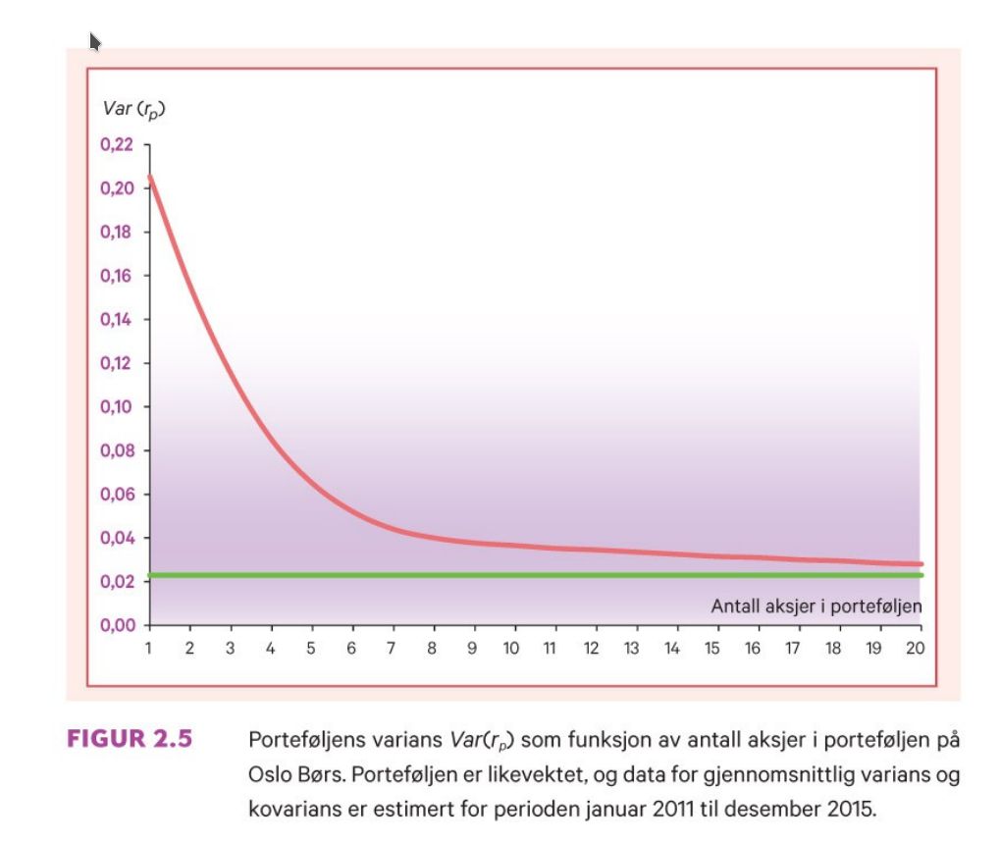
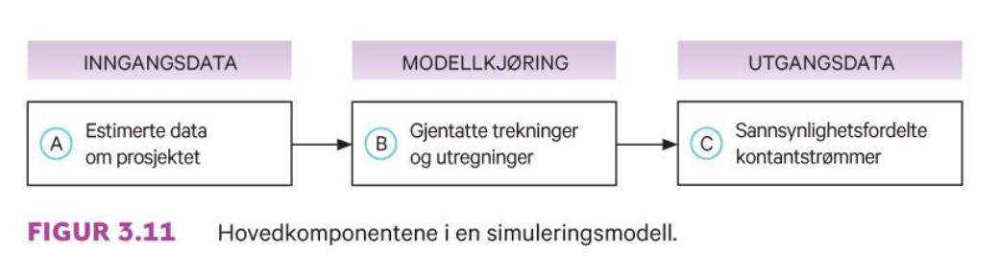
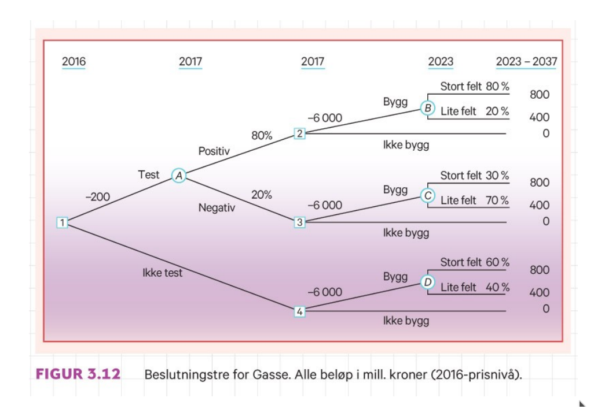
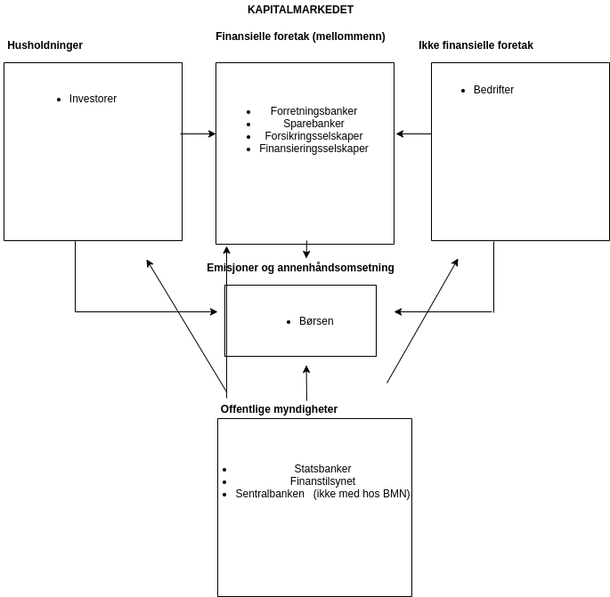

```{r xaringan-tile-view, echo=FALSE, message=F, warning=F}
xaringanExtra::use_editable(expires = 1)
xaringanExtra::use_tile_view()
#xaringanExtra::use_share_again()
xaringanExtra::use_scribble()
xaringanExtra::use_webcam()
#xaringanExtra::use_slide_tone()
xaringanExtra::use_panelset()
library(htmlTable)
library(magrittr)
library(xaringan)
library(plotly)
```

```{r eval=FALSE, include=FALSE}
xaringan::inf_mr("presentations.Rmd")
#xaringan::inf_mr("presentations.Rmd")
rmarkdown::render("presentations.Rmd")
system("brave presentations.html")
servr::daemon_stop()
```


```{r echo=FALSE, message=FALSE, warning=FALSE}
source("timeplan.R")
```

## Timeplan

```{r echo=F}
timep_i
```

---

```{r echo=F}
timep_ii
```

---


# Anbefalte oppgaver

```{r, echo=F}
oppgaveplan
```

---

# Pensumliste

.pull-left[

## Hovedbok


```{r, echo=FALSE, out.width="75%", fig.cap=""}
knitr::include_graphics("pensum/figurer-01.png")
```

[Finans: Teori og praksis. Bøhren, Michalsen og Norli](https://www.fagbokforlaget.no/Finans-Teori-og-praksis/I9788245022193)

]

.pull-right[

## Supplerende
```{r, echo=FALSE, out.width="25%", fig.cap=""}
knitr::include_graphics("pensum/falitt.jpg")
```

[fallitt-norske-finansielle-kriser](https://respublica.no/produkter/fallitt-norske-finansielle-kriser/)

]

---

# Kursgodkjennelse

Består av (1) obligatorisk arbeidskrav og (2) skriftlig eksamen. 

## Obligatorisk innleveringsoppgave

28.9: obligatorisk arbeidskrav publiseres (før høstferien)

26.10: obligatorisk arbeidskrav innlevering (to uker etter høstferien)

## Eksamen

Eksamen avholdes den 10.12.

Individuell, skriftlig firetimers eksamen.

Karakterregel: A-F.

Hjelpemidler: godkjent kalkulator.

---

# Lenker benyttet i kurset (foreløpig liste)
- [Kursbeskrivelse](https://www.hiof.no/studier/emner/oss/2020/host/sfb30820.html)
- [Bokens nettside](https://finans2.portfolio.no/)
- [Statens pensjonsfond utland](https://www.nbim.no/no/)
- [Canvas](https://hiof.instructure.com/courses/5156)

---

class: inverse, center, middle

# Forelesning 1: `r tema[1]`

**Læringsmål:**

- Forklare strukturen i risikojustert rente metoden for beregning av nåverdi.
- Redegjøre for forskjellen mellom et investeringsprosjekt og et finansieringsprosjekt.
- Konstruere en kontantstrøm fra prosjektdata.
- Forklare hva som menes med begrepene sannsynlighet, tilstand og utfall.
- Beregne forventet kontantstrøm og forventet avkastning for et prosjekt og en portefølje.
- Gi et oversiktsbilde av innholdet i boken og bokens nettside.

`r paste("Oppdatert:",Sys.Date())`

---

## Nåverdiberegninger med og uten usikkerhet

**Uten usikkerhet (til nå)**

*Nåverdikriteriet*
\begin{equation}
NV = \sum_{t=0}^{T} \frac{X_{t}}{(1+k)^t} = 
X_{0} + \frac{X_{1}}{(1+k)^1} + \frac{X_{2}}{(1+k)^2} + ... + \frac{X_{T}}{(1+k)^T} 
\end{equation}

Beslutningsregel:
- Gitt uavhengig prosjekter, prosjektet igangsettes dersom nåverdien (NV) $> 0$
- Gitt avhengige prosjekter, det prosjekt som har høyest nåverdi (NV) av de $>0$ igangsettes 

Merk: Ved inkludering av faktorer som inflasjon, skatt og finansiering, endres benevningen *både*
i teller og nevner.

---

**Med usikkerhet/risiko (framover)**

*Risikojustert-rente-metoden (RJ-metoden)*
\begin{equation}
NV = \sum_{t=0}^{T} \frac{E(X_{t})}{(1+k)^t} = 
E(X_{0}) + \frac{E(X_{1})}{(1+k)^1} + \frac{E(X_{2})}{(1+k)^2} + ... + \frac{E(X_{T})}{(1+k)^T} 
\end{equation}

- Telleren er nå erstattet med *forventet* kontantstrøm
- Nevneren er nå erstattet med kapitalkostnad som er *risikojustert*

Beslutningsregel (som tidligere):
- Gitt uavhengig prosjekter, prosjektet igangsettes dersom *forventet* nåverdi (NV) > 0
- Gitt avhengige prosjekter, det prosjekt som har høyest *forventet* nåverdi (NV) av de $>0$ igangsettes 

Et alternativ til RJ-metoden (som gir samme svar) er å foreta selve risikojusteringen i telleren av uttrykket. Dette gjøres ved å trekke risikokostnaden fra den forventede kontantstrømmen. Nettbeløpet som blir igjen omtales som *sikkerhetsekvivalenten*. I tråd med prinsippet om samme type benevning i teller og nevner, må dette beløpet deles på den risikofrie renten.

---

Sammenlignet med nåverdikriteriet, krever RJ-metoden at vi i tillegg klare å
beregne

- Forventet kontantstrøm

Utgangspunktet her er at vi betrakter framtiden i form av ulike scenarioer, hvor vi tilknytter en sannsynlighet til hvert enkelt scenario.

- Kapitalkostnad (risikojustert-rente)

Dette uttrykket består nå både av en *tids-* og *usikkerhetsdimensjon*.

Formelt kan vi uttrykke dette som
\begin{equation}
\text{Risikojusert rente}=\text{risikofri rente}+\text{risikopremie}
\end{equation}

Hvor *Risikopremien (risikokostnaden)* representerer den nye komponenten. I kapittel 2-3 i læreboka vises det at for et prosjekt vil denne komponentene er produktet av en *pris (kostnad per risikokomponent)* og *kvantumkomponent (antall risikoenheter tilhørende prosjektet)*. 
---

**Oppgave** N.1.1

Forventet kontantstrøm om ett år er 10 mill. kroner. Risikofri kapitalkostnad er 2 %, og prosjektet har en risikokostnad på 7 %.

Hva er kontantstrømmen verd i dag?
<br>**Svar:**<br>
\begin{equation}
NV=\frac{10}{1+(0.02+0.07)}=\frac{10}{1.09}=9.17
\end{equation}

Hva er sikkerhetsekvivalenten ved slutten av perioden?
<br>**Svar:**<br>
\begin{equation}
9.17=\frac{X}{1+(0.02)} \Leftrightarrow  \\
X=9.17\cdot (1.02)=9.17\cdot (1.02)=9.35
\end{equation}

Hva er sikkerhetsekvivalenten ved periodens begynnelse?
<br>**Svar:**<br>
\begin{equation}
NV=9.17
\end{equation}

---

## Investerings- vs. finansierinsgprosjekt

Et investeringsprosjekt viser bedriftens bruker av penger for å skaffe seg eiendeler i form av anlegg- og omløpsmidler (regnskapsbalansens venstreside)

Et finansieringsprosjekt viser bedriftens anskaffelse av penger i form av gjeld og egenkapital (regnskapsbalansens høyreside)
---

**Oppgave N.1.4**

1. Hvordan vil du beskrive forskjellen mellom et investeringsprosjekt og et finansieringsprosjekt ut fra egenskaper ved kontantstrømmene de gir?
<br>**Svar:**<br>
- I et investeringsprosjekt er tegnfølgen i kontantstrømmen (–,+,+,…,+)
- Tegnfølgen i et finansieringsprosjekt er (+,–,–,…,–)
1. Hva er forholdet mellom kapitalkostnad og nåverdi for et investeringsprosjekt kontra for et finansieringsprosjekt?
<br>**Svar:**<br>
For investeringsprosjekter faller nåverdien med økende kapitalkostnad. For finansieringsprosjekter stiger den.

<!--1. Hva reflekterer kapitalkostnaden (diskonteringsrenten) i et finansieringsprosjekt?-->
---

## Prosjektets Kontantstrøm
For prosjektets kontantstrøm kan velkjente prinsipper tas i bruk til beregning av kontantstrømmen, en trenger kun å spesifere de ulike scenarioene/tilstandene og tilknytte en sannsynlighet til hver av disse.

Fra Oljefelteksemplet eksempel 1.3 i læreboka har vi

```{r, echo=F}
radnr <- c("Salgsinntekt",
	   "Driftsutgift",
	   "Investering",
	   "Ny arbeidskapital",
	   "Avskrivninger",
	   "Skattbart overskudd",
	   "Skatt",
	   "Kontantstrøm etter skatt",
	   "Sannsynlighet")
tils1 <- c(1350,500,200,50,300,550,440,160,0.42)
tils2 <- c(900,500,200,50,300,100,80,70,0.28)
tils3 <- c(1350,400,200,50,300,650,520,180,0.18)
tils4 <- c(900,400,200,50,300,200,160,90,0.12)
df_prosj_kontantstrøm <- data.frame(radnr,tils1,tils2,tils3,tils4)
htmlTable(df_prosj_kontantstrøm, header=c("Tilstand:","1","2","3","4"))
```


---

Den forventede kontantstrømmen framkommer derfor som 

$$
0.42\cdot 160+0.28\cdot 70+0.18\cdot 180 +0.12\cdot 90 = 130 
$$

---

## Nærmere om forventet kontantstrøm

Formelt vil den forventede kontantstrømmen for en bestemt periode t kunne uttrykkes som den forventede verdien til en sannsynlighetsfordeling:

\begin{equation}
E(X)=\sum_{s=1}^{S}Pr(s)X(s)=Pr(1)X(1) + Pr(2)X(2) + ... + Pr(S)X(S)
\end{equation}

Her uttrykker
- $Pr(s)$ gir oss *sannsynligheten* (verdi mellom 0 og 1) for at tilstand s inntreffer
- $s \in \{1,2,..,S\}$ representerer settet av alle mulige *tilstander* som kan inntreffe
- $X(s)$ er *utfallet* til kontantstrømmen dersom tilstand $s$ inntreffer

---

## Porteføljeavkastning

Selve porteføljeavkastningen (rp) uten skatt er gitt ved

$rp=\frac{P_{T}+Div_{0,T}-P_{0}}{P_{0}}$

### Metode 1: Forventet avkastning

\begin{equation}
E(rp) = \sum_{s=1}^{S}Pr(s)X(s) = 
Pr(1)X(1) + Pr(2)X(2) + ... + Pr(S)X(S) 
\end{equation}

### Metode 2: Forventet avkastning

\begin{equation}
E(rp) = \sum_{i=1}^{N}w_{i}E(X_{i})=w_{1}E(X_{1})+w_{2}E(X_{2})+...+w_{N}E(X_{N})
\end{equation}

---

**Oppgave N.1.2**

AS Condor står overfor tre investeringsprosjekter med følgende avkastning:

```{r, echo=F}
#Prosjekt	Nedgangstid	Oppgangstid
#X	3	3
#Y	5	12
#Z	9	11
#Sannsynlighet	30 %	70 %
dfn12 <- data.frame(prob=c(0.30,0.70),beskr=c("Nedgangstid","Oppgangstid"),x=c(3,3),y=c(5,12),z=c(9,11))
#htmlTable(df1,header=c("Sannsynlighet","Prosjekt X","Prosjekt Y","Prosjekt Z"))
htmlTable(dfn12,header=c("Sannsynlighet","Tilstandsbeskrivelse","Prosjekt X","Prosjekt Y","Prosjekt Z"))
```

1. Hva er særtrekket ved prosjekt X?
<br>**Svar:**<br>
Kontantstrømmen er sikker (lik 3 i begge perioder)
2. Beregn forventet avkastning for hvert prosjekt.
<br>**Svar:**<br>
\begin{equation}
E(r_x)=0.30\cdot 3+0.70\cdot 3 = 3\\
E(r_y)=0.30\cdot 5+0.70\cdot 12 = 9.9\\
E(r_z)=0.30\cdot 9+0.70\cdot 11 = 10.4
\end{equation}
---
<p>3.</p> Hva er forventet avkastning på en portefølje med like stort beløp investert i hvert av prosjektene?
.panelset[
.panel[.panel-name[Metode 1]
<br>
<br>
$$
E(r_p)=0.3\cdot (1/3\cdot 3+ 1/3\cdot 5 +1/3\cdot 9) + \\
0.7\cdot (1/3\cdot 3+ 1/3\cdot 12 +1/3\cdot 11) = 7.76
$$
]
.panel[.panel-name[Metode 2]
<br>
<br>
$$
E(r_p)=1/3\cdot 3+1/3\cdot 9.9 +1/3\cdot 10.4=1/3\cdot(3+9.9+10.4) = 7.76
$$
]
]

<p>4.</p> Hva er svaret på spm. 3 hvis begge tilstander er like sannsynlige?
<br>**Svar:**<br> 
$$
E(r_p)=0.5\cdot (1/3\cdot 3+ 1/3\cdot 5 +1/3\cdot 9) + 
0.5\cdot (1/3\cdot 3+ 1/3\cdot 12 +1/3\cdot 11) = 7.16 
$$ 
---

**Oppgave** N.1.3

Gå tilbake til de tre prosjektene fra oppgave N.1.2.

1. Hvordan bør du velge porteføljevekter for å få høyest mulig forventet avkastning?
<br>**Svar:**<br>
Sette alt i prosjekt Z (vekt lik 1), siden dette gir den høyeste forventede avkastningen.
1. Er porteføljen du valgte under spm. 1 også den beste porteføljen som kan velges?
<br>**Svar:**<br>
Nei, prosjekt gir høyere avkastning under oppgangstid.
1. Er det fornuftig å sette alle pengene i prosjekt X?
<br>**Svar:**<br>
Nei, både Y og Z gir bedre avkastning enn X uansett tilstand.

---

## Veien framover

Oppgave til neste forelesning:
- Gi et oversiktsbilde av innholdet i boken og bokens nettside.


```{r, echo=FALSE, out.width="25%", fig.cap=""}

```
---

class: inverse, center, middle

# Forelesning 2: `r tema[2]`

**Læringsmål:**

-  Forklare gjennom et eksempel hvorfor et prosjekt som er risikabelt vurdert alene kan ha lav risiko når prosjektet inngår i en portefølje.
-  Tallfeste risiko i en portefølje ved å beregne standardavvik.
-  Forklare hvorfor porteføljens risiko avhenger av samvariasjonen mellom prosjektene som inngår i porteføljen og de andelene som er investert i hvert prosjekt.

`r paste("Oppdatert:",Sys.Date())`

---

## Prosjektrisiko for eierne vs. bedriften

Grunnleggende forutsetning: Ledelsen i bedriften har som oppgave å treffe beslutninger som maksimerer verdien av egenkapitalen til eierne. 

Vi tar utgangspunkt i følgende tabell
```{r, echo=FALSE, out.width="25%"}
dfn12 <- data.frame(prob=c(0.20,30,50),
		    beskr=c("Nedgangstid","Trend","Oppgangstid"),
		    tilstand=c(1,2,3),
		    bedriften=c(-60,5,60),
		    nyttprosj=c(30,2.5,-30),
		    portefoljen_ikkediv=c(-60,5,60),
		    portefoljen_div=c(10,5,-10))
g1 <- ggplot(data=dfn12, aes(x=beskr, y=nyttprosj)) + geom_bar(stat="identity")
g2 <- ggplot(data=dfn12, aes(x=beskr, y=bedriften)) + geom_bar(stat="identity")
g3 <- ggplot(data=dfn12, aes(x=beskr, y=portefoljen_ikkediv)) + geom_bar(stat="identity")
g4 <- ggplot(data=dfn12, aes(x=beskr, y=portefoljen_div)) + geom_bar(stat="identity")
htmlTable(dfn12, header=c("Sannsynl.","Tilstandsb.","Tilstand","Bedriftens portefølje","Nytt prosjekt","Eierens portefølje (ikke div.)", "Eierens portefølje (div.)"))
```

---

### Risiko for bedriften

De nye prosjektets bidrag til bedriftens kontantstrøm

```{r, echo=FALSE, out.width="45%"}
gridExtra::grid.arrange(g1,g2,ncol=2)
```

---

### Risiko for eierne

- Udeversifiserte eiere: 
  - Ser forventet kontantstrøm fra det nye prosjektet i sammenheng med **bedriftens** allerede eksisterende kontantstrøm

```{r, echo=FALSE, out.width="20%"}
gridExtra::grid.arrange(g1,g3,ncol=2)
```

- Veldiversifiserte eiere: 
  - Ser forventet kontantstrøm fra det nye prosjektet i sammenheng med **porteføljens** eksisterende kontantstrøm

```{r, echo=FALSE, out.width="20%"}
gridExtra::grid.arrange(g1,g4,ncol=2)
```

---

## Måling av risiko 

**Metode 1 for måling av risiko (1-n investeringsobjekter)**
- Varians
\begin{equation}
Var(X)=\sum_{s=1}^{S}Pr(s)[X(s)-E(X)]^2=\\ Pr(1)[X(1)-E(X)]^2+Pr(2)[X(2)-E(X)]^2+...+\\Pr(S)[X(S)-E(X)]^2
\end{equation}
- Standardavvik
\begin{equation}
Std(X)=\sqrt{Var(X)}
\end{equation}

Merk: Mens standardavviket gir oss samme benevning som forventet verdi, er benevningen til variansen vanskeligere å forholde seg til ("tolkning: Det kvadrerte til benevningen av standardavviket")


---

**Metode 2 for måling av risiko (2 investeringsobjekter)**
- Varians
\begin{equation}
Var(r_p)=w_1^2Var(r_1)+w^2_2Var(r_2)+2w_1w_2Kov(r_1,r_2)
\end{equation}
Hvor samvariasjonen er gitt ved
\begin{equation}
Kov(r_1,r_2)=\sum_{s=1}^{S}Pr(s)[r_1(s)-E(r_1)][r_2(s)-E(r_2)] \\
Pr(1)[r_1(1)-E(r_1)][r_2(1)-E(r_2)]+\\Pr(2)[r_1(2)-E(r_1)][r_2(2)-E(r_2)]+...+ \\ Pr(S)[r_1(S)-E(r_1)][r_2(S)-E(r_2)] 
\end{equation}

- Standardavviket
\begin{equation}
Std(r_p)=\sqrt{Var(r_p)}
\end{equation}

---

## Måling av risiko
### Enkelobjekter

**Eksempel 2.1**
```{r, echo=F}
# Data input
df_eks_2_1 <- data.frame(tilstand=c(1,2,3),
                         prob=c(0.2,0.5,0.3),
                         avk_a=c(0.16,0.12,0.06),
                         avk_b=c(0.05,0.20,0.40)
                         )
ex_a <- c(df_eks_2_1$avk_a%*%df_eks_2_1$prob)
ex_b <- c(df_eks_2_1$avk_b%*%df_eks_2_1$prob)
vx_a <- c((df_eks_2_1$avk_a-ex_a)^2%*%df_eks_2_1$prob)
vx_b <- c((df_eks_2_1$avk_b-ex_b)^2%*%df_eks_2_1$prob)
htmlTable(df_eks_2_1, header=c("Tilstand","Sansynlighet","A","B"))
```

---

Fra Metode 1 oppgitt under første forelesning har vi at 

$$E(r_a)=0.2\cdot 0.16+0.5\cdot 0.12+0.3\cdot 0.06=0.11$$ 
$$E(r_b)=0.2\cdot 0.05+0.5\cdot 0.20+0.3\cdot 0.40=0.23$$

Fond **A**
\begin{equation*}
Var(r_a) =0.2[0.16-0.11]^2+0.5[0.12-0.11]^2+0.3[0.06-0.11]^2=0.0013 \\
Std(r_a)=\sqrt{0.0013}=0.03605551
\end{equation*}

Fond **B**
\begin{equation*}
Var(r_b) =0.2[0.05-0.23]^2+0.5[0.20-0.23]^2+0.3[0.40-0.23]^2=0.0156 \\
Std(r_b)=\sqrt{0.0156}=0.1249
\end{equation*}

---

## Måling av risiko
### Sammensatt fond 

Vi antar nå at investeringsbeløpet er likt fordelt mellom de to fondene, dvs $w_1=1/2,w_2=1-w_2=1/2$. 

```{r, echo=F}
# Portefølje: 1-2
w <- c(0.50,0.50)
## Metode 1
df_eks_2_1_w <- df_eks_2_1 %>%
  dplyr::mutate(wa=w[1],wb=w[2]) %>%
  dplyr::mutate(avk_c=avk_a*wa+avk_b*wb)

ex_c <- c(df_eks_2_1_w$avk_c%*%df_eks_2_1_w$prob)
vx_c <- c((df_eks_2_1_w$avk_c-ex_c)^2%*%df_eks_2_1_w$prob)
# Covarnaise missing
htmlTable(df_eks_2_1_w, header=c("Tilstand","Sansynlighet","Avk. A","Avk. B", "w_a","w_b","Avk. C"))
```

Risikoen til det sammensatte fondet C kan måles ved bruk av både metode 1 og 2.

---

**Metode 1**
\begin{equation*}
Var(r_c) =0.2[0.105-0.17]^2+0.5[0.16-0.17]^2+0.3[0.23-0.17]^2=0.001975\\
Std(r_c)=\sqrt{0.001975}=0.044
\end{equation*}

**Metode 2**
\begin{equation*}
Var(r_c) =(1/2)^2(0.0013)+(1/2)^2(0.0156)-2(1/2)(1/2)0.0045=0.001975 \\
Std(r_c)=\sqrt{0.001975}=0.044
\end{equation*}

Hvor vi har benyttet at
\begin{equation*}
Kov(r_a,r_b) = 0.2[0.16-0.11][0.05-0.23]+0.5[0.12-0.11][0.20-0.23]+\\
0.3[0.06-0.11][0.40-0.23]=-0.0045\\
\end{equation*}

```{r, echo=F, eval=F}
0.2*(0.16-0.11)*(0.05-0.23)+
0.5*(0.12-0.11)*(0.20-0.23)+
0.3*(0.06-0.11)*(0.40-0.23)
#
(1/2)^2*(0.0013)+(1/2)^2*(0.0156)-2*(1/2)*(1/2)*0.0045
cx_c <- c(((df_eks_2_1_w$avk_a-ex_a)*
	   (df_eks_2_1_w$avk_b-ex_b))%*%df_eks_2_1_w$prob)
#m <- as.matrix(df_eks_2_1_w[,c(3,4)])
#v <- as.vector(df_eks_2_1_w[,c(2)])
#cov.wt(m,v)$cov
```

---

## Risikoholdning og risikokompensasjon

### Holdning

Vi kan skille mellom *risiknøytrale* og *risikoaversje* aktører

- Risikonøytral kun opptatt av forventet avkastning (+)
	- Bedre ut: *Nordover* et diagram med risiko på x-aksen og forventet avkastning på y-aksen
- Risikoaversj opptatt av forholdet mellom forventet avkastning (+) og risiko (-)
- Bedre ut: *Nordvestover* (*forventning-varians/standardavvik-kriteriet*) i et diagram (forventet avkastning varians/standardavvik kriteriet) med risiko på x-aksen og forventet avkastning på y-aksen

I dette kurset legger vi til grunn at alle aktørene er risikoaversje (ikke villig til å bære usikkerhet gratis), men at graden av risikoaversjon kan variere mellom de ulike aktørene.

---

```{r, echo=FALSE, out.width="75%", fig.cap=""}
knitr::include_graphics("pensum/figurer-04.png")
```

---

### Risikokompenasjon (litt empiri)

Finner man igjen dette i det observerte tallmateriale?

#### Veldiversifisert portefølje

```{r, echo=F}
velportf <- data.frame(label=c("Risikofri rente","Aksjeindeks"),gjsnitt=c(0.015,0.068),stavviks=c(0.01,0.127)) 
htmlTable(velportf, header=c("","Gjennomsnitt","Standardavvik"))
```

#### Udiversifisert portefølje

```{r, echo=F}
udiportf <- data.frame(label=c("Yara","Itera","Aker Solutions","","Portefølje (3 aksjer)"),gjsnitt=c(0.07,0.07,0.08,NA,0.07),stavviks=c(0.29,0.27,0.31,NA,0.21)) 
htmlTable(udiportf, header=c("","Gjennomsnitt","Standardavvik"))
```

---

**Hovedresultater fra undersøkelsen**

1. Det er mye å hente ved diversifisering: Risikoen kan reduseres kraftig uten at du taper noe i form av lavere forventet avkastning
2. Risikokompensasjonen for en enkeltaksje er ikke knyttet til aksjens standardavvik (totalrisiko). Relevant risiko må derfor måles på andre måter.

---

## Endring av porteføljevekter og samvariasjon

### Porteføljevekter

```{r, echo=FALSE, out.width="75%", fig.cap=""}
knitr::include_graphics("pensum/figurer-06.png")
```

---

**øvelse:** forsøk å repliker følgende resultater i excel

.panelset[
.panel[.panel-name[tabell]
```{r, echo=F}
htmlTable(df_eks_2_1, header=c("tilstand","sannsynlighet","avkastning a", "avkastning b"))
```
]
.panel[.panel-name[r-kode (ikke pensum)]
```{r}
#r <- cor(df_eks_2_1[,3],df_eks_2_1[,4])
#plotwf <- c(r) %>% purrr::map_dfr(function(r,df=df_eks_2_1){
#	w <- seq(0,1,0.01)
#	v <- as.vector(df[,(2)])
#	m <- as.matrix(df[,(3:4)])
#	covall <- cov.wt(m,v,method='ml')
#	avk <- as.vector(covall$center)
#	kov <- covall$cov[lower.tri(covall$cov)] 
#	var <- as.vector(diag(as.matrix(covall$cov)))
#	avkdf <- data.frame(corr=r,w1=1-w, w2=w) %>%
# 		dplyr::mutate(forvavk=w1*avk[1]+w2*avk[2]) %>%
# 		dplyr::mutate(varians=w1^2*var[1]+w2^2*var[2]+2*w1*w2*r*sqrt(var[1])*sqrt(var[2])) %>%
# 		dplyr::mutate(stdavk=sqrt(varians))
#			 }
#)
```
]
.panel[.panel-name[figur]
```{r, echo=F}
#gg <- ggplot2::ggplot(data=plotwf,ggplot2::aes(x=stdavk,y=forvavk)) + ggplot2::geom_point() 
#plotly::ggplotly(gg)
```
]
]

---

### Korrelasjonskoeffisienten (standardisert mål på samvariasjon)

\begin{equation}
Kor(r_a,r_b)=\frac{Kov(r_a,r_b)}{S(r_a)S(r_b)}
\end{equation}

- $Kor(r_a,r_b)=1$ (helt avhengige)
- $Kor(r_a,r_b)=0$ (helt uavhengige)
- $Kor(r_a,r_b)=-1$ (helt motsatt avhengige)

Løser denne for $Kov(r_a,r_b)=Kor(r_a,r_b)S(r_a)S(r_b)$

Som gjør at vi kan skrive
\begin{equation}
Var(r_p)=w_1^2Var(r_1)+w^2_2Var(r_2)+2w_1w_2Kor(r_a,r_b)S(r_a)S(r_b)
\end{equation}

---

Holder vi oss til eksempel 2.1, innebærer dette at beregningene av porteføljevariansen også kan uttrykkes som
\begin{equation*}
Kor(r_a,r_b)=\frac{-0.0045}{0.036\cdot 0.125}=-1
\end{equation*}

Mens variansen til porteføljen kan uttrykkes som
\begin{equation*}
Var(r_p)=(1/2)^2(0.0013)+(1/2)^2(0.0156)-2(1/2)(1/2)0.036\cdot 0.125 \\= 0.001975
\end{equation*}

---

```{r, echo=FALSE, out.width="75%", fig.cap=""}
knitr::include_graphics("pensum/figurer-05.png")
```

---


```{r, echo=FALSE, out.width="75%", fig.cap=""}
knitr::include_graphics("pensum/figurer-07.png")
```

---

**Øvelse:** Forsøk å replikere følgende tabell i Excel

.panelset[
.panel[.panel-name[Tabell]
```{r, echo=F}
htmlTable(df_eks_2_1, header=c("Tilstand","Sannsynlighet","Avkastning A", "Avkastning B"))
```
]
.panel[.panel-name[R-kode (ikke pensum)]
```{r}
plotwf <- c(-1,0,1) %>% purrr::map_dfr(function(r,df=df_eks_2_1){
	w <- seq(0,1,0.01)
	v <- as.vector(df[,(2)])
	m <- as.matrix(df[,(3:4)])
	covall <- cov.wt(m,v,method='ML')
	avk <- as.vector(covall$center)
	kov <- covall$cov[lower.tri(covall$cov)] 
	var <- as.vector(diag(as.matrix(covall$cov)))
	avkdf <- data.frame(corr=r,w1=1-w, w2=w) %>%
 		dplyr::mutate(forvavk=w1*avk[1]+w2*avk[2]) %>%
 		dplyr::mutate(varians=w1^2*var[1]+w2^2*var[2]+2*w1*w2*r*sqrt(var[1])*sqrt(var[2])) %>%
 		dplyr::mutate(stdavk=sqrt(varians))
			 }
)
```

]
.panel[.panel-name[Figur]
```{r, echo=F}
ggf <- ggplot2::ggplot(data=plotwf,ggplot2::aes(x=stdavk,y=forvavk, group_by=corr)) + ggplot2::geom_point() 
#plotly::ggplotly(ggf)
```
]
]
Følgende tabell
```{r, echo=FALSE, out.width="25%"}
dfn12 <- data.frame(prob=c(0.20,0.30,0.50),
		    beskr=c("Nedgangstid","Trend","Oppgangstid"),
		    tilstand=c(1,2,3),
		    bedriften=c(-60,5,60),
		    nyttprosj=c(30,2.5,-30),
		    portefoljen_ikkediv=c(-60,5,60),
		    portefoljen_div=c(10,5,-10))
g1 <- ggplot(data=dfn12, aes(x=beskr, y=nyttprosj)) + geom_bar(stat="identity")
g2 <- ggplot(data=dfn12, aes(x=beskr, y=bedriften)) + geom_bar(stat="identity")
g3 <- ggplot(data=dfn12, aes(x=beskr, y=portefoljen_ikkediv)) + geom_bar(stat="identity")
g4 <- ggplot(data=dfn12, aes(x=beskr, y=portefoljen_div)) + geom_bar(stat="identity")
htmlTable(dfn12, header=c("Sannsynl.","Tilstandsb.","Tilstand","Bedriftens portefølje","Nytt prosjekt","Eierens portefølje (ikke div.)", "Eierens portefølje (div.)"))
```

---

class: inverse, center, middle

# Forelesning 3: `r tema[3]`

**Læringsmål:**

-  Beskrive hvorfor risikoen i en portefølje reduseres når antall prosjekter i porteføljen øker.
-  Gi eksempler på kilder for systematisk og usystematisk risiko.
-  Beregne betaverdien til et prosjekt og forklare hva den fanger opp.

`r paste("Oppdatert:",Sys.Date())`

---

## Måling av risiko (portefølje fra 3 til n fonds)

**Metode 2 for måling av risiko (3 investeringsobjekter)**

Porteføljens varians er gitt ved
\begin{equation}
Var(r_p)=w_a^2Var(r_a)+w^2_bVar(r_b)+w^2_cVar(r_c) + \\
2w_aw_bStd(a)Std(b)Korr(a,b)+\\
2w_aw_cStd(a)Std(c)Korr(a,c)+\\
2w_bw_cStd(b)Std(c)Korr(b,c) 
\end{equation}
Mens standardavviket (som tidligere) framkommer som
\begin{equation}
Std(r_p)=\sqrt{Var(rp)}
\end{equation}

---

**Eksempel 2.6**

```{r, eval=T, echo=F}
w <- c(0.30, 0.40, 0.30)
df_eks_2_6 <- data.frame(aksje=c("A","B","C"),erp=c(0.12,0.15,0.25),std=c(0.10,0.20,0.40),korr=c("Mellom A og B: 0.8",
												 "Mellom A og C: 0.5",
												 "Mellom B og C: -0.10"))
htmlTable(df_eks_2_6, header=c("Aksje","Forventet avkastning","Standardavvik","Korrelasjonskoeffisient"))
```

Hvor investert beløp vektene er gitt ved $w_a$=`r w[1]`, $w_b$=`r w[2]` og $w_c$=`r 1-w[1]-w[2]`

Ved innsetting av formelen gir dette oss

\begin{equation}
Var(r_p)=(0.30)^2\cdot 0.10^2+(0.40)^2\cdot 0.20^2+(0.3)^2\cdot 0.40^2 \\ 
+2 \cdot 0.30 \cdot 0.40 \cdot 0.10 \cdot 0.20 \cdot 0.80 \\ 
+2 \cdot 0.30 \cdot 0.30 \cdot 0.10 \cdot 0.40 \cdot 0.50 \\
-2 \cdot 0.40 \cdot 0.30 \cdot 0.20 \cdot 0.40 \cdot 0.10 \\ 
=0.02722
\end{equation}

\begin{equation*}
Std(r_p)=\sqrt{0.02722}=0.1649848
\end{equation*}

```{r, eval=F, echo=F}
#! doublecheck
l1 <- (0.30)^2*0.10^2+(0.40)^2*0.20^2+(0.3)^2*0.40^2
l2 <- 2*0.30*0.40*0.10*0.20*0.80+2*0.30*0.30*0.10*0.40*0.50 -2*0.30*0.40*0.20*0.40*0.10  
l1+l2
sqrt(l1+l2)
```

---

**Metode 2 for måling av risiko (generell metode med n investeringsobjekter)**

Porteføljens forventning er gitt ved
\begin{equation}
E(r_p)=\sum_{i=1}^{N}w_iE(r_i)=w_1E(r_1)+w_2E(r_2)+...+w_NE(r_N)
\end{equation}
Porteføljens varians gitt ved
\begin{equation}
Var(r_p)=\sum_{i=1}^{N}w_i^2Var(r_i)+\underset{i\neq j}{\sum_{i=1}^{N}\sum_{j=1}^{N}}w_iw_jKov(i,j)=\\
\sum_{i=1}^{N}w_i^2Var(r_i)+\underset{i\neq j}{\sum_{i=1}^{N}\sum_{j=1}^{N}}w_iw_jStd(i)Std(j)Korr(i,j)
\end{equation}
Mens standardavviket (som tidligere) er gitt ved
\begin{equation}
Std(r_p)=\sqrt{Var(rp)}
\end{equation}

---

### Diversifisering og risikoreduksjon

- Legg merke til at første del av uttrykket for porteføljevariansbestår av $N$ ledd, mens siste består av $N^2-N$ ledd

- Dersom vi antar at en like stort andel $1/N$ blir investert i hvert av de n objektene, kan vi skrive 
\begin{equation}
Var(r_p)=\frac{1}{N}^2(Var(r_1)+Var(r_2)+...+Var(r_N)))\\
+(N^2-N)(Kov(r_1,r_2)+Kov(r_1,r_2)+...+Kov(r_1,r_2))))
\end{equation}

Vi har at gjennomsnittlig varians ( $\overline{Var}$ ) er gitt ved

$$
\overline{Var}=\frac{1}{N}(Var(r_1)+Var(r_2)+...+Var(r_N))
$$

Mens gjennomsnittlig kovarians ( $\overline{Kov}$ ) er gitt ved

$$
\overline{Kov}=\frac{1}{N}(Kov(r_1,r_2)+Kov(r_1,r_2)+...+Kov(r_1,r_2))
$$

---

Uttrykket ovenfor kan derfor skrives som

\begin{equation}
Var(r_p)=N(1/N)^2(\overline{Var}) + (N^2-N)(\frac{1}{N})^2(\overline{Kov})
\end{equation}

Vi kan forenkle dette, slik at vi til slutt står igjen med

\begin{equation}
Var(r_p)=\frac{1}{N}(\overline{Var}) + (1-\frac{1}{N})(\overline{Kov})
\end{equation}

Dette uttrykket forteller oss:

- Større N (dvs. desto flere aksjer i porteføljen), desto mer dominerer porteføljevariansen av $(1-\frac{1}{N})\overline{Kov}$ framfor $\frac{1}{N}\overline {Var}$
- Når $N \rightarrow \infty$, synker porteføljevariansen mot sin nedre grense gitt ved $\overline(Kov)$
- Desto lavere $\overline{Kov}$ er i forhold til 
  $\overline{Var}$, desto rasker synker porteføljevariansen når antall aksjer i porteføljen stiger

---

Eks. Oslo Børs perioden 2011-2015. 


```{r, echo=FALSE, out.width="55%", fig.cap=""}

```

Her har vi at $\overline{Var}=0.21$ og gjennomsnittlig $\overline{Kov}=0.0229$.

\begin{equation*}
Var(r_p)=\frac{1}{N}(0.21) + (1-\frac{1}{N})(0.0229)
\end{equation*}

---


.panelset[
.panel[.panel-name[R-kode (ikke pensum)]
```{r}
varo <- 0.21
kovo <- 0.0229
tportvar <- '(1/N)*varo + (1-1/N)*kovo'
N <- 1:60
df_n <- data.frame(N=N,varp=eval(parse(text=tportvar),c(varo=varo,kovo=kovo,list(N=N))))
```
]
.panel[.panel-name[Figur]
```{r, out.width="55%",echo=F}
ggplot2::ggplot(df_n, aes(x=N,y=varp)) + geom_line()
```
]]

**Øvelse:** Se om du klarer å replikere figuren som er vist her ved bruk av et regneark.

---

## Kilder til usystematisk og relevant risiko

Uttrykket for porteføljvariansen med N-objekter (**øvelse:** se om du klarer å finne ut av det på egenhånd) kan dekomponeres til å bestå av en komponent for *Systematisk* risiko og en annen komponent for *usystemtisk* risiko. 

\begin{equation}
Var(r_p)=(\frac{1}{N})\overline{Var}+(1-\frac{1}{N})\overline{Kov}=\\ 
\underset{\text{Systematisk risiko}}{\overline{Kov}} +
(\frac{1}{N}) \underset{\text{Usystematisk riskiko}}{(\overline{Var}-\overline{Kov})} 
\end{equation}

Det første leddet er her et mål på porteføljens *systematiske* (ikke diversifiserbare) risiko, mens det siste leddet representerer den *usystematiske* risikoen. 

---

- Usystematisk risiko
  - Ledelsen kompetanse eller helse
  - Forsinkelser, lokal streik, brann
  - Overgang til ny teknolog innen en bransje

- Systematisk risiko
  - Konjunkturbevegelser
  - Pandemi
  - Krig eller fred 

---

## Betaverdien til en aksje eller et prosjekt

Relevant risiko til en enkelt aksje eller et prosjekt kan forstås som 
forholdet mellom aksjens eller prosjektets risiko i forhold til markedsporteføljen. Dette relativet risikomålet betegner vi som *beta* ( $\beta$ ):

\begin{equation}
\beta_j=\frac{Kov(r_j,r_m)}{Var(r_m)}
\end{equation}

- $\beta_j>1$ - Mer følsom enn markedsporteføljen
- $\beta_j=1$ - Følsomhet lik markedsporteføljen 
- $\beta_j<1$ - Mindre følsom enn markedsporteføljen
- $\beta_j=0$ - Risikofri aksje (null systematisk risiko, man kan innehold usystematisk risiko)

Ved å utnytte sammenhengen om at $Kor(j,m)=\frac{Kov(j,m)}{Std(j)Std(m)}$, kan vi også uttrykke beta som 

\begin{equation}
\beta_j=\frac{Kor(r_j,r_m)Std(r_j)}{Std(r_m)}
\end{equation}

---

```{r, echo=FALSE, out.width="55%", fig.cap=""}
knitr::include_graphics("pensum/figurer-09.png")
```

---

```{r, echo=FALSE, out.width="55%", fig.cap=""}
knitr::include_graphics("pensum/figurer-10.png")
```

---

class: inverse, center, middle

# Forelesning 4: `r tema[4]`

**Læringsmål:**

- Forklare begrepene effisiente og ineffisiente porteføljer og konstruere slike porteføljer ut fra data.

`r paste("Oppdatert:",Sys.Date())`

---

## Effisiente porteføljer

### Effisienslinjen uten risikofritt alternativ

```{r, echo=FALSE, out.width="55%", fig.cap=""}
knitr::include_graphics("pensum/figurer-15.png")
```

**Øvelse:**: Ta utgangspunkt i forventning-standardavvik-kriteriet, og forklar hvorfor kurven B-C-D-E utgjør et *effisient sett* av porteføljer.

---


.panelset[
.panel[.panel-name[Tabell]
```{r, echo=F}
htmlTable(df_eks_2_1, header=c("Tilstand","Sannsynlighet","Avkastning A", "Avkastning B"))
```
]
.panel[.panel-name[R-kode (ikke pensum)]
```{r}
# Gjøres enklere til R-funkjson?=
porttrekk <- 1:1000 
plotwfd <- porttrekk  %>% purrr::map_dfr(function(pd){
        # Trekker investeringsandelene
	n <- 3
	x <- runif(3, 0, 1)
	w <- x/sum(x)
	#w <- c(0.3,0.4,0.3)
	# Finner kovariansmatrisen
	erp <- c(0.12,0.15,0.25)
	std <- c(0.10,0.20,0.40)
	korr <- c(0.8,0.5,-0.10)
	kor_matq <- matrix(c(std[1],korr[1],korr[2],korr[1],std[2],korr[3],korr[2],korr[3],std[3]),nrow=3)
	kovv <- c(0,0,0)
	kovv[1]<- korr[1]*std[1]*std[2]  
	kovv[2]<- korr[2]*std[1]*std[3]
	kovv[3]<- korr[3]*std[2]*std[3]
	cov_mat <- matrix(c(std[1]^2,kovv[1],kovv[2],kovv[1],std[2]^2,kovv[3],kovv[2],kovv[3],std[3]^2),nrow=3)
	# Forventet avkastning	
	port_returns <- (sum(w *df_eks_2_6$erp))
        # Varians	
	port_risk_v <- t(w) %*% (cov_mat %*% w)
	port_risk_s <- sqrt(t(w) %*% (cov_mat %*% w))
	avkdf <- data.frame(pdraw=pd,w1=1-w[1], w2=w[2], w3=w[3],wc=sum(w)) %>%
 	dplyr::mutate(forvavk=port_returns) %>%
 	dplyr::mutate(varians=port_risk_v) %>%
	dplyr::mutate(stdavk=port_risk_s)
})
```

]
.panel[.panel-name[Figur]
```{r, echo=F}
ggf <- ggplot2::ggplot(data=plotwfd,ggplot2::aes(x=stdavk,y=forvavk)) + ggplot2::geom_point() 
plotly::ggplotly(ggf)
```
]
]


---

### Effisienslinjen med risikofritt alternativ

```{r, echo=FALSE, out.width="55%", fig.cap=""}
knitr::include_graphics("pensum/figurer-16.png")
```

- Den blå linjen viser kombinasjoner av investeringer i risikofritt alternativ og den effiseinte akjseporteføljen C
 - Til venstre for C vil en andel av de oppsparte innvesteringsbeløpet plasseres i banken 
 - Til høyre for C, ingen sparing så akjseporteføljen blir der finansiert ved bruk av banklån   

---

- Den grønn linjen viser kombinasjoner av investeringer i risikofritt alternativ og den effisiente akjseporteføljen M
 - Til venstre for M vil en andel av de oppsparte innvesteringsbeløpet plasseres i banken 
 - Til høyre for M, ingen sparing så akjseporteføljen blir der finansiert ved bruk av banklån   

Merk: Vi forutsetter her (1) ingen kredittrestriksjoner og at (2) sparerenten er lik utlånsrenten

**Tofondsresultatet:**

1. Uansett graden av risikoaversjon, setter alle investorer sammen sin aksjeportefølje på nøyaktig samme måte.
1. Den enkelte investors risikoaversjon avgjør bare hvor mye som totalt skal satses på den risikable komponenten framfor den risikofrie. Ikke sammensetningen av den risikable komponenten.

**Øvelse:** Hvilken antagelse ligger implisitt til grunn under punkt 1 om investorenes forventninger?

---

### Utledning av kapitalmarkedslinjen (n=2, kombinasjon av risikofri investering og markedsporteføljen M

Forventet avkastning for porteføljen er gitt ved 

\begin{equation}
E(r_p)=wr_f+(1-w)E(r_m) 
\end{equation}

Mens variansen fremkommer som

\begin{equation}
Var(r_p)=(1-w)^2Var(r_m)
\end{equation}

Tar vi kvadratroten av denne på begge sider får vi

\begin{equation}
\frac{Std(r_p)}{Std(r_m)
}=(1-w) 
\end{equation}

Porteføljeavkastningen kan dekomponeres til å bestå av

$$
E(r_p)=wr_f+(1-w)E(r_m) + (r_f - r_f) 
$$

$$
E(r_p)=r_f+(1-w)(E(r_m) - r_f) 
$$

---

Kombinerer uttrykket for forventet avkastning og standardavvik ved å sett inn for $1-w$ gjør at vi kan skrive
\begin{equation}
E(r_p)=r_f+\frac{Std(r_p)}{Std(r_m)}(E(r_m) - r_f) \Leftrightarrow
\end{equation}

- Gitt at $0<w<1 \Rightarrow E(r_p) < E(r_m)$ 
- Gitt at $w=1 \Rightarrow E(r_p) = E(r_m)$
- Gitt at $w>1 \Rightarrow E(r_p) > E(r_m)$ 

```{r, echo=FALSE, out.width="55%", fig.cap=""}
knitr::include_graphics("pensum/figurer-17.png")
```

---

Fra eksempel 3.1-3.2 har vi følgende opplysninger

```{r, echo=F}
radnr <- c("Markedsporteføljen",
	   "Portefølje I",
	   "Portefølje I",
	   "Risikofri rente")
tils1 <- c(0.07,0.05,0.08,0.04)
tils2 <- c(0.03,0.02,0.06,0.00)
df_prosj_kontantstrøm <- data.frame(radnr,tils1,tils2)
htmlTable(df_prosj_kontantstrøm, header=c("","Forventet avkastning","Standardavik"))
```

- Vi har at investor A (stor grad av risikoaversjon) ønsker å plassere 80 prosent av formuen risikofritt
  -  $E(r_p)=0.8\cdot 0.04 + 0.2\cdot 0.07=0.046$ 
  -  $Var(r_p)=0.8^2\cdot 0 + 0.2^2\cdot 0.03^2 +2\cdot 0.8\cdot 0.4\cdot 0=0.00004$
  -  $Std(r_p)=\sqrt{0.00004}  =0.006$
- Vi har at investor B (liten grad av risikoaversjon) ønsker at forventet avkastning i porteføljen skal være på 8.5%
  -  $0.085=w\cdot 0.04 +(1-w)\cdot 0.07 \Leftrightarrow w =-0.5$ og $1-w=1.5$ 
  -  $Var(r_p)=-0.5^2\cdot 0 + 1.5^2\cdot 0.03^2 \cdot 0.07 + 2 \cdot 0.5\cdot 1.5\cdot 0=0.02$
  -  $Std(r_p)=\sqrt{.02}  =0.045$

---

class: inverse, center, middle

# Forelesning 5: `r tema[5]` 

**Læringsmål:**

- Skrive opp kapitalverdimodellen og forklare modellens økonomiske innhold.
- Forklare forskjellen mellom kapitalkostnaden for bedriften og kapitalkostnaden for et enkeltstående prosjekt i bedriften.
- Beskrive kapitalverdimodellens sterke og svake sider.
- Forklare hva slags type risiko følsomhetsanalyse og beslutningstre tar hensyn til.

`r paste("Oppdatert:",Sys.Date())`

<!-- https://www.nettavisen.no/okonomi/oystein-stray-spetalen-advarer-gronne-investorer-de-vil-tape-alle-pengene-sine/s/12-95-3424177786 -->
<!-- https://resett.no/2021/09/11/spetalen-mener-gronne-aksjer-er-overpriset-det-kommer-til-a-bli-helt-katastrofe/ -->

---

## Kapitalverdimodellen (KVM)

Porteføljeteorien som vi analysert forut bygger på eksplisitte forutsetninger om:

- Investorene
 - Risikoaversjon (forventning-varians/standardavvik-kriteriet)
 - Alle investorene har samme én periodiske tidshorisont og prognoser om forventet avkastning
- Kapitalmarkedet
 - Alle investorer kan låne og spare i kapitalmarkedet til den samme risikofrie rente
 - Informasjonen er fritt tilgjengelig for alle
 - Tilbudet av alle eiendeler er gitt

*Kapitalverdimodellen* (KVM) er basert på porteføljeteorien, men inneholder i tillegg forutsetningen om at: 
- Kapitalmarkedet er i likevekt

---

Fra **eksempel 3.3** i læreboka har vi at markedet består tre selskaper(1,2 og 3) og to investorer (A og B). Selskap 1 har en egenkapitalverdi på 2000 kr, selskap 2: 6000 kr og selskap 3: 4000 kr. Investor A ønsker å plassere 3000 kr, mens B plasserer 9000 kr.  


```{r, echo=F}
radnr_i <- c("Etterspørsel A",
	   "Etterspørsel B",
	   "Samlet etterspørsel",
	   "Tilbud")
radnr_ii <- c("Selskap 1",
	   "Selskap 2",
	   "Selskap 3",
	   "")
tils1 <- c(3000,9000,12000,12000)
tils2 <- c(2000,6000,4000,0)
df_prosj_kontantstrøm <- data.frame(radnr_i,tils1,radnr_ii,tils2)
htmlTable(df_prosj_kontantstrøm, header=c("","Børsen","","Verdi EK"))
```


Knyttet til fordelingen av de to investeringsbeløpene, kan vi se for oss to forskjellige situasjoner:
- Situasjon 1 (likeveid): Investorene setter like stort beløp hvert selskap
  - $w=(4000/12000,4000/12000,4000/12000)=(1/3,1/3,1/3)$
- Situasjon 2 (verdiveid): Investorene setter det *verdiveide* beløp i hvert selskap
	- $w=(2000/12000,6000/12000,4000/12000)=(1/6,3/6,2/6)$

---

```{r, echo=F}
radnr_i <- c("Etterspørsel A",
	   "Etterspørsel B",
	   "Samlet etterspørsel",
	   "Tilbud")
w1 <- c(1000,3000,4000,2000)
w2 <- c(1000,3000,4000,6000)
w3 <- c(1000,3000,4000,4000)
df_prosj_kontantstrøm_lik <- data.frame(radnr_i,w1,w2,w3)
htmlTable(df_prosj_kontantstrøm_lik, header=c("","w_1=1/6","w_2=1/6","w_3=1/6"))
```
	- Ikke forenlig med likevekt

```{r, echo=F}
radnr_i <- c("Etterspørsel A",
	   "Etterspørsel B",
	   "Samlet etterspørsel",
	   "Tilbud")
w1 <- c(500,1500,2000,2000)
w2 <- c(1500,4500,6000,6000)
w3 <- c(1000,3000,4000,4000)
df_prosj_kontantstrom_ver <- data.frame(radnr_i,w1,w2,w3)
htmlTable(df_prosj_kontantstrom_ver, header=c("","w_1=1/6","w_2=3/6","w_3=2/6"))
```
	- Forenlig med likevekt

**Resultat: Situasjon 2 gir oss den maksimalt diversifiserte *markedsporteføljen (M)* (dvs. den verdiveide)**

---

### Risiko og kapitalkostnad i likevekt

Samlet sett gir porteføljeteorien pluss forutsetningen om markedslikevekt oss mulighet til å finne prisen (forholdet mellom risiko og forventet avkastning)
av samtlige aksjer som inngår i markedsporteføljen (M). Formelt kan vi uttrykke dette som 

\begin{equation}
E(r_j)=r_f+\beta_j[E(r_m) - r_f] \\
\end{equation}

Videre kan vi grafisk representere denne sammenhengen ved den grønne *verdipapirmarkedslinjen* i figuren nedenfor


```{r, echo=FALSE, out.width="40%", fig.cap=""}
knitr::include_graphics("pensum/figurer-18.png")
```

---

Kapitalverdimodellen (KVM) forteller oss hva en investor kan regne med av forventet avkastning i aksjemarkedet dersom vedkommende bære en bestemt mengde systematisk risiko

---

### Litt empiri 

**Markedsporteføljen (den verdiveide)**

```{r, echo=FALSE, out.width="55%", fig.cap=""}
knitr::include_graphics("pensum/figurer-19.png")
```

Som gir oss i real makrosørrelsene (realisert)

- Markedets risikofri realrente: $0.032$
- Markedets risikopremie: $0.064$

---

**Enkeltaksjer**

```{r, echo=FALSE, out.width="55%", fig.cap=""}
knitr::include_graphics("pensum/figurer-20.png")
```


```{r, echo=F}
radnr_i <- c(
     "Frontline",
	   "Norsk Hydro",
	   "Telenor",
	   "DNO",
	   "Subsea 7")
w1 <- c(1.69,0.92,0.71,1.53,1.43)
df_prosj_beta_selskap <- data.frame(radnr_i,w1)
htmlTable(df_prosj_beta_selskap, header=c("Selskap","Beta"))
```

---

### Kapitalkostnad for egenkapital og gjeld

- Kapitalkostnad for egenkapital 

\begin{equation}
k_E=r_f+\beta_E[E(r_m) - r_f] 
\end{equation}

- Kapitalkostnad for gjeld

\begin{equation}
k_G=r_f+\beta_G[E(r_m) - r_f] 
\end{equation}

- Totalkapitalkostnaden (gjennomsnittskostnaden) for egenkapital og gjeld

\begin{equation}
k_T= k_E\underset{=w_E}{\frac{E}{E+G}} + 
k_G(1-s)\underset{=w_G}{\frac{G}{E+G}}
\end{equation}

\begin{equation}
k_T= k_Ew_E + k_G(1-s)w_G
\end{equation}

---

Fra **eksempel 3.4** i læreboka om Tomra (eksempel fra virkeligheten) er aksjens beta, basert på tre år med data, estimert slik at $\beta_E=0.83$, mens gjeldsbetaen er beregnet slik at $\beta_G=0.1$. Den nominelle risikofrie renten er på $3$ prosent, mens markedets risikopremie anslås til 5 prosent og Tomras skattesats er lik 5 prosent. 

Totalt sett har Tomra 148 020 078 aksjer utestående (pålydende 1,- per aksje) med markedspris lik 85,50 den 02.02.2016. Det gir en markedsverdi på egenkapital lik $=148020078\cdot 85.50=$ 12 654 mill.

Fra årsapporten har vi videre at:

```{r, echo=F}
radnr_i <- c("Innskutt egenkapital",
	   "Opptjent egenkapital",
	   "Minoritetsinteresser",
	   "Gjeld",
	   "Totalt")
w1 <- c(1066,2879,160,3212,7317)
df_aarsrapport <- data.frame(radnr_i,w1)
htmlTable(df_aarsrapport, header=c("",""))
```

---

Framgangsmåte for å bestemme totalkapitalkostnaden til et selskap

1. Beregne vektene (markedsverdi) for egenkapital og gjeld
\begin{equation*}
w_E=\frac{E}{E+G}=\frac{12654}{12654+3212}=0.80 \\ 
w_G=\frac{G}{E+G}=\frac{3212}{12654+3212}=0.20
\end{equation*}
1. Kapitalkostnad for egenkapital
$$
k_E=r_f+\beta_E[E(r_m) - rf]=0.03+0.83[0.08 - 0.03] = 0.0715
$$
1. Kapitalkostnad for gjeld
$$
k_G=r_f+\beta_G[E(r_m) - rf] = 0.03+0.1[0.05]= 0.035 
$$
1. Totalkapitalkostnad for selskapet
$$
k_T= k_Ew_E + k_G(1-s)w_G = 0.0715\cdot0.8 + 0.035\cdot(1-0.05)0.2 = 0.063
$$

```{r eval=FALSE, include=FALSE}
0.03+0.83*(0.08 - 0.03)
0.03+0.1*(0.05) 
0.0715*0.8 + 0.035*(1-0.05)*0.2
```
---

## Kapitalkostnad for nye prosjekter vs. bedriftens eksisterende virksomhet

Som allerede omtalt under forelesning 3 (`r tema[3]`), ville den relevante risikoen (systematiske risikoen) kunne knytte opp mot både en enkelt aksje eller et prosjekt, hvor beta ble beregnet på grunnlag av 
\begin{equation}
\beta_j=\frac{Kor(r_j,r_m)Std(r_j)}{Std(r_m)}
\end{equation}

Foreløpig har kun benyttet dette målet opp mot en aksje (selskapet), men vi nevnte allerede under forelesning 1 (`r tema[1]`) at vi ønsket å komme fram til kapitalkostnaden (risikojusert-rente) for det nye prosjektet fordi den inngikk som en sentral del av risikojustert-rente-metoden (dvs. nevneren)

Merk: Skal nåverdibeslutningen bli helt korrekt, er det denne kapitalkostnaden som vi må bruke i bergegningen av nåverdier med usikre kontantstrømmer

---

Likefullt blir i praksis bedriftens totalkapitalkostnad hyppig benyttet som kapitalkostnaden også for nye prosjekter. Være imidlertid klar at konsekvensen av dette vil bli:
1. Ved for lav $\beta$, gjennomgående for *få* investeringsprosjekter vil bli satt i gang
1. Ved for høy $\beta$, gjennomgående for *mange* investeringsprosjekter vil bli satt i gang

---

**Eksempel på korrekt nåverdiberegning risikojuster-rente-metoden**

Tilknyttet Tomra-eksemplet som vi har sett på tidligere er det opplyst at selskapet vurderer oppkjøp av en bokseprodusent i Tyskland. 
Dette oppkjøpet er i tråd selskapets strategi om operere langs store deler av verdikjede for gjenvinning av drikkeembalasje. Dette prosjektets totalkapitalkostnad er beregnet til å være 3.4 prosent. Investeringsbeløpet er 1.3 mrd. kroner og forventes i 10 år framover å gi en årlig total kapitalstrøm etter skatt på 160 milll. Nåverdien vil hær være gitt ved

\begin{equation*}
NV = - 1300 + \frac{160}{(1+0.034)} + \frac{160}{(1+0.034)^2} + ... + \frac{160}{(1+0.034)^{10}} = 37
\end{equation*}

---

## Bedriftsdiversifisering kontra eierdiversifisering

Porteføljeteorien innebærer at investorene (for å kvitte seg med usystematisk risiko) sprer sine investeringer over flest mulig selskaper 

Er det slik at samme resultat *også* vil holde for en enkeltstående bedrift (dvs. bør de søke seg mot å bli et diversifisert konglomerat)? 

Svar: 
1. Generelt vil diversifiseringsstratgi kunne påvirke både nevneren og telleren i bedriftens framtidige kontantstrøm  
1. For nevneren er det klart at diversifiseringsgevinst enklere kan oppnås ved at eieren selv holder en diversifisert portefølje: det er billigere for eierne å spre sine investeringer i aksjemarkedet framfor at bedriften gjør det i produktmarkedet
1. For telleren kan effekten av en diversifiseringsstratgi kom i form av en *kontantstrømssynergi* i form av økt markedsmakt: eks. økt forhandlingsstyrke, bedre distribusjonskanaler, kjernekompetansen på tvers av produkter
1. Konklusjon: For bedriften vil det derfor *isolert* kun være kontantstrømssynergieffekten som bør trekke i retning av bedrifts eller selskapsdiversifisering.


---

## Informasjonseffisiens

- Under forutsetning om likevekt i kapitalmarkedet ligger implisitt en antagelse om at kapitalmarkedet er *informasjonseffisient*

- Med dette forstå at all eksisterende relevant informasjon er reflektert (tatt hensyn til) i dagens aksjekurser

- Det betyr at gjenbruk av informasjon til å finne feilprisede aksjer vil ikke være mulig

Merk: Det er antagelsen om Informasjonseffisiens som ligger til grunn for at markedsporteføljen (M) (den verdiveide) skulle inngå som en komponent i den effisiente porteføljestrategien 

**Spørsmål:** Ligger en antagelse om Informasjonseffisiens til grunn for Statens Pensjonsfond (Oljefondets) investeringstrategi?

---

### Effisienstyper

- *Svak effisiens:* Aksjeprisen reflekterer all informasjon som ligger i aksjens tidligere prisutvikling
- *Halvsterk effisiens:* Svak effisiens + all offentlig tilgjengelig informasjon 
- *Sterk effisiens:* Halvsterk effisiens + *all* relevant informasjon (også innsideinformasjon)


```{r, echo=FALSE, out.width="55%", fig.cap=""}
knitr::include_graphics("pensum/figurer-21.png")
```

---

### Effisiensmekanismen


```{r, echo=FALSE, out.width="55%", fig.cap=""}
knitr::include_graphics("pensum/figurer-22.png")
```

- Informasjonseffisiens skapes av (1) konkurransen investorene imellom og (2) profittmuligheter for den som oppdager og raskt utnytter effisiens
- For at markedet skal være våre effisient må det *alltid* finnes investorer som tror at markedet ikke er effisient. Forsvinner den troen vil nemlig markedet bli ineffisient.

---

## Svake og sterk sider ved KVM

.pull-left[
Pluss (+)

+ Sterk teoretisk matematisk fundament (porteføljeteorien + antagelse om likevekt i kapitalmarkedet)
+ Evnen til å skille mellom systematisk og ikke systematisk risiko 
+ Mulig til å forklare de observerbare priser på usikre kontantstrømmer


]

.pull-right[

Minus (-)

- I stor grad bygd på antagelsen om Informasjonseffisiens  
- Empirisk settes man vanligvis likhet mellom markedsporteføljen og aksjemarkedet
- Modellen er en-periodisk (men det er mulig å bygge ut modellen til å gjelde flere perioder)

]

---

## Tradisjonell metode, eller alternativer til kVM

Skal være berørt i tidligere kurs i investering- og finansieringsanalyse. Består av

1. Følsomhetsanalyse
1. Scenarioanalyse
1. Simulering.
1. Beslutningstre

Et kjennetegn ved alle disse metodene er at de ikke tilfredsstiller *noen* av de tre egenskapene som tidligere ble ramset opp som styrken til KVM.

---

### Følsomhetsanalyse

```{r, echo=FALSE, out.width="55%", fig.cap=""}
knitr::include_graphics("pensum/figurer-24.png")
```

Fordeler:

+ Enkelt å forstå siden den enkelt kan belyse usikkerheten i selve kontantstrømmen 
+ ...
+ ...


---

### Scenarioanalyse

```{r, echo=F}
radnr_i <- c("1", "2")
w1 <- c("Pris og produksjon opp 10%","Pris og produksjon ned 20%")
df_scenario <- data.frame(radnr_i,w1)
htmlTable(df_scenario, header=c("Scenario","Faktorverdier (endring fra basis)"))
```

Fordeler:

+ Nyttig risikoinformasjon siden en kan fokusere på usikkerhet i kontantstrømmen framfor en vanskelig tolkbar nåverdi
+ ... 
+ ...

---

### Simulering


```{r, echo=FALSE, out.width="55%", fig.cap=""}

```

Fordeler:

+ Kan ta hensyn sannsynligheter for alle kategorier inngangsdata
+ ...
+ ...


---

### Beslutningstre


```{r, echo=FALSE, out.width="55%", fig.cap=""}

```

Fordeler:

+ Velegnet når prosjektet inneholder fleksibilitet
+ ...
+ ...

---

class: inverse, center, middle

# Forelesning 6: `r tema[6]`

**Læringsmål:**

- Redegjøre for hovedkjennetegn ved ordinære lån, obligasjonslån og konvertible lån.
- Beregne markedsverdi og effektiv rente for en obligasjon.
- Finne terminrenter fra spotrenter (samt beregne durasjon (varighet) og rentefølsomhet for en obligasjon.)
- Lage en balanseoppstilling basert på bokverdier og markedsverdier.
- Redegjøre for egenkapitalemisjoner og kjøp av egne aksjer samt beregne verdien av en tegningsrett.
- Forklare de økonomiske effektene av aksjesplitter og fondsemisjoner.

`r paste("Oppdatert:",Sys.Date())`

---

## Kapitalmarkedet, aktørene og finansielle instrumenter

### Illustrasjon av finanssektoren sin plass i realøkonomien

```{r, echo=FALSE, out.width="50%", fig.cap=""}

```

---

- Aktørene
	- Husholdningen (enkeltinvestorer)
	- Ikke finansielle foretak (bedrifter)
	- Finansielle foretak (fungerer som mellommann)
	- Offentlige myndigheter (sentralbanken, finanstilsynet, statsbanker, m.m)

- Kapitalmarkedets *tre* hovedoppgaver
	- Kanalisere og samle kapital
	- Omfordele og spre risiko
	- Verdsette økonomisk virksomhet

- Finansielle instrumenter
	- Er en kontrakt som består av to parter
	- Part A: Mottar kapital fra den andre parten 
	- Part B: Tilfører kapital samtidig med at vedkommende oppnår *visse rettigheter* ovenfor den andre parten

---

- Under idealiserte betingelser om fullkommen konkurranse (jmf. m1. velferdsteorem fra mikroøkonomi) vil kapitalmarkedets tre hovedoppgaver kunne bli ivaretatt uten noen form for offentlige reguleringer.

- I praksis vil *imperfeksjoner* i kapitalmarkedet forekomme. For eks. i form av:
  - Letter å skaffe finansiering for store bedrifter enn små bedrifter
  - Informasjonsineffisiens
  - Avvik mellom Bedriftsøkonomisk og samfunnsøkonomisk lønnsomhet
  - ...

- Det offentlig forsøker å redusere disse imperfeksjonene i form av institusjoner som finanstilsynet og lover og regler
  - Minimumskrav om informasjonsinnhold i emisjonsprosjekter
  - Egenkapitalkrav
  - Støtteordninger for spesielle prosjekter
  - ...

---

## Gjeld

### Ordinære lån

Hovedkjennetegn:

- Bestemt løpetid
- Stilling av sikkerhet
- Avdragsplan
- Effektiv rente

---


### Obligasjonslån

.pull-left[

Hovedkjennetegn:

- En investor kjøper en andel av et større lån
- Til forskjell fra et banklån, lånetaker må forholde seg mange kreditorer
- Investor mottar et verdipapir som gir rett til en forhåndsbestemt kontantstrøm som består av renter (kupong) og tilbakebetalt pålydende 

]

.pull-right[

```{r, echo=FALSE, out.width="100%", fig.cap=""} 
knitr::include_graphics(c("pensum/figurer-32.png"))
```

]


---

#### Omsetning av obligasjonslån i Norge

```{r, echo=FALSE, out.width="50%", fig.cap=""} 
knitr::include_graphics(c("pensum/figurer-31.png"))
```


```{r, echo=FALSE, out.width="35%", fig.cap=""} 
knitr::include_graphics(c("pensum/figurer-33.png", "pensum/figurer-34.png"))
```

---

#### Beregning av obligasjonspris

-  Ordinær obligasjon (dvs. med periodevise utbetalinger)

\begin{equation}
P_0=\sum_{t=1}^{T}\frac{Mr_k/n}{(1+r/n)^{t}} + \frac{M}{(1+r/n)^T} = \\ 
\frac{Mr_k/n}{(1+r/n)^{1}} + \frac{Mr_k/n}{(1+r/n)^{2}} + ... + \frac{Mr_k/n}{(1+r/n)^{T}}+\frac{M}{(1+r/n)^T} 
\end{equation}

- Null-kupong obligasjoner (dvs. uten periodevise utbetalinger)

\begin{equation}
P_0=\frac{M}{(1+r)^T} 
\end{equation}
---

**Eksempel 5.1:** En obligasjon med 5 år til forfall har pålydende 10 000,-, kupongrente $r_k=0.05$ som utbetales n=2 ganger i året og årlige effektiv rente $r=0.06$. Innsatt i uttrykket ovenfor gir oss

\begin{equation}
P_0=\sum_{t=1}^{5\cdot 2}\frac{10000\cdot 0.05/2}{(1+0.06/2)^{5\cdot 2}} + \frac{10000}{(1+0.03)^{5 \cdot 2}} = 2132.55+7440.94 = 9573.49
\end{equation}

```{r, eval=F, echo=F} 
(0.05*10000)*
((1-(1/(0.03))^(10+1))/
(1-(1/(0.03))))
# [1] 7440.939
10000/(1-(1/0.03))^10
# [1] 8.007468e-12
```

**Beregning av effektiv rente**

Tar utgangspunkt i **eksempel 5.1:**, men antar at prisen i utgangspunktet er 9650,-. Formelen for prising av obligasjoner kan da skrives som

$$
9500=\sum_{t=1}^{2\cdot 5}\frac{10000\cdot 0.05/2}{(1+r/2)^{t}} + \frac{10000}{(1+r/2)^T} =  
$$

Løse uttrykkene ovenfor mhp. r. (ved bruk av tabell, programvare eller kalkulator)

$$
r=0.0291
$$

---


#### Terminstruktur

Rentens *terminstruktur* gjelder sammenhengen mellom løpetid (tid til forfall) og rente for obligasjoner som er lik på alle andre områder. I figurer fremstilles denne sammenhengen i form av *yield-kurver*

```{r, echo=FALSE, out.width="40%", fig.cap=""} 
knitr::include_graphics(c("pensum/figurer-36.png", "pensum/figurer-37.png"))
```
---

#### Forventningshypotesen

Terminstrukturen kan også benyttes til å avdekke sammenhengen mellom dagens renter (*spotrenter*) og forventede framtidige renter (*terminrenter/forwardrenter*).

- **Beregning av spotrente og implisitte renter:**

Vi har som utgangspunkt at en investor er *indifferent* mellom to alternative lån med samme sluttverdi. Den generelle sammenhengen mellom spotrenten for en obligasjon med forfall i periode T og de implisitte terminrenten er da gitt ved

\begin{equation}
(1+_{o}r_{T})^T=(1+_{o}r_{1})(1+_{1}f_{2})...(1+_{T}f_{T})
\end{equation}

Løser mhp. $(1+_{t-1}f_{t})$ 
\begin{equation*}
(1+_{t-1}f_{t})=\frac{(1+_{o}r_{t})^t}{(1+_{o}r_{1})(1+_{1}f_{2})...(1+_{t-2}f_{t-1})
}
\end{equation*}

Setter inn for $(1+_{o}r_{t-1})^{t-1}=(1+_{o}r_{1})(1+_{1}f_{2})...(1+_{t-2}f_{t-1})$

\begin{equation*}
_{t-1}f_{t}+1=\frac{(1+_{0}r_{t})^{t}}{(1+_{0}r_{t-1})^{t-1}}
\end{equation*}

---

Som forteller oss at termin-/forwardrenten for periode $t$ er bestemt ved 

\begin{equation}
_{t-1}f_{t}=\frac{(1+_{0}r_{t})^{t}}{(1+_{0}r_{t-1})^{t-1}} - 1
\end{equation}

---

**Eksempel 5.2:** Vi har tre statsobligasjoner med pålydende 1000 og årlig kupongrente på 60 kroner. Videre har vi
```{r, echo=F}
stats_df <- data.frame(lopetid=c(1,2,3),
		       M=c(1000,1000,1000),
		       p=c(1019.23,1018.59,1013.49),
		       rente=c(4,5,5.5)
		       )
##htmlTable(df1,header=c("Sannsynlighet","Prosjekt X","Prosjekt Y","Prosjekt Z"))
#htmlTable(dfn12,header=c("Sannsynlighet","Tilstandsbeskrivelse","Prosjekt X","Prosjekt Y","Prosjekt Z"))
#til obligasjonene er gitt ved $P_{0,1}=1019.23$, $P_{0,1}=1018.59$, og P_{0,1}=1013.49$.
htmlTable(stats_df, header=c("Løpetid","Pålydende","Markedspris","Effektiv rente"))
```

*Terminrente periode 2*

\begin{equation*}
_{1}f_{2}=\frac{(1+_{0}r_{2})^{2}}{(1+_{0}r_{1})^{1}} - 1 = 
\frac{(1+0.05)^2}{(1+0.04)^1}-1=0.0601
\end{equation*}

*Terminrente periode 3*

\begin{equation*}
_{2}f_{3}=\frac{(1+_{0}r_{3})^{3}}{(1+_{0}r_{2})^{2}} - 1
=\frac{(1+0.055)^3}{(1+0.05)^2}-1=0.0651
\end{equation*}

---

- **Beregning av inflasjonsforventningene**

Vi starter med definisjonen mellom realrenten, nominal rente og inflasjon som er gitt ved
\begin{equation}
1+r=\frac{1+i}{1+j} \Leftrightarrow
1+j+r+rj=i+1 \\
r(1+j)=i-j \\
r=\frac{i-j}{1+j}
\end{equation}

Uttrykt ved symbolene for terminrenter gjør at vi kan skrive

\begin{equation}
_{t-1}f^R_t=\frac{_{t-1}f^N_t-_{t-1}j_{t}}{1+_{t-i}j_t}
\end{equation}

---

**Eksempel 5.3:**

*Forventet realrente periode 2*
\begin{equation*}
_{1}f^R_2=\frac{_{1}f^N_2-_{1}j_{2}}{1+_{1}j_2}
=\frac{0.0601-0.0317}{1+0.0317}=0.0275
\end{equation*}

*Forventet realrente periode 3*
\begin{equation*}
_{2}f^R_3=\frac{_{2}f^N_3-_{2}j_{2}}{1+_{2}j_3}
=\frac{0.0651-0.0317}{1+0.0317}=0.0324
\end{equation*}

---

#### Renterisiko og durasjon

```{r, echo=FALSE, out.width="50%", fig.cap=""} 
knitr::include_graphics(c("pensum/figurer-38.png"))
```

Rentefølsomheten til en obligasjon påvirkes av
- Dens løpetid
- Kupongrenten
- Kontantstrømselementenes tidsfasing
- Ikke symetrisk ved lik renteoppgang som nedgang

---

- **Beregning av durasjon (for de spesielt interesserte)**

Et kvantitativt mål som reflekterer disse sammenhengen kan vi finne ved å derivere uttrykket for prisen til en ordinær obligasjon mhp. endring i effektiv (markedsrente) rente og dele dette på obligasjonens markedspris

\begin{equation}
\frac{\Delta P_o}{P_o}=-\frac{\Delta(1+r)}{(1+r)}D
\end{equation}

Komponenten D omtales som Maculay-durasjonen (mål på prisfølsomhet) og er gitt ved
\begin{equation}
D=\frac{\sum_{t=1}^{T}\frac{tX}{(1+r)^t} + \frac{T\cdot M}{(1+r)^T}}{P_o}=\\ \left[1 \frac{NV(X_1)}{P_0}\right]+\left[2 \frac{NV(X_1)}{P_0}\right]+\left[3 \frac{NV(X_1)}{P_0}\right]...\left[T \frac{NV(X_1)}{P_0}\right]
\end{equation}

Tolkning: Durasjonsmålet kan tolkes som et slags gjennomsnitt av hvor lang tid det tar før hvert kontantstrømselement forfaller, og av hvor viktig kontantstrømelmenet er for obligasjonens verdi(?).

- Durasjonen *D* er kortere enn obligasjonens løpetid $T$
- For obligasjoner med samme løpetid og markedsrente er durasjonen lengre jo lavere kupongrenten er
- For obligasjoner med samme kupong- og markedsrente er durasjonen lengre desto lengre løpetiden er

---


.panelset[
.panel[.panel-name[R-kode (ikke pensum)]

```{r, echo=F}
durasjon_df <- function(r=0.0153,r_m=0.0175,n=2,T=10,M=1000){
	dur <- data.frame(per=seq(1,T*n-1)) %>% 
		dplyr::mutate(kont=(M*r_m)/n) %>%
		dplyr::mutate(disk=round((1/(1+r/n))^per,digits=6)) %>%
		dplyr::mutate(NV=round(kont*disk,digits=6)) %>%
		dplyr::mutate(wNV=round(per*NV,digits=6))

}
```
]
.panel[.panel-name[Tabell]

```{r}
r <- 0.0153
r_m <- 0.0175
po <- 1019.50
n <- 2
T <-  10
M <- 1000
dur <- durasjon_df(r=r,r_m=r_m,n=2,T=T,M=M)
htmlTable(head(dur), header=
	  c("Periode","Kontantstrømselement","Diskontering","NV","veid NV"))
```
]
.panel[.panel-name[Durasjon]

```{r}
term <- rev(dur$wNV)[1]+(T*n-1)*(M/(1+r/n)^(T*n-1))
durasjon <- (sum(dur$wNV[1:18])+term)/po
c("halvårlig"=durasjon,"årlig"=durasjon/2)
```
]
]


---

### Konvertible obligasjoner (KO) og warrants (OA)

*Konvertible obligasjoner* en hybrid mellom egenkapital og gjeld

.pull-left[

Hovedkjennetegn KO:

- Innehaver av en KO har rett, men ikke plikt, til å omgjøre sitt krav fra gjeld til egenkapital
- Dersom innehaveren benytter denne rettigheten, lever vedkommende inn sine obligasjoner til selskapet og får det antall aksjer i bytte som ble avtalt i KO-emisjonen
- Hvis ikke, enten selge KO i annenhåndsmarkedet eller beholde den til forfall
- Verdien til KO = Verdien av obligasjone + Verdien av konverteringsrettigheten ( $\geqslant0$ )
]

.pull-right[

```{r, echo=FALSE, out.width="100%", fig.cap=""}

```

]

---

*Obligasjoner med aksjekjøpsrett (warrants)* (OA) utgjør en annen hybrid mellom egenkapital og gjeld

Hovedkjennetegn OA:
- Tilsvarende egenskap som KO gitt at rettigheten ikke benyttes
- Benyttes rettighetene, selskapet utsteder *nye* aksjer i bytte for innbetalt kontraktspris og får med det tilført kapital

---

## Egenkapital

### Bokbasert kontra markedsbasert egenkapital

.pull-left[

- Bokverdi (historisk inntjening av alle finansieringsressurser utenom gjeld)
	- Bokverdi Egenkapital = Innskutt Egenkapital + Opptjent egenkapital (dvs. overskudd ikke utbetalt som dividende eller disponert på annen måte)
 
]

.pull-right[

- Markedsverdi (framtidig inntjening)
	- Aksjekursen gir uttrykk for nåverdien av framtidig inntjening per aksje
	- Markedsverdi EK = Aksjekurs $\cdot$ Antall utestående aksjer
]

---

```{r, echo=FALSE, out.width="50%", fig.cap=""}
knitr::include_graphics(c("pensum/figurer-40.png"))
```
---


### Omsetning av egenkapital


.pull-left[
#### Emisjon (førstehåndsomsetning)

- Ved *egenkapitalemisjon* selger de eksisterende (gamle) eierne deler av sin eiendomsrett til selskapets framtidige inntjening ved enten 
	1. Rettet emisjonen
	2. Offentlig emisjon


]

.pull-right[

```{r, echo=FALSE, out.width="90%", fig.cap=""}
knitr::include_graphics(c("pensum/figurer-41.png"))
```

]

---

```{r, echo=FALSE, out.width="90%", fig.cap=""}
knitr::include_graphics(c("pensum/figurer-42.png"))
```

---

#### Annenhåndsomsetning

For opptak på Oslo Børs (EuroNext) kreves det (blant annet)

- Markedsverdien må være på mins 300 mill
- Minimum 500 aksjonærer med aksjer verdt minst 10 000,-
- Offentlig årsregnskap og årsberetning i henhold til regnskapslovgivningen i de tre siste årene før børsnotering


```{r, echo=FALSE, out.width="90%", fig.cap=""}
knitr::include_graphics(c("pensum/figurer-44.png"))
```
---


### Tegningsrettigheter

- Emisjon med forkjøpsrett for gamle aksjonærer er hjemlet i aksjeloven. Forkjøpsretten sikres ved at selskapet utsteder *tegningsrettigheter* (rights) til alle som er i aksjonærregisteret.
- Antall tegningsrettigheter tilsvarer antall utestående aksjer
- Hvor mange aksjer som gis per tegningsrettighet bestemmes av forholdet mellom antall gamle og nye aksjer

---

- **Beregning av tegningsrettigheter:**


*Rights-on-kursen* ( $P_0$ ) og emisjonskursen ( $P_e$ )

\begin{equation}
P_x=\frac{n}{n+m}P_0+\frac{m}{n+m}P_e= \frac{nP_0+mP_e}{n+m} 
\end{equation}

Dersom vi definerer forholdet mellom antall gamle aksjer og nye emiterte aksjer $N=n/m$.

\begin{equation}
P_x=\frac{n}{n+m}P_0+\frac{m}{n+m}P_e= \frac{NP_0+P_e}{N+1} 
\end{equation}

Tegningsretten er gitt ved
\begin{equation}
T_n=\left( P_x-P_e \right)\frac{1}{N}
\end{equation}

Som ved innsetting for $P_x$ gir

\begin{equation}
T_n=\left(\frac{nP_0+mP_e}{n+m} - P_e\right)\frac{1}{1/N} = \frac{P_o-P_e}{N+1}
\end{equation}

---

**Eksempel 5.11** EDB Ergogroup har aksjekapital på 301 834 333.50 med pålydende på 1.75. Det betyr at antall aksjer n=172476762.
Dagens kurs $P_0=13.20$ Selskapet planlegger nå en emisjon på m=94862219 aksjer til kurs $P_e$=9.45. Det gir
$$
P_x=\frac{172476762\cdot 13.20+94862219\cdot 9.45}{172476762+94862219}=11.86935
$$

Eller, dersom vi har at $N=n/m=1.82$

Aksjen vil derfor falle med $11.86935$

Verdien av tegningsretten $T_x$ vil derfor være

$$
T_x=\frac{13.20-9.45}{1.82+1}=1.33
$$

Mens kursfallet vil være på
$$
P_x-P_e=13.20-11.86935=1.33
$$

Verdien av tegningsrettigheten nøyaktig tilsvarer kursfallet. Gamle aksjonærers formue vil derfor være *helt* upåvirket av emisjonen.

```{r, eval=F, echo=F}
301834333.50/1.75
# [1] 172476762
(172476762*13.20+94862219*9.45)/(172476762+94862219)
# [1] 11.86935
N <- 172476762/94862219
# [1] 1.818182
(13.20-9.45)/(N+1)
# [1] 1.330645
13.20-11.86935
```
---

### Tilbakekjøp av egne aksjer

Kjøpe tilbake egne aksjer i annenhåndsmarkedet. Dette *reduserer* antallet utestående aksjer i markedet, inkludert beholdningene til eventuelle innsideeiere.

---

### Aksjesplitt og fondsemisjon

Ved en *aksesplitt* økes antall aksjer. Pålydende pr. aksje reduseres samtidig slik at total aksjekapital og fordelingen av aksjekapital eierne imellom er den samme før og etter splitten.

En *fondsemisjon* skjer ved bokføringsmessig overføring fra kontoopptjent egenkapital til kontoen aksjekapital.

---

# Forelesning 7: `r tema[7]`

**Læringsmål:**

1. Definere begrepene gjeldsgrad og gjeldsandel.
1. Forklare hva som bestemmer selskapets investeringsrisiko.
1. Redegjøre for hvordan finansieringsrisiko påvirker risiko for eierne.
1. Forklare hvorfor finansieringsrisiko ikke primært skyldes konkursrisiko.
1. Skille mellom den positive og negative effekten av høyere gjeldsgrad sett med eiernes øyne.

`r paste("Oppdatert:",Sys.Date())`

```{r, eval=T, echo=F}
sd.p=function(x){sd(x)*sqrt((length(x)-1)/length(x))}
```

---

# Gjeldsgrad og risiko

- Problemstilling: Hvilken effekt har endring i kapitalstrukturen (forholdet mellom gjeld og egenkapitalen) på finansieringsrisikoen?

Formelt kan vi definere dette forholdet på to litt ulike måter:
1. Gjeldsandel: (mellom 0 og 1) 
\begin{equation}
G/(G+E)
\end{equation}
1. Gjeldsgrad (mellom 0 og $\infty$) 
\begin{equation}
G/E
\end{equation}

I selve omtalen av bedriftens kapitalstruktur benyttes disse begrepene gjerne om hverandre, men i de formlene som vi nå skal se på vil det være nødvendig å gjøre et skille mellom de.

---

## Sammenhengen mellom forventet avkastning og totalrisiko for et gitt investeringsprosjekt

Alternative navn på investeringsrisiko: *eiendelsrisiko, prosjektrisiko, driftsrisiko elle forretningsrisiko.*

Samtlige betegnelser signaliserer at usikkerheten skriver seg fra bedriftens *produksjonsvirksomhet*. Faktorer som påvirker denne kan være:
- Etterspørselsrisiko
- Prisusikkerhet på produktprisene
- Prisusikkerhet på råvarerisiko
- Endret markedsmakt
- Høyere faste utbetalinger

I slutten av dette kurset skal vi se nærmer på noen finansielle instrumenter (eks. swapper, futures og opsjonner) kan benyttes til påvirke usikkerheten til disse kontantstrømmene.

---

**Eksempel 6.1:** Overskudd før renter (OFR) til Kapitalstruktur i fem alternative tilstander. 

```{r, echo=F}
radnr_i <- c("OFR")
til_p <- data.frame(OFR=c(250,200,150,100,50),Sannsynlighet=c(1/5,1/5,1/5,1/5,1/5)) 
htmlTable(t(til_p), header=c(seq(1,5)), rnames=c("OFR","Sannsynlighet"), rowlabel="Tilstand:")
```

---

.pull-left[

```{r, echo=F}
radnr_i <- c("OFR","Renter","OER","OPA")
rm <- 0.00
M <- 0
utaksjer <- 10
til_u <- data.frame(ofr=c(250,200,150,100,50)) %>%
	dplyr::mutate(r=ofr*rm) %>%
	dplyr::mutate(oer=ofr-M*rm) %>%
	dplyr::mutate(opa=oer/utaksjer)
htmlTable(t(til_u), header=c(seq(1,5)),rnames=radnr_i,
	  rowlabel="Tilstand:")
```


]

.pull-right[

```{r, echo=F}
radnr_i <- c("OFR","Renter","OER","OPA")
rm <- 0.05
M <- 1000
utaksjer <- 5
til_m <- data.frame(ofr=c(250,200,150,100,50)) %>%
	dplyr::mutate(r=M*rm) %>%
	dplyr::mutate(oer=ofr-r) %>%
	dplyr::mutate(opa=oer/utaksjer)
htmlTable(t(til_m), header=c(seq(1,5)),rnames=radnr_i,
	  rowlabel="Tilstand:")
```

]

```{r, echo=FALSE, align='rights', out.width="60%", fig.cap=""}
knitr::include_graphics(c("pensum/figurer-46.png"))
```
---

```{r, eval=T, echo=F}
mu <- mean(til_u$opa)
mm <- mean(til_m$opa)
su <- round(sd.p(c(til_u$opa)),digits=0)
sm <- round(sd.p(c(til_m$opa)),digits=0)
vu <- round(su/mu,digits=1)
vm <- round(sm/mm,digi=1)
uu <- max(til_u$opa)-min(til_u$opa)
um <- max(til_m$opa)-min(til_m$opa)
```

### Forventet avkastning og total risiko

.pull-left[

```{r, eval=T, echo=F}
mu <- mean(til_u$opa)
mm <- mean(til_m$opa)
su <- round(sd.p(c(til_u$opa)),digits=0)
sm <- round(sd.p(c(til_m$opa)),digits=0)
vu <- round(su/mu,digits=1)
vm <- round(sm/mm,digi=1)
uu <- max(til_u$opa)-min(til_u$opa)
um <- max(til_m$opa)-min(til_m$opa)
```

**Ingen gjeld**

- Forventet avkastning: `r mu`
- Standardavvik: `r su` 
- Variasjonskoeffisienten: `r vu`
- Utfallsspekteret: `r uu`

]

.pull-right[

**Med gjeldsandel på 50%**

- Forventet avkastning: `r mm`
- Standardavvik: `r sm` 
- Variasjonskoeffisienten: `r vm`
- Utfallsspekteret: `r um`

]

**Fem effekter av økt gjeldsgrad:**

1. OPA øker
1. OPA blir mer usikkert (høyere total risiko)
1. OPA blir høyere i gode tider, men lavere i dårlige tider
1. Variasjonskoeffisienten ved gjeldsgrad lik 0 reflekterer kun *investeringsrisiko*
1. Positiv gjeldsgrad gir automatisk *finansieringsrisiko*

---

## Sammenhengen mellom forventet avkastning og systemrisiko for et gitt investeringsprosjekt

Benytter $\beta_{I}$ for *systematisk risko* som et mål på ikke-diversifisebar risiko i den kontantstrømmen som driften gir (dvs. uten hensyn hvordan driften er finansiert).

Alterntive navn er: *investeringsbeta, foretningsbeta, prosjektbeta eller driftsbeta*.

---

### Formelt (uten skatt, men med konkursrisiko) ###

- Systematisk investeringsrisiko
\begin{equation*}
\beta_{I}=w_E\beta_{E}+w_G\beta_{G}
\end{equation*}

- Løst for egenkapitalbeta 

\begin{equation*}
\beta_{E}=\beta_{I}+(\beta_I-\beta_G)(\frac{G}{E})
\end{equation*}

- Uten konkursrisiko ( $\beta_G=0$ )

\begin{equation*}
\beta_{E}=\beta_{I}(1+\frac{G}{E})
\end{equation*}

```{r, eval=F, echo=F}
bi=we*be+wg*bg
bi=(E*be+G*bg)/(E+G)
(E+G)*bi=E*be+G*bg
```


---

**Eksempel 6.4:** Kapitalstruktur er 100 prosent egenkapitalfinansiert og aksjens systematiske risiko $\beta_I=0.8$. Ledelsen tror at (1) en økning i gjeldsgraden (G/E) opp til 1 ikke medfører noen konkursrisiko, men (2) gjeldsbeta etter det stiger med 0.1 pr enhets økning i G/E.


```{r, echo=F}
radnr_p <- c("G/E","Investeringsbeta","Gjeldsbeta","Aksjebeta")
rm <- 0.10
M <- 1000
utaksjer <- 10
goe_v <- c(0,0.2,0.5,1.0,1.5,2.0,3.0)
inb_v <- seq(0.8)
gjb_v <- c(0,0,0,0,0.05,0.10,0.2)
til_b <- data.frame(goe=goe_v, invb=inb_v) %>%
	dplyr::mutate(gjb=gjb_v) %>%
	dplyr::mutate(akb=invb+(invb-gjb)*gjb) 
a <- data.frame(t(til_b))
htmlTable(t(til_b),rnames=radnr_p)
```
```{r, echo=FALSE, align='rights', out.width="60%", fig.cap=""}
knitr::include_graphics(c("pensum/figurer-47.png"))
```
---

class: inverse, center, middle

# Forelesning 8: `r tema[8]`

**Læringsmål:**

- Beregne kontantstrøm til kreditorene og overskuddet for eierne med utgangspunkt i data om et investeringsprosjekt og et finansieringsprosjekt.
- Vise med et eksempel at forventet overskudd pr. aksje stiger med stigende gjeldsgrad.
- Forklare hva en arbitrasjemulighet er.
- Konstruere en arbitrasjestrategi for å høste en arbitrasjegevinst.
- Gjengi de to hovedresultatene til Miller og Modigliani (M&M) med formler og ord for en verden uten skatt.
- Forklare hvorfor kapitalverdimodellen kan gi to prosjekter samme kapitalkostnad selv om de ifølge M&M ikke er i samme risikoklasse.

`r paste("Oppdatert:",Sys.Date())`

---

# Gjeldsgrad og verdi i perfekte kapitalmarkeder

I kapittel 6 så vi at økt gjeldsgrad førte til
1. Økt forventet avkastning
1. Økt risiko (både for total risiko og systematisk risiko) 

Spørsmålet vi stiller nå:
- Er den positive effekten av 1. større, lik (dette omtales som *seperasjonsprinsippet*) eller mindre av de negative effekten av 2.?

---

## Oppsplitting av en kontantstrøm

.pull-left[
- Til kreditorene: $R=0$
- Til aksjonærene: $OER_U=OFR$
- Totalt: $R+OER_U=OFR$
]
.pull-right[
- Til kreditorene: $R=r\cdot PG$
- Til aksjonærene: $OER_M=OFR-r\cdot PG$
- Totalt: $R+OER_M=\\ r\cdot PG-OFR-r\cdot PG= OFR$
]

```{r, echo=F}
radm <- c("Pålydende gjeld", "Gjeldsrente","Til kreditorene","Til eierne","Totalt")
ofr <- 100
til_u <- data.frame(gjeld=c(100,200,400,600,700),
		    gjeldr=c(0.04,0.04,0.05,0.06,0.08)) %>% 
	dplyr::mutate(kredit=gjeld*gjeldr) %>%
	dplyr::mutate(eierne=ofr-kredit) %>% 
	dplyr::mutate(totalt=kredit+eierne) 
htmlTable(t(til_u),rnames=radm)
```

**Resultat: Gjeldsgrad påvirker kun fordelingen mellom kreditorer og eiere, men ikke den totale kontantstrømmen**

---

## Arbitrasje

Dersom gjeldsgraden ikke påvirker den totale kontantstrømmen, hva betyr dette for verdien av to selskaper som *kun* utskiller seg i finansieringsform?

**Eksempel 7.2:** Tar utgangspunkt i to selskaper med lik total kontantstrøm, ulik finansfor og verdifastsettelse

.pull-left[
Selskap U (100 prosentet egenkapitalfinansiert)
- Verdien av selskapet 1000. Hvor $V_U=E_U=1000$ og $G_U=0$
- Gir dividiende $=OFR$
- Salg 10 prosent av aksjer: 1000*0.1=100,-
]
.pull-right[
Selskap M 
- Verdien av selskapet 900. Hvor $V_M=900$, $E_M=500$ og $G_M=450$ med en pålydende gjeld på 6 prosent
- Gir dividiende $=OFR-0.06\cdot 500=OFR-30$
- Kjøper for 90,-
- Investering: Aksjer $0.1\cdot 500$ og Obligasjoner $0.1\cdot 400$ som totalt er lik 90
- Utbetaling: $0.1\cdot OFR$
]

Arbitrasjegevinst ("pengepumpe"): 90,- av et beløp på 100,- kan benyttes til å oppnå samme kontantstrøm.


---

**Generell strategi:**
1. Selg dine *aksjer* i det overprisede selskapet
1. Kjøp deg inn i det underprisede selskapet. Porteføljen må da tilpasses slik at
  a. Uten gjeld i det overprisede selskapet, kjøper du samme andel av egenkapital og gjeld i det underprise selskapet
  b. Med gjeld i det overprisede selskapet, låner du privat for å få samme gjeldsgrad som i det overprisede selskapet
]

**Resultat:** Den arbitrasjestrategien fører til at verdifastsettelsen blir lik (pga. økt tilbud av det overprisede selskapet samt økt etterspørsel av det underprise selskapet) mellom de to selskapene.

---

## Miller & Modigliani (M&M)

Som vist vil arbitrasje føre til lik verdifastsette, men hva blir verdien som blir fastsatt i markedet?

Forutsetninger til grunn for verdsetting av selskaper

**Markedet:**
- Alle investorer har full informasjon om markedsmulighetene
- For samme risiko, alle kan låne til samme rente
- Ingen transaksjonskostnader
- Alle selskapers egenkapital og gjeld er fritt omsettelige via aksjer og obligasjoner
- Ingen betaler skatt

.pull-left[
**Investeringssiden:**
- Selskapenes M og U OFR er perfekt korrelerte (vi skal snart se at vi har mulighet til å lette på denne forutsetningen)
- OFR er evigvarende
- Sannsynlighetfordelingen for OFR den samme i alle perioder for begge selskaper
]

.pull-right[
**Finansieringsiden:**
- Fast evigvarende gjeld
- OER går kun til utbytte
]

---

Basert på disse forutsetningene kan vi sette opp tre uttrykk som viser forventet avkastning for gjeld ( $k_G$ ), egenkapital ( $k_E$ ) og totalkapital ( $k_T$ ):

\begin{equation}
k_G = \frac{r\cdot PG}{G}
\end{equation}

\begin{equation}
k_E = \frac{E(OER)}{E}
\end{equation}

\begin{equation}
k_T = \frac{E(OFR)}{V}
\end{equation}

- **M&M-1**
\begin{equation}
V = \frac{E(OFR)}{k_t}=\frac{E(OFR)}{k_u}
\end{equation}

- **M&M-2**

\begin{equation}
k_E = k_T + (k_T-k_G)\frac{G}{E} =
=k_U + (k_U-k_G)\frac{G}{E}
\end{equation}

---

*Seperasjonsprinsippet*
- M&M impliserer at det ikke er mulig å øke bedriftens eller enkeltstående prosjekters verdi gjennom finansieringsformen:
	1. Økt gjeldsgrad fører til *økt* finansieringsrisiko og dermed økning i eiernes avkastningskrav
	1. Men totalkapitalkostnaden påvirkes ikke av gjeldsgraden, og selskapsverdien foreblir derfor uendret
	1. Dette resultatet ofte som *seperasjonsprinsippet*

---

**Eksempel 7.5:** TV fabrikken Tittco budsert $OFR=2$ mill for neste år og alle perioder framover. Selskapet disponerer avdragsfri gjeld med 250 tusen i utestående renter. En bedrift i samme risikoklasse, men som er gjeldfri, har en investeringsrisiko $\beta_I=0.04$

- Ifølge M&M-I vil verdien til Tittco være gitt ved
\begin{equation}
V = \frac{E(OFR)}{k_u} = \frac{2}{0.04}=50
\end{equation}

- Ifølge M&M-II
\begin{equation}
k_E = k_T + (k_T-k_G)\frac{G}{E}\\
k_T + (k_T-k_G)\frac{G}{E}
\end{equation}

```{r, echo=FALSE, out.width="40%", fig.cap=""}
knitr::include_graphics(c("pensum/figurer-52.png"))
```

---

### Sammenhengen mellom KVM og M&M

Vi løsner nå på forutsetningen om de to selskapene som sammenlignes skal være i samme risikoklasse (som innbærer lik total og systematisk risiko). Vi definerer istedet risikoklasse (som i KVM) some alle selskaper med en bestemt investeringsbeta. Eksemplet nedenfor viser at KVM,  under de nå mindre restriktive forutsetningen, impliserer både M&M-1 og M&M-2.

**Eksempel 7.5**: For Demo ASA er $\beta_G=0.02$ og $\beta_E=1.4$. Selskapet er finansiert med like mye gjeld som egenkapital, $w_G=w_E=0.05$.
Den risikofrie renten i markedet $r_f=0.03$ mens markedsporteføljen forventede avkastning $E(rp)=1.4$.
.pull-left[
**Alternativ 1: KVM**
\begin{equation*}
k_E=r_f+\beta_E \left[E(r_m)-r_f \right] \\ =0.03 + 1.4[0.08-0.03]=0.10
\end{equation*}

**Konklusjon:M&Ms konklusjonder holder også under mer robuste og velkjente forutsetninger.**
]

.pull-right[
**Alternativ 2: M&M**

Vi har fra kapittel 6 (uten skatt)
\begin{equation*}
\beta_{I}=w_E\beta_{E}+w_G\beta_{G}\\
=0.5\cdot 1.4+0.5\cdot 0.20 = 0.80
\end{equation*}
som fra KVM gir (sjekk ut!) $k_U=0.07$. Vider har vi 
\begin{equation*}
k_G=r_f+\beta_G \left[E(r_m)-r_f \right] \\ =0.03 + 0.2[0.08-0.03]=0.04
\end{equation*}
Vi kan derfor benytte M&M-2:
\begin{equation*}
k_E = 0.07+0.2\cdot (0.08-0.03) = 0.10 
\end{equation*}
]

```{r}
knitr::knit_exit()
```

- Sjekke ut eksamensdato
- 06:01-07:45
- Sjekk ut comments output
1. Nettoeffekt av (1) ...  + (2)... = 0
Arbitrasjeeksempelet


.pull-left[

# 1

```{r, echo=F}
radnr_i <- c("OFR","Renter","OER","OPA")
rm <- 0.10
M <- 1000
utaksjer <- 10
til_u <- data.frame(ofr=c(250,200,150,100,50)) %>%
	dplyr::mutate(r=ofr*rm) %>%
	dplyr::mutate(oer=ofr-M*rm) %>%
	dplyr::mutate(opa=oer/utaksjer)
htmlTable(t(til_u), header=c(seq(1,5)), rnames=radnr_i)
```
]

.pull-right[

# 2

```{r, echo=F}
radnr_i <- c("OFR","Renter","OER","OPA")
rm <- 0.10
M <- 1000
utaksjer <- 10
til_m <- data.frame(ofr=c(250,200,150,100,50)) %>%
	dplyr::mutate(r=ofr*rm) %>%
	dplyr::mutate(oer=ofr-M*rm) %>%
	dplyr::mutate(opa=oer/utaksjer)
htmlTable(t(til_m), header=c(seq(1,5)), rnames=radnr_i)
```

]


